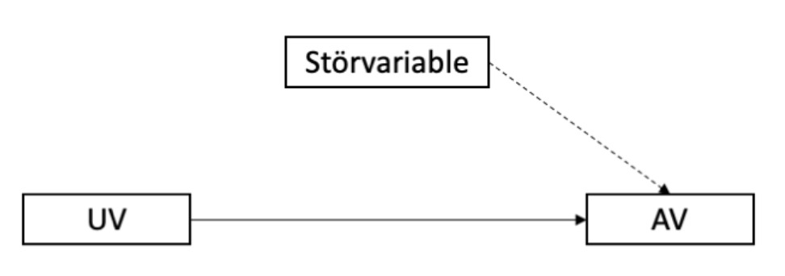
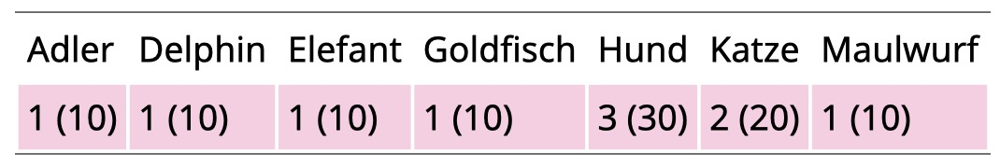
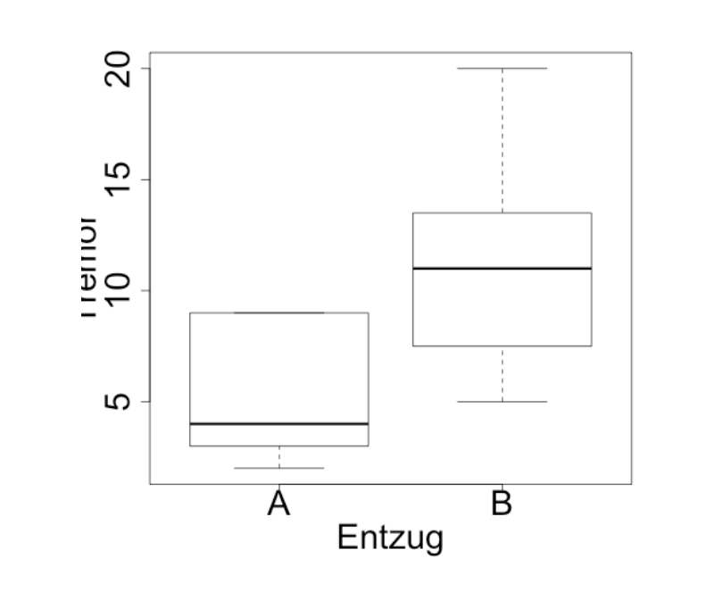
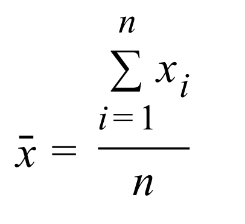
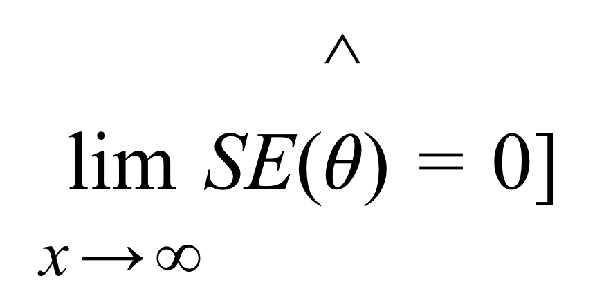

```{r setup, include=FALSE}
library(learnr)
library(psych)
library(shiny)
library(faux)
library(tidyverse)
knitr::opts_chunk$set(echo = FALSE)

#Datensätze simulieren

#patienten_Daten
set.seed(123) 
patienten_Daten = data.frame(
  ID = sample(x = 10000 : 19999, size = 100),
  Diagnose = sample(c("Angstst.", "Depression", "Schizophr.", "PTBS", "Essstoerung"), 100, prob = c(0.3, 0.4, 0.05, 0.1, 0.15),  replace = TRUE), 
  Geschlecht = sample(c("maennlich", "weiblich"), 100, replace = TRUE),
  Alkohol = round(rexp(100, rate = 0.2))
)

patienten_Daten$PWB_ges[patienten_Daten$Diagnose == "Angstst."] = round(rnorm(n = table(patienten_Daten$Diagnose)["Angstst."], mean = 65, sd = 15))
patienten_Daten$PWB_ges[patienten_Daten$Diagnose == "Depression"] = round(rnorm(n = table(patienten_Daten$Diagnose)["Depression"], mean = 50, sd = 15))
patienten_Daten$PWB_ges[patienten_Daten$Diagnose == "Schizophr."] = round(rnorm(n = table(patienten_Daten$Diagnose)["Schizophr."], mean = 70, sd = 15))
patienten_Daten$PWB_ges[patienten_Daten$Diagnose == "PTBS"] = round(rnorm(n = table(patienten_Daten$Diagnose)["PTBS"], mean = 80, sd = 15))
patienten_Daten$PWB_ges[patienten_Daten$Diagnose == "Essstoerung"] = round(rnorm(n = table(patienten_Daten$Diagnose)["Essstoerung"], mean = 40, sd = 15))

# Korrelation simulieren: 
# a = rnorm(100, 0, 1) 
# b = rnorm_pre(a, mu = 5, sd = 2, r = 0,75, empirical = T)

model = lm(PWB_ges ~ Diagnose, patienten_Daten)


```

## Willkommen

### Was können Sie von dieser Übung erwarten?

Wir möchten Ihnen eine erste Möglichkeit geben, sich mit dem Statistikprogramm `R` vertraut zu machen. 

Dazu verwenden wir das Paket `learnr`. 

Dieses Paket gibt uns die Möglichkeit, `R` Aufgaben direkt über Ihren Browser zu üben. Dafür müssen Sie die Programme `R` und `RStudio` nicht auf dem eigenen Computer installieren. 

Zunächst erhalten Sie eine Einführung in die grundlegende Funktionalität von `R`. So können Sie im Verlauf des Semesters die gelernten statistischen Analysen direkt in `R` ausprobieren.

Zusätzlich finden Sie im Rahmen der Lektionen Quizaufgaben, um Ihr Wissen zu überprüfen. 


```{r eval = TRUE, echo = F, out.width = "150px", fig.align='center'}
knitr::include_graphics("images/R_logo.png")
```

## Grundlegende Arithmetik in R

Wir können in `R`, ähnlich wie auf einem Taschenrechner, alle mathematischen Grundrechenoperationen ausführen. 

Dazu tippen Sie einen Rechenbefehl in das Programmierfenster und drücken auf `Run Code`.

Berechnen Sie: $2 + 3$

```{r Addition, exercise=TRUE}

```

Berechnen Sie: $7 - 3$

```{r Subtraktion, exercise=TRUE}

```

Berechnen Sie: $3 \cdot 9$

```{r Multiplikation, exercise=TRUE}

```

Berechnen Sie: 9 $\div$ 3

```{r Division, exercise=TRUE}

```

Berechnen Sie: $3^3$

Falls Sie beim Schreiben eines der Befehle Hilfe benötigen, können Sie auf `Hint` klicken.

```{r Quadrieren, exercise=TRUE}

```

```{r Quadrieren-hint}
3^3
```

Berechnen Sie: Wurzel aus 9

```{r Wurzel, exercise=TRUE}

```

```{r Wurzel-hint}
sqrt(9)
```

Berechnen Sie: $\sqrt{9} \cdot (2+6)$

```{r Arith, exercise=TRUE}

```

```{r Arith-hint}
sqrt(9) * (2+6)
```

## Datenobjekte in R

Natürlich wollen wir `R` nicht nur wie einen Taschenrechner verwenden, denn das Programm kann noch viel mehr.

Einer der größten Vorteile von `R` ist es, dass wir **Objekte** definieren können. Mit diesen Objekten können wir im Rahmen von Analysen oder zu einem späteren Zeitpunkt weiterarbeiten.

### Datenobjekte

Wir wollen 3 Arten von Datenobjekten kennenlernen:

1. Skalar
2. Vektor
3. Matrix

```{r eval=FALSE, include=FALSE}
@STEPHAN: Wie können Wir das Bild kleiner anzeigen? 
  
  # s.u.
```

Die folgende Graphik zeigt Ihnen, wie die 3 Arten von Datenobjekten in einem Datensatz aussehen könnten:

```{r eval = TRUE, echo = F, out.width = "450px", fig.align='center'}
knitr::include_graphics("images/Datenformat_1.png")
```

### Skalar

Der einfachste Objekttyp in R ist der **Skalar**. Ein Skalar ist einfach nur ein einzelner Wert, z.B. eine Zahl oder ein Wort.

##### Aufgabe 
Nun wollen wir den Wert 100 einem Skalar mit dem Buchstaben `a` zuweisen.


```{r Skalar1, exercise=TRUE}

```

```{r Skalar1-hint}
a = 100
```

Wie Sie bemerken, erzeugt R, wenn Sie diesen Code ausführen, keinen Output. Dazu geben Sie nun lediglich den Namen des Skalars in das Eingabefeld unterhalb Ihres Codes ein und drücken erneut `Run Code`. Wir haben unserem Skalar mit dem Wert 100 den "Namen" `a` gegeben.

Wir können einen Skalar auch mit dem Ergenbnis einer Rechenoperation belegen. 

##### Aufgabe 
Erstellen Sie bitte den Skalar `b`, welcher das Ergebnis der Rechnung $3 \div 100$ enthalten soll, und lassen Sie sich diesen direkt anzeigen.  


```{r Skalar2, exercise=TRUE}

```

```{r Skalar2-hint}
b = 3 / 100
b
```

Weiterführend können wir einen Skalar auch mit dem Ergebis einer Rechenoption bestehend aus anderen Skalaren belegen. 

##### Aufgabe 
Erstellen Sie hierzu den Skalar `a` mit dem Wert $50$, den Skalar `b` mit dem Wert $3$. Nun wollen wir einen dritten Skalar `c` mit dem Ergebnis der Rechenoperation $(a + b) \div b$ belegen. Lassen Sie sich das Ergebnis auch direkt ausgeben. 

```{r Skalar3, exercise=TRUE, exercise.lines = 5}

```

```{r Skalar3-hint}
a = 50
b = 3
c = (a+b) / b
c
```

*Hinweis: Wenn Sie in diesem Übungssheet Rechenoperationen ausführen, müssen Sie Ihre Datenobjekte in jedem Eingabefeld wieder neu "belegen". In der Vollversion von R, welche Sie im 2. Semester kennenlernen, merkt sich `R` diese Objekte. Wenn Sie also zum Beispiel den Skalar `a` mit einem beliebigen Wert belegen, merkt sich `R` dies und Sie können durch die Eingabe von `a` jederzeit wieder mit dem Wert des Skalars `a` weiterrechnen. Dies gilt auch für Vektoren oder ganze Datensätze* 

Skalare müssen nicht numerisch sein, sondern können auch Worte beinhalten. Wortobjekte heißen in `R` **characters** (engl. strings). In `R` schreibt man Worte immer in Anführungszeichen `""`.

##### Aufgabe 
Erstellen Sie nun den Skalar `a`, der das Wort `Charlotte Fresenius` und den Skalar `b`, der das Wort `Carl Remigius Fresenius` beinhaltet. Lassen Sie sich lediglich den Inhalt des Skalars `b` ausgeben. 

```{r Skalar4, exercise=TRUE}

```

```{r Skalar4-hint}
a = "Charlotte Fresenius"
b = "Carl Remigius Fresenius"
b
```

Wie Sie sich vermutlich vorstellen können, behandelt R numerische und *character* Skalare unterschiedlich. Zum Beispiel lassen sich mit numerischen Skalaren grundlegende arithmetische Operationen durchführen (Addition, Subtraktion, Multiplikation…) – das funktioniert mit character Skalaren nicht. Um das auszuprobieren gehen Sie einfach zurück in Ihr letztes Eingabefeld und versuchen die Rechenoperation $a + b$ auszuführen. `R` wird Ihnen hier die Fehlermeldung <span style="color:red">*non-numeric argument to binary operator*</span> ausgeben. 

### Vektor

Machen wir weiter mit `Vektoren`. Ein Vektor Objekt ist einfach eine Kombination mehrerer Skalare in einem einzelnen Objekt (z.B. eine Zahlen- oder Wortreihe). Zum Beispiel könnten die Zahlen von 1-10 in einen Vektor mit der Länge 10 kombiniert werden. Oder die Buchstaben des Alphabets könnten in einen Vektor mit der Länge 26 gespeichert werden. Genau wie Skalare, können Vektoren numerisch oder characters sein (Aber nicht beides auf einmal!)

Die einfachste Art einen Vektor zu erstellen ist mit der `c()` Funktion. Das c steht für *“concatenate”*, was auf Englisch so viel heißt wie “zusammenbringen”. Die `c()` Funktion nimmt mehrere Skalare als Input und erstellt einen Vektor, der diese Objekte enthält.

Wenn man `c()` benutzt, muss man immer ein **Komma** zwischen die Objekte setzen (Skalare oder Vektoren), die man kombinieren möchte.

##### Aufgabe 
Lassen Sie uns die `c()` Funktion nutzen um einen **numerischen Vektor** zu erstellen der `a` heißt und die Zahlen von 1 bis 7 enthält. Lassen Sie sich das Ergebnis direkt ausgeben:

```{r Vektor1, exercise=TRUE}

```

```{r Vektor1-hint}
a = c(1, 2, 3, 4, 5, 6, 7)
a
```

Sie können auch **character Vektoren** erstellen, indem Sie die `c()` Funktion auf einzelne character Skalare anwenden. 

##### Aufgabe 
Erstellen Sie einen Vektor, der die folgende Namen beinhaltet: `Freud`, `Wundt`, `Bandura`, `Watson`, `Jung`. Wir nennen diesen Vektor zur besseren Übersicht einmal `char.vec`. Lassen Sie sich den Inhalt des Vektors direkt ausgeben. 

```{r Vektor2, exercise=TRUE}

```

```{r Vektor2-hint}
char.vec = c("Freud", "Wundt", "Bandura", "Watson", "Jung")
char.vec
```

Mit Vektoren lassen sich auch Rechenoperationen ausführen. 

##### Aufgabe 
Erstellen Sie den Vektor `a` mit den Zahlen von 1 - 3 und den Vektor `b` mit den Zahlen von 4 - 6 und addieren diese zu einem neuen Vektor `c`. Lassen Sie sich den neuen Vektor `c` direkt anzeigen. Bei dieser Art der Addition wird jeweils die $n$te Zahl des Vektors `a` mit der $n$ten Zahl des Vektors `b` addiert. 

```{r Vektor3, exercise=TRUE}

```

```{r Vektor3-hint}
a = c(1, 2, 3)
b = c(4, 5, 6)
c = a + b 
c
```

Vektoren lassen sich über die `c()` Funktion auch aneinanderhängen. Anders als bei den Rechenoperationen funktioniert dies auch mit character Vektoren. 

##### Aufgabe 
Erstellen Sie die Vektoren `a` mit den Farben `blau` und `rot` sowie den Vektor `b` mit den Farben `gelb`und `grün`. Hängen Sie diese beiden Vektoren zu einem neuen Vektor `c` zusammen und lassen sich diesen anzeigen. 

```{r Vektor4, exercise=TRUE}

```

```{r Vektor4-hint}
a = c("blau", "rot")
b = c("gelb", "grün")
c = c(a, b) 
c
```


### Faktor Variablen

Wir haben bereits gelernt, wie man einen Vektor aus character Objekten erstellt. Manchmal brauchen wir in R jedoch Variablen, die nicht nur Worte enthalten, sondern dem Programm mitteilen, dass es sich um feste Gruppen oder **Kategorien** handelt. Es geht also nicht nur um eine "Sammlung" von Worten (z.B. Nachnamen von Probanden), sondern um festgelegte Analyseeinheiten. Solche Variablen heißen in R `factor`. 

In einer factor Variable ist jeder Kategorie eine Zahl zugeordnet (z.B. 1 = männlich, 2 = weiblich).

Um Faktor Variablen zu erstellen, machen wie einen Vorgang, den man **Kodieren** nennt und das geht so:

Wir haben einen Vektor mit Codes 1 und 2 für männlich und weiblich vorliegen:

```{r echo=TRUE}
geschlecht = c(1, 2, 2, 1, 2)
# Das Ergebnis ausgeben
geschlecht
```

In dieser Form erkennt R diesen Vektor als numerische Variable. Um Sie in einen Faktor umzuwandeln, definieren wir die Zahlen (1 und 2) als `levels` des Faktors und geben dann jedem level einen Namen (`labels`):

```{r echo=TRUE}
geschlecht = factor(geschlecht, levels = c(1,2), labels = c("männlich", "weiblich"))
# Das Ergebnis ausgeben
geschlecht
```

Das Ergebnis ist eine codierte Faktorvariable. Wenn wir Sie uns ausgeben lassen erhalten wir unter den Merkmalsausprägungen eine Liste mit den einzelnen Kategorien (levels) des Faktors.

R wird uns für Faktoren alle Ergebnisse nach der **Reihenfolge** der levels anzeigen. Wenn wir keine Faktorvariable haben, sondern eine character Variable funktioniert die Reihenfolge immer alphabetisch.

##### Aufgabe 
Erstellen Sie nun im folgenden Eingabefeld den Vektor `Wohnort` `c(1,2,1,3,2,1)` mit den Codes $1$ für `München`, $2$ für `Hamburg` und $3$ für `Köln`. Erstellen Sie erst einen numerischen Vektor und lassen diesen dann in einen Faktor umwandeln und anzeigen. 

*Hinweis: Da `R` in dieser Übung keine Information zwischen den einzelnen Eingabefeldern überträgt, müssen Sie die beiden Schritte, die Ihnen in zwei unterschiedlichen Eingabefeldern gezeigt wurden, nun in einem kombinieren* 

```{r Faktor, exercise=TRUE}

```

```{r Faktor-hint}
Wohnort = c(1,2,1,3,2,1)
Wohnort = factor(Wohnort, levels = c(1,2,3), labels = c("München", "Hamburg", "Köln"))
Wohnort
```

*An dieser Stelle ein weiterer Hinweis: `R` ist "case sensitive". Das bedeutet, dass Groß- und Kleinschreibung relevant ist. Wenn Sie also beispielsweise den Vektor `Wohnort`erstellen, wird `R` diesen nicht wiederfinden, wenn Sie `wohnort` eingeben.*

### Vektor Indizierung

Manchmal möchten wir wieder einen einzelnen Skalar auswählen, der als Teil von einem Vektor gespeichert ist. Diese **Auswahl** eines Einzelelements nennt man **Indizierung**. Die Auswahl eines kleineren Objekts aus einem größeren Objekt funktioniert in `R` immer mit `[]`. 

Benötigen wir aus einem Vektor z.B. genau den 3. Skalar, schreiben wir einfach eine 3 in eckige Klammern hinter den Vektor.

##### Aufgabe 
Erstellen Sie nun den Vektor `color`, der die folgenden Farben enthält: `blau`, `rot`, `grün`, `gelb`. Lassen Sie sich lediglich die zweite Farbe ausgeben (In unserem Fall sollte in dem Ausgabefeld also "rot" erscheinen)

```{r Indizierung1, exercise=TRUE}

```

```{r Indizierung1-hint}
color = c("blau", "rot", "grün", "gelb")
color[2]
```

### Erstellen von Datenmatrizen

In der Psychologie beobachten wir für unsere Studien fast immer mehr als eine Variable. Wir könnten diese alle in einzelnen Vektoren speichern und uns die Objektnamen merken. Z.B.:

```{r echo=TRUE}
Name = c("Max", "Maja", "Mia", "Moritz", "Markus")
Alter = c(20, 31, 25, 34, 51)
Diagnose = c("Depression", "Zwangsstörung", "Depression", "Soziale Phobie", "Depression")
```

Praktischer ist es, die einzelnen Vektoren in Tabellenform zu speichern, der **Datenmatrix**. In R heißen Datenmatrizen `data.frame`. Wir können die Vektoren folgendermaßen zu einem data.frame kombinieren:

```{r echo=TRUE}
df = data.frame(Name, Alter, Diagnose)
# Das Ergebnis ausgeben
df
```

Dies wollen wir direkt einmal üben: 

##### Aufgabe 
Erstellen Sie eine Datenmatrix mit dem Namen `Personen` mit folgenden Informationen: <br>
*(Wir betrachten die Variablen `Name`, `Alter`, `Wohnort`)*

`Peter, 41, Mainz` <br>
`Susanne, 23, Regenburg` <br>
`Hannes, 31, München` <br>
`Jana, 43, Köln`

Lassen Sie sich die Datenmatrix direkt ausgeben. 

```{r df1, exercise=TRUE, exercise.lines = 5}

```

```{r df1-hint}
Name = c("Peter", "Susanne", "Hannes", "Jana")
Alter = c(41, 23, 31, 43)
Wohnort = c("Mainz", "Regensburg", "München", "Köln")
Personen = data.frame(Name, Alter, Wohnort)
Personen
```

Wie in jeder Datenmatrix entsprechen die **Zeilen** den einzelnen Personen (Fällen) und die **Spalten** den Variablen. 

`R` bezeichnet Zeilen und Spalten als **rows** und **columns**. Wollen wir z.B. wissen, wie viele Zeilen der data.frame hat, können wir `nrow()` benutzen. Für die Anzahl der Spalten nehmen wir `ncol()`:

Probieren Sie dies einmal in Ihrem gerade erstellten Datensatz aus. Fügen Sie am Ende Ihres Codes einfach entweder `nrow(Personen)` oder `ncol(Personen)` ein.

Wenn wir die einzelnen Vektoren nicht bereits vorher definiert haben, können wir auch alles in einem Schritt machen. Das Ergebnis ist das gleiche:

```{r echo=TRUE}
df = data.frame("Name" = c("Max", "Maja", "Mia", "Moritz", "Markus"),
                "Alter" = c(20, 31, 25, 34, 51),
                "Diagnose" = c("Depression", "Zwangsstörung", "Depression", "Soziale Phobie", "Depression")
                )
# Das Ergebnis ausgeben
df
```

Wollen wir wieder eine einzelne Variable aus dem Datensatz benutzen, können wir diese über das `$` Zeichen anwählen:

```{r echo=TRUE}
df$Alter
```

### Indizierung

Wollen wir aus dem data.frame wieder einzelne Elemente verwenden, nutzen wir wieder die Indizierung. Auch hier brauchen wir die `[]`. Da wir im data.frame Zeilen und Spalten haben, brauchen wir eine Möglichkeit, beides auszuwählen, wie ein Curser der von links nach rechts, bzw. von oben nach unten läuft. 

Wir trennen dafür unsere `[]` mit einem Komma `[,]`. Alles, was **links vom Komma** steht, bezieht sich auf Zeilen alles **rechts vom Komma** bezieht sich auf Spalten.

##### Aufgabe 
Um dies zu Üben erstellen Sie wieder eine Datenmatrix mit dem Namen `Personen` mit folgenden Informationen: <br>
*(Wir betrachten die Variablen `Name`, `Alter`, `Wohnort`)*

`Peter, 41, Mainz` <br>
`Susanne, 23, Regenburg` <br>
`Hannes, 31, München` <br>
`Jana, 43, Köln`

Lassen Sie sich im Ausgabefeld nun lediglich den Wohnort von Susanne anzeigen. 

*Hinweis: Sie können den Code Ihres Datensatzes aus dem letzten Eingabefeld kopieren, um nicht alles neu schreiben zu müssen*

```{r Indizierung_df, exercise=TRUE, exercise.lines = 5}

```

```{r Indizierung_df-hint}
Name = c("Peter", "Susanne", "Hannes", "Jana")
Alter = c(41, 23, 31, 43)
Wohnort = c("Mainz", "Regensburg", "München", "Köln")
Personen = data.frame(Name, Alter, Wohnort)
Personen[2,3]
```

**Nun haben Sie bereits einige der wichtigsten Grundfunktionen von `R` kennengelernt und wir können dazu übergehen, vorlesungsbegleitende Übungsaufgaben zu erarbeiten.**


## Vorlesung 1

Nun wollen wir damit starten, die in den Vorlesungen vermittelten Inhalte direkt in `R` anzuwenden. Wir beginnen mit deskriptivstatistischen Analysen. Zunächst betrachten wir Möglichkeiten, wie wir numerische Daten beschreiben können. 

### Lagemaße

Lagemaße, auch bekannt als Maße der zentralen Tendenz, sind statistische Kennzahlen, die uns Informationen über die typische oder durchschnittliche Lage einer Verteilung geben. Sie helfen dabei, den Mittelpunkt oder die Mitte eines Datensatzes zu bestimmen. 

Die gängigsten Lagemaße sind: 

* Mittelwert (arithmetisches Mittel, engl. *mean*)
* Median 
* Modus (Modalwert).

Lagemaße sind nützliche Werkzeuge, um einen Überblick über Daten zu gewinnen und Vergleiche zwischen verschiedenen Verteilungen anzustellen (z.B. bei Gruppenvergleichen). 

Über folgende Befehle können Sie sich in `R` die eben beschriebenen Lagemaße berechnen lassen: 

* Mittelwert mit der `mean()` Funktion 
* Median mit der `median()` Funktion 
* Um den Modalwert herauszufinden lassen Sie sich am besten eine Häufigkeitstabelle erstellen. Wie das funktioniert werden wir uns im nächsten Schritt anschauen

 
##### Aufgabe 
Sie leiten als Psychotherapeut:in eine KVT (Kognitive Verhaltenstherapie) Gruppentherapie und interessieren sich für die Altersstruktur Ihrer Patient:innen. Folgende Teilnehmer:innen haben Sie in Ihrer Gruppe: 

| ID|Alter 
|:----------------------|:-----------------------
|    1 |32  
|    2 |23   
|    3 |42
|    4 |19
|    5 |56

Berechnen Sie nun sowohl den Mittelwert als auch den Median des Alters Ihrer Therapiegruppe.

*Hinweis: Erstellen Sie hierzu zunächst lediglich einen Vektor namens `Alter`, der das Alter Ihrer Patient:innen enthält. Wie wir uns ganze Datensätze deskriptiv näher anschauen, betrachten wir im nächsten Schritt*

```{r Lage1, exercise=TRUE}

```

```{r Lage1-hint}
Alter = c(32,23,42,19,56)
mean(Alter)
median(Alter)
```

Erstellen Sie nun einen data.frame namens `df`, der die oben beschriebenen Informationen enthält. Also sowohl `ID`, als auch das dazugehörige `Alter`. Wie Sie bereits gelernt haben, können Sie sich mit Hilfe des `$` Symbols einzelne Spalten (Variablen) aus einem Datensatz ausgeben lassen. Versuchen Sie einmal, dieses Wissen zu transferieren, und sich aus dem Datensatz `df` den Mittelwert der Variable `Alter` ausgeben zu lassen. 

```{r Lage2, exercise=TRUE}

```

```{r Lage2-hint}
df = data.frame("ID" = c(1, 2, 3, 4, 5),
                "Alter" = c(32, 23, 42, 19, 56)
                )

mean(df$Alter)
```

Diese Funktionen funktionieren nur für Vektoren, nicht für `data.frames()`.

**Vorsicht:** Es kann vorkommen, dass wir in unseren Daten fehlende Werte (missings) haben. Dann funktionieren die Funktionen nicht mehr:

```{r echo=TRUE}
vektor = c(2, 4, NA, 1, 5, 2, 5, NA)

mean(vektor)
```

Wir können das Problem jedoch mit einem kleinen Extra-Argument (`na.rm = T`) lösen. Die Statistik wird dann auf Basis aller verfügbaren Werte berechnet und die fehlenden Werte werden ignoriert:

```{r echo=TRUE}
mean(vektor, na.rm = T)
```

Manchmal wollen wir uns jedoch nicht die Mühe machen, die Deskriptivstatistiken alle einzeln und nacheinander zu berechnen. Schöner wäre es, mit einer Funktion alle relevanten Kennwerte auf einmal zu erhalten.

Eine solche Funktion ist `describe()` aus dem `psych` Paket. Die `describe()` Funktion funktioniert sowohl bei Vektoren als auch bei ganzen Datensätzen. 

*Hintergrund: Es gibt in `R` sognenannte Packages. Ein R-Package ist einfach ein Bündel von Funktionen (also bereits geschriebener Code), die in einem übersichtlichen Paket gespeichert sind. In dieser Übung haben wir bereits alle benötigten Pakete installiert. Wie Sie diese Pakete in der Vollversion von `R` installieren, werden Sie nächstes Semester im Rahmen der `R` Übung erfahren* 

##### Aufgabe 
Um dies einmal zu verdeutlichen, kopieren Sie sich in das nachfolgende Eingabefeld wieder Ihren Vektor `Alter` und wenden die Funktion `describe()` an. 

```{r Lage3, exercise=TRUE}

```

```{r Lage3-hint}
Alter = c(32,23,42,19,56)
describe(Alter)
```

Nun wollen wir die `describe()` Funktion auf einen Datensatz anwenden. Kopieren Sie dazu wieder Ihren Datensatz `df` in das nachfolgende Eingabefeld und wenden die Funktion an. 

```{r Lage4, exercise=TRUE}

```

```{r Lage4-hint}
df = data.frame("ID" = c(1, 2, 3, 4, 5),
                "Alter" = c(32, 23, 42, 19, 56)
                )

describe(df)
```

Wie wir in `R` Streuungsmaße berechnen, schauen wir uns in der nächsten Vorlesung an. 

### Kategorische Variablen

Leider gibt es zum Zusammenfassen kategorialer (nominalskalierter) Variablen nicht so viele Möglichkeiten wie für die numerischen Variablen (die Mittelwert, Median, Standardabweichung... ermöglichen).

#### Absolute Häufigkeiten

Die gängigste Deskription einer kategorialen Variable ist die Erstellung einer Häufigkeitstabelle. Eine Häufigkeitstabelle mit absoluten Häufigkeiten lässt sich mit dem `table()` Befehl erstellen.

#### Aufgabe 
Erstellen Sie zur Übung folgende Datenmatrix und lassen sich die absoluten Häufigkeiten der Diagnosen ausgeben. Über eine Häufigkeitstabelle wie diese können Sie auch schnell den Modalwert ablesen. 

```{r echo=FALSE}
df = data.frame("Geschlecht" = c("m", "w", "w", "w", "m"),
                "Diagnose" = c("Depression", "Depression", "Angststoerung", "Depression", "Soziale Phobie")
                )
knitr::kable(df)

```

```{r Kat1, exercise=TRUE}

```

```{r Kat1-hint}
df = data.frame("Geschlecht" = c("m", "w", "w", "w", "m"),
                "Diagnose" = c("Depression", "Depression", "Angststoerung", "Depression", "Soziale Phobie")
                )

table(df$Diagnose)
```

#### Relative Häufigkeiten

Um unsere absoluten Häufigkeiten in relativen Häufigkeiten anzeigen zu lassen, können wir die Funktion `prop.table()` nutzen. Diesen Befehl müssen wir jedoch auf den `table()` Befehl anwenden. Unser Code sieht also so aus: `prop.table(table())`. 

##### Aufgabe 
Kopieren Sie nun wieder Ihren Datensatz aus der vorherigen Übung in das Eingabefeld und lassen Sie sich eine relative Häufigkeitstabelle der Diagnosen ausgeben. 

```{r Kat2, exercise=TRUE}

```

```{r Kat2-hint}
df = data.frame("Geschlecht" = c("m", "w", "w", "w", "m"),
                "Diagnose" = c("Depression", "Depression", "Angststoerung", "Depression", "Soziale Phobie")
                )
prop.table(table(df$Diagnose))
```

### Wissensüberprüfung 1. Vorlesung 

```{r quiz1_1, echo = FALSE}
quiz(
  question("Wofuer ist das Alter einer Versuchsperson ein Beispiel?",
    answer("Datensatz"),
    answer("Datenbank"),
    answer("Statistik"),
    answer("Daten", correct = TRUE), allow_retry = TRUE
  )
    )
```

```{r quiz1_2, echo = FALSE}
quiz(
  question("Was sind Vorteile digitaler Datenanalyse?",
    answer("Es können große Datensätze verarbeitet werden", correct = TRUE),
    answer("Kommt zu besseren Ergebnissen"),
    answer("Es werden weniger Flüchtigkeitsfehler gemacht", correct = TRUE),
    answer("Iterationsbasierte Verfahren möglich", correct = TRUE), allow_retry = TRUE
  )
    )
```

```{r quiz1_3, echo = FALSE}
quiz(
  question("Was sind Kriterien für wissenschaftliche Hypothesen?",
    answer("Falsifizierbarkeit", correct = TRUE),
    answer("Finalsatz"),
    answer("empirisch untersuchbar", correct = TRUE),
    answer("Konditionalsatz", correct = TRUE), allow_retry = TRUE
  )
    )
```

```{r quiz1_4, echo = FALSE}
quiz(
  question("Welche sind wissenschaftliche Hypothesen?",
    answer("Manche depressive Patienten schlafen schlechter.", correct = TRUE),
    answer("Zwangspatienten machen häufiger sauber, als gesunde Kontrollprobanden."),
    answer("Es gibt Menschen, die zum pathologischen Grübeln neigen."),
    answer("Es besteht ein Zusammenhand zwischen Angst und sozialer Netzwerkgröße.", correct = TRUE), allow_retry = TRUE
  )
    )
```

```{r quiz1_5, echo = FALSE}
quiz(
  question("Bei welchen handelt es sich um gerichtete Hypothesen?",
    answer("Frauen sind besser als Männer in mentalen Rotationsaufgaben.", correct = TRUE),
    answer("Es besteht ein Zusammenhang zwischen Schlafproblemen und Agitiertheit."),
    answer("Wenn man mehr Stress ausgesetzt ist entwickelt man leichter eine Psychose", correct = TRUE),
    answer("Es besteht ein negativer Zusammenhang zwischen Vermeidungsverhalten und beruflichem Erfolg.", correct = TRUE), allow_retry = TRUE
  )
    )
```

```{r quiz1_6, echo = FALSE}
quiz(
  question("Gewicht [kg] ist eine..",
    answer("stetige Variable", correct = TRUE),
    answer("latente Variable"),
    answer("dichotome Variable"),
    answer("manifeste Variable", correct = TRUE), allow_retry = TRUE
  )
    )
```

```{r quiz1_7, echo = FALSE}
quiz(
  question("Welche der folgenden sind latente Variablen?",
    answer("Persönlichkeit", correct = TRUE),
    answer("Extraversion", correct = TRUE),
    answer("Zittern"),
    answer("Blutdruck"),
    answer("Einsamkeit", correct = TRUE)
    , allow_retry = TRUE
  )
    )
```

```{r quiz1_8, echo = FALSE}
quiz(
  question("In der Hypothese: <Männer schlafen morgens länger als Frauen.> ist Geschlecht die...",
    answer("Moderatorvariable"),
    answer("AV"),
    answer("Störvariable"),
    answer("UV", correct = TRUE), allow_retry = TRUE
  )
    )
```

```{r quiz1_9, echo = FALSE}
quiz(
  question("Welche Aussagen sind hinsichtlich der Population und Stichprobe korrekt?",
    answer("Population wird auch als Grundgesamtheit bezeichnet", correct = TRUE),
    answer("Population = Teilgruppe die das interessierende Merkmal hat."),
    answer("Population wird gezogen."),
    answer("Verteilung innerhalb der Population basiert auf Wahrscheinlichkeitsannahmen.", correct = TRUE),
    answer("Verteilung innerhalb der Stichprobe basiert auf Beobachtung.", correct = TRUE), allow_retry = TRUE
  )
    )
```

```{r quiz1_10, echo = FALSE}
quiz(
  question("Welche sind Maße der zentralen Tendenz?",
    answer("Varianz"),
    answer("Mittelwert", correct = TRUE),
    answer("t-Test"),
    answer("Standardabweichung"),
    answer("Median", correct = TRUE), allow_retry = TRUE
  )
    )
```

```{r quiz1_11, echo = FALSE}
quiz(
  question(" Was macht Inferenzstatistik?",
    answer("Die Daten beschreiben"),
    answer("Aussagen über die Population treffen", correct = TRUE),
    answer("Schließen von Population auf Stichprobe"),
    answer("Vorhersagen über die Stichprobe"), allow_retry = TRUE
  )
    )
```

```{r quiz1_12, echo = FALSE}
quiz(
  question("Was ist bezogen auf Hypothesen zutreffend?",
    answer("Die Nullhypothese besagt, dass der erwartete Effekt besteht"),
    answer("H1: Der hypothetisierte Effekt besteht", correct = TRUE),
    answer("Wir versuchen die H0 zu verwerfen", correct = TRUE),
    answer("Wir versuchen die H1 zu verwerfen"),
    answer("Der angenommene Effekt wird durch die Alternativhypothese ausgedrückt", correct = TRUE), allow_retry = TRUE
  )
    )
```

```{r quiz1_13, echo = FALSE}
quiz(
  question("Was ist zutreffend? <br> {width=400px}",
    answer("Störvariablen sind alle Einflussgrößen auf die AV, die in einer Untersuchung nicht erfasst werden", correct = TRUE),
    answer("Ziel ist es, Störvariablen möglichst zu kontrollieren und zu erfassen", correct = TRUE),
    answer("Bsp. im Sinne der Abbildung: Eine neue Unterrichtsmethode (UV) soll anhand des Notendurchschnitts (AV) evaluiert werden. Ein Teil der Klasse wiederholt das Jahr jedoch und es bleibt unberücksichtigt, dass sie den Stoff bereits im vergangenen Jahr durchgenommen haben.", correct = TRUE),
    answer("Bsp. im Sinne der Abbildung: Schulnote (UV) beeinflusst Selbstwertgefühl, Selbstwertgefühl beeinflusst Lebenszufriedenheit (AV)"), allow_retry = TRUE
  )
    )
```

```{r quiz1_14, echo = FALSE}
quiz(
  question("Wir fertigen nach einer Befragung zu Lieblingshaustieren folgende Tabelle an. Welche Aussagen sind zutreffend? <br> {width=400px}",
    answer("20 Personen gaben an, dass Katzen ihre Lieblingshaustiere seien"),
    answer("Hund = Modus", correct = TRUE),
    answer("30% der befragten Personen gaben an, dass Hunde ihre Lieblingshaustiere seien", correct = TRUE),
    answer("N = 100"),
    answer("N = 10", correct = TRUE), allow_retry = TRUE
  )
    )
```


## Vorlesung 2

### Graphische Darstellung von Häufigkeiten

`R` liefert Ihnen in der Grundversion bereits einige Möglichkeiten, Daten graphisch darzustellen. Wir möchten uns zunächst die Funktionen `barplot()` und `hist()` anschauen. Wie die Namen bereits verraten, können wir mit der `barplot()` Funktion Balkendiagramme und mit der `hist()` Funktion Histogramme erstellen. 

```{r quiz1, echo = FALSE}
quiz(
  question("Worin unterscheiden sich ein Histogramm und ein Balkendiagramm?",
    answer("Beide eignen sich zur grafischen Darstellung einer Häufigkeitstabelle", correct = TRUE),
    answer("Histogramm für numerische Variablen", correct = TRUE),
    answer("Histogramm für kategoriale Variablen"),
    answer("Balkendiagramm für numerische Variablen"),
    answer("Balkendiagramm für kategoriale Variablen", correct = TRUE),
    allow_retry = TRUE
  )
    )
```

#### Aufgabe 
Stellen Sie sich vor, Sie befinden sich in Ihrem Orientierungspraktikum in einer Psychiatrie. Johanna ist leitende Psychologin der Station auf der Sie arbeiten. Auf Ihrer Station wird ein transdiagnostisches Behandlungsangebot gemacht - es werden also eine Vielzahl an unterschiedlichen Störungsbildern behandelt. Sie kriegen mit, dass der Klinikdirektor auf Johanna zugeht und Sie um eine Übersicht über Art und Häufigkeit der im letzten Quartal behandelten Störungsbilder bittet. Da Sie sich bereits etwas mit der Aufbereitung von Daten auskennen, bieten Sie Johanna Ihre Hilfe an.

Johanna teilt Ihnen mit, dass Sie in `R` bereits einen Datensatz names `patienten_Daten` erstellt hat, der alle notwendigen Informationen enthält. Geben Sie in das nachfolgende Eingabefeld einfach mal `patienten_Daten` ein, und drücken auf `run code`. 

```{r Hist1, exercise=TRUE}

```

```{r quiz2, echo = FALSE}
quiz(
  question("Welche Aussagen zu den Ihnen angezeigten Daten stimmen?",
    answer("Jede Zeile steht für eine Person", correct = TRUE),
    answer("Jede Spalte steht für eine Person"),
    answer("Der Datensatz enthält die Variablen ID, Diagnose, Geschlecht, Alkohol und PWB_ges", correct = TRUE),
    answer("Der Datensatz umfasst 10 Patient:Innen"),
    answer("Der Datensatz umfasst 100 Patient:Innen", correct = TRUE),
    allow_retry = TRUE
  )
    )
```

Erstellen Sie nun zunächst eine (absolute) Häufigkeitstabelle der behandelten Diagnosen:

```{r Hist2, exercise=TRUE}

```

```{r Hist2-hint}
table(patienten_Daten$Diagnose)
```

Im nächste Schritt wollen Sie diese Daten in einer geeigneten Form grafisch darstellen, um Sie dem Klinikdirektor zu präsentieren.

*Hinweis: Mittels der `hist()` Funktion können wir direkt die Häufigkeitsverteilung eines numerischen Vektors grafisch darstellen. Wenn wir die `barplot()` Funktion verwenden, müssen wir einen kleinen Umweg gehen. Wir müssen zunächst eine Häufigkeitstabelle erstellen und diese dann mittels der `barplot()` Funktion grafisch darstellen: `barplot(table())`*

```{r Hist3, exercise=TRUE}

```

```{r Hist3-hint}
barplot(table(patienten_Daten$Diagnose))
```

Johanna ist ganz begeistert davon, wie gut Sie schon mit `R` umgehen können. Sie erklärt Ihnen, dass die Spalte `Alkohol` in Ihrem Datensatz für den (vor der Aufnahme in die Klinik) wöchentlichen Alkoholkonsum der Patient:innen in Gläsern steht. Sie bittet Sie darum, diesen Konsum in einer geeigneten Darstellung zu visualisieren.

```{r Hist4, exercise=TRUE}

```

```{r Hist4-hint}
hist(patienten_Daten$Alkohol)
```

### Wissensüberprüfung 2. Vorlesung 

```{r quiz2_1, echo = FALSE}
quiz(
  question("Was trifft auf <Messen> zu?",
    answer("Messen = Variablen in Zahlen darstellen", correct = TRUE),
    answer("Daten erheben und Messen sind dasselbe"),
    answer("Einzelne Ausprägungen werden Zahlen auf einer Skala zugeordnet", correct = TRUE),
    answer("Messen ist homomorphe Abbildung eines empirischen Relativs in ein numerisches Relativ", correct = TRUE), allow_retry = TRUE
  )
    )
```

```{r quiz2_2, echo = FALSE}
quiz(
  question("Das Skalenniveau...",
    answer("ist immer entweder nominal oder numerisch"),
    answer("ist eindeutig durch das Merkmal definiert"),
    answer("bestimmt welche Rechenoperationen möglich sind", correct = TRUE),
    answer("eine der wichtigsten Eigenschaften einer Variable", correct = TRUE), allow_retry = TRUE
  )
    )
```

```{r quiz2_3, echo = FALSE}
quiz(
  question("Welches ist das niedrigste Skalenniveau?",
    answer("ordinal"),
    answer("nominal", correct = TRUE),
    answer("metrisch"),
    answer("intervall"), allow_retry = TRUE
  )
    )
```

```{r quiz2_4, echo = FALSE}
quiz(
  question("Das Lieblingsfußballteam ist ein Beispiel für eine Variable mit welchem Skalenniveau",
    answer("nominal", correct = TRUE),
    answer("metrisch"),
    answer("Verhältnisskala"),
    answer("intervall"), allow_retry = TRUE
  )
    )
```

```{r quiz2_5, echo = FALSE}
quiz(
  question("Der IQ ist ein Beispiel für eine Variable mit welchem Skalenniveau?",
    answer("metrisch", correct = TRUE),
    answer("Verhältnisskala"),
    answer("intervall", correct = TRUE),
    answer("ordinal"), allow_retry = TRUE
  )
    )
```

```{r quiz2_6, echo = FALSE}
quiz(
  question("Welches Skalenniveau ist zur Berechnung des Mittelwerts mindestens notwendig?",
    answer("nominal"),
    answer("intervall", correct = TRUE),
    answer("Verhältnisskala"),
    answer("ordinal"), allow_retry = TRUE
  )
    )
```

```{r quiz2_7, echo = FALSE}
quiz(
  question("Was trifft auf das Nominalskalenniveau zu?",
    answer("Häufig wird hier mit einer Codierung gearbeitet", correct = TRUE),
    answer("nur Beziehungen <gleich> , <ungleich> möglich", correct = TRUE),
    answer("logische Reihenfolge ist möglich"),
    answer("höchstes Skalenniveau"), 
    answer("eindeutige Transformationen sind möglich", correct = TRUE), allow_retry = TRUE
  )
    )
```

```{r quiz2_8, echo = FALSE}
quiz(
  question("Was trifft auf das Verhältnisskalenniveau zu?",
    answer("Hat absoluten Nullpunkt", correct = TRUE),
    answer("Temperatur waere ein Beispiel", correct = TRUE),
    answer("Aussage über das Verhältnis zwischen zwei Werten ist moeglich", correct = TRUE),
    answer("Selten in den Sozialwissenschaften", correct = TRUE), allow_retry = TRUE
  )
    )
```

```{r quiz2_9, echo = FALSE}
quiz(
  question("Maße der zentralen Tendenz...",
    answer("Sind z.B. Mittelwert und Median", correct = TRUE),
    answer("Können nur sinnvoll in der Stichprobe verwendet werden (nicht in Population)"),
    answer("geben Auskunft über Variation der Messwerte"),
    answer("Werden mit Häufigkeiten angegeben"), 
    answer("repraesentieren alle Einzelwerte der Verteilung zusammenfassend", correct = TRUE), allow_retry = TRUE
  )
    )
```

```{r quiz2_10, echo = FALSE}
quiz(
  question("Der Modalwert...",
    answer("ist der Durchschnitt einer Verteilung"),
    answer("ist der häufigste Wert", correct = TRUE),
    answer("Ist genau die Mitte der Verteilung"),
    answer("ist in der Wertereihe [1,2,2,3,3,3,4,4,4,4] die 3"), allow_retry = TRUE
  )
    )
```

```{r quiz2_11, echo = FALSE}
quiz(
  question("Was trifft auf den Median zu?",
    answer("Benötigt mindestens nominal skalierte Variablen"),
    answer("Ist der mittlere Wert der Verteilung", correct = TRUE),
    answer("Ist robust gegenüber Ausreißern", correct = TRUE),
    answer("Ist i.d.R. besser als der Mittelwert"), allow_retry = TRUE
  )
    )
```

```{r quiz2_12, echo = FALSE}
quiz(
  question("Folgende Urliste sei gegeben. Welche Aussagen stimmen? 
[2, 2, 3, 3, 4, 4, 4, 5, 6, 6, 6, 7, 8, 8, 9, 9] ",
    answer("Der Modus ist der Wert 4 bzw. 6", correct = TRUE),
    answer("Median = 5"),
    answer("Median = 5,5", correct = TRUE),
    answer("Arithmetisches Mittel = 5,5"), allow_retry = TRUE
  )
    )
```

```{r quiz2_13, echo = FALSE}
quiz(
  question("Welche Aussagen stimmen?",
    answer("Auf Ordinalskalenniveau ist es nicht möglich, Variablen in eine logische Reihenfolge zu bringen"),
    answer("Der Sitz des Wohnsitzfinanzamtes ist ein Beispiel für nominalskalierte Daten", correct = TRUE),
    answer("Die metrische Variable <Ergebnis in einem IQ Test> lässt sich auf ordinalskalenniveau runterskalieren", correct = TRUE),
    answer("Viele Daten in den Sozialwissenschaften haben Intervallskalenniveau", correct = TRUE), allow_retry = TRUE
  )
    )
```

```{r quiz2_14, echo = FALSE}
quiz(
  question("Was trifft zu?",
    answer("Bei einer linkssteilen Verteilung gilt: Modus < Median < Mittelwert", correct = TRUE),
    answer("Bei einer linkssteilen Verteilung gilt: Modus = Median = Mittelwert"),
    answer("Bei einer linkssteilen Verteilung gilt: Mittelwert < Modus < Median"),
    answer("Keine dieser Aussagen ist richtig"), allow_retry = TRUE
  )
    )
```

```{r quiz2_15, echo = FALSE}
quiz(
  question("Welche Aussagen stimmen?",
    answer("Häufigkeiten stellen wir in einem Histogramm dar", correct = TRUE),
    answer("Kategorien stellen wir in einem Balkendiagramm dar", correct = TRUE),
    answer("In einem Histogramm können auf der Y-Achse die absoluten Häufigkeiten der Ausprägungen dargestellt", correct = TRUE),
    answer("Gesamtfläche eines Histogramms = 1 <relative Häufigkeit> bzw. N <Absolute Häufigkeit>", correct = TRUE), allow_retry = TRUE
  )
    )
```

## Vorlesung 3

### Streuungsmaße

Streuungsmaße sind statistische Kennzahlen, die uns Auskunft über die Verteilung oder Streuung von Daten um die zentrale Tendenz geben. Sie helfen dabei, die Variabilität oder die Ausdehnung eines Datensatzes zu quantifizieren. 

Die gängigsten Streuungsmaße sind: 

* Spannweite (engl. *range*) 
* Varianz `var()`
* Standardabweichung (engl. *standard deviation*, SD) `sd()`
* Quartilabstand (engl. *inter-quartile-range*, IQR) `IQR()`

Streuungsmaße helfen dabei, die Homogenität oder Heterogenität von Daten zu analysieren und den Grad der Variation zu verstehen. 

#### Aufgabe 
Ann ist eine Klinische Psychologin, die die Ergebnisse eines psychologischen Tests zur Messung der sozialen Angst bei ihren Patienten analysiert. Sie hat die Testergebnisse von 8 Patienten in einem Vektor gespeichert, wobei jeder Wert im Vektor die Schwere der sozialen Angst für einen Patienten darstellt. Ann möchte die Varianz und die Standardabweichung dieser Testergebnisse berechnen, um die Streuung und die durchschnittliche Abweichung von der durchschnittlichen sozialen Angst in ihrer Patientenstichprobe zu verstehen.

Erstellen Sie in R einen Vektor mit den Testergebnissen und berechnen Sie die folgenden Statistiken:

* Die Varianz der Testergebnisse.
* Die Standardabweichung der Testergebnisse.

Folgende Testergebnisse hat Ann vorliegen: 

| ID|Testergebnis
|:----------------------|:-----------------------
|   1 | 52
|   2 | 42  
|   3 | 38
|   4 | 56
|   5 | 55
|   6 | 29
|   7 | 48
|   8 | 34


```{r t1vl2, exercise=TRUE}

```

```{r t1vl2-hint}
angst = c(52, 42, 38, 56, 55, 29, 48, 34)

var(angst)
sd(angst)
#auch über Funktion describe() möglich
```

#### Aufgabe 
Nun befinden Sie sich wieder in Ihrem Praktikum und die leitende Psychologin Johanna kommt mit einer erneuten Bitte auf Sie zu. In Ihrem Datensatz `patienten_Daten` gibt es die Spalte `PWB_ges`. Dieser Wert steht für den Gesamtscore des Psychological Well Being Fragebogens. Ein Fragebogen, der das Konstrukt Psychisches Wohlbefinden misst. Johanna möchte nun gerne wissen, wie hoch die Standardabweichung über alle PWB Werte hinweg ist und in welchem Bereich 50% der Werte liegen. 

```{r t1vl3, exercise=TRUE}

```

```{r t1vl3-hint}
sd(patienten_Daten$PWB_ges)
IQR(patienten_Daten$PWB_ges)

```

```{r quiz3_1, echo = FALSE}
quiz(
  question("Welche Aussagen stimmen?",
    answer("Die Standardabweichung beträgt 19.95", correct = TRUE),
    answer("50% der Werte liegen zwischen 0 und 28"),
    answer("50% der Werte liegen in einem Bereich um den Mittelwert mit der Spannweite 28"),
    answer("50% der Werte liegen in einem Bereich um den Median, mit der Spannweite von 28", correct = TRUE),
    answer("Die Standardabwichung beträgt 397.86"), allow_retry = TRUE
  )
    )
```

Während Sie diese Analyse rechnen, überkommt Sie die Frage, ob sich der Durchschnittsscore (Mittelwert) des `PWB` innerhalb der einzelnen Diagnosegruppen unterscheidet. Berechnen Sie dazu einmal den `PWB` Score nur für die Gruppe der Depressiven und der Patient:innen mit Angststörung. Beantworten Sie danach das nachfolgende Quiz. 

*Hinweis: Sie wissen bereits, dass man mit den eckigen Klammern `[]` einzelne oder mehrere Objekte aus einem Datensatz oder Vektor "herausziehen" kann. Bei data.frames, die sowohl Zeilen als auch Spalten haben, trennen wir die eckigen Klammern mit einem Komma `[,]`. Alles vor dem Komma bezieht sich auf die Zeilen (Fälle), alles nach dem Komma auf die Spalten (Variablen). Anstatt mit Indizes zu arbeiten können wir Werte jedoch auch nach einer Logik auswählen. Dafür eigenen sich sogenannte Bool’sche Operatoren `=, >, <`. Um z.B. nur `PWB` Werte von Patient:innen mit der Diagnose `Depression` anzeigen zu lassen, können wir schreiben `patienten_Daten$PWB_ges[patienten_Daten$Diagnose == "Depression"]`*


```{r t2vl3, exercise=TRUE, exercise.lines = 6}

```

```{r t2vl3-hint}
mean(patienten_Daten$PWB_ges[patienten_Daten$Diagnose == "Depression"])
mean(patienten_Daten$PWB_ges[patienten_Daten$Diagnose == "Angstst."])


```

```{r quiz3_2, echo = FALSE}
quiz(
  question("Welche Aussagen stimmen?",
    answer("Der mittlere PWB Score aller Patient:innen mit Depression liegt bei 50.84", correct = TRUE),
    answer("Der mittlere PWB Score aller Patient:innen mit Depression liegt bei 57.94"),
    answer("Der mittlere PWB Score aller Patient:innen mit einer Angststörung liegt bei 50.84"),
    answer("Der mittlere PWB Score aller Patient:innen mit einer Angststörung liegt bei 65.44", correct = TRUE),
    answer("Patient:innen unserer Stichprobe mit der Diagnose Depression haben im Mittel einen um 14.60 Punkte niedrigeren Score im PWB als Patient:innen mit einer Angststörung", correct = TRUE),
    answer("Patient:innen unserer Stichprobe mit der Diagnose Depression haben im Mittel einen um 14.60 Punkte höheren Score im PWB als Patient:innen mit einer Angststörung"), allow_retry = TRUE
  )
    )
```


### Wissensüberprüfung 3. Vorlesung 

```{r quiz3_3, echo = FALSE}
quiz(
  question("Was ist in Bezug auf Streuungsmaße korrekt?",
    answer("Maße der zentralen Tendenz können eine Verteilung vollständig beschreiben."),
    answer("Sie beschreiben wie stark die einzelnen Werte einer Verteilung von der zentralen Tendenz abweichen", correct = TRUE),
    answer("Es handelt sich um Deskriptivstatistiken.", correct = TRUE),
    answer("Die Streuung kann man im Histogramm sehen.", correct = TRUE), allow_retry = TRUE
  )
    )
```

```{r quiz3_4, echo = FALSE}
quiz(
  question("Woran kann es liegen wenn unimodale Verteilungen mit gleichem Mittelwert in ihrer Form verschieden sind?",
    answer("Nominales Skalenniveau"),
    answer("Median"),
    answer("Streuung", correct = TRUE),
    answer("Inferenzstatistik"), allow_retry = TRUE
  )
    )
```

```{r quiz3_5, echo = FALSE}
quiz(
  question("Die Spannweite...",
    answer("beschreibt den Bereich in dem 50% der Werte liegen."),
    answer("beschreibt die Mitte der Verteilung"),
    answer("ist die Größe des Bereichs in dem alle Messwerte liegen", correct = TRUE),
    answer("berechnet sich als  Differenz aus größtem und kleinstem Wert", correct = TRUE), allow_retry = TRUE
  )
    )
```

```{r quiz3_6, echo = FALSE}
quiz(
  question("Was trifft auf die Varianz zu?",
    answer("Nur für metrische Daten sinnvoll.", correct = TRUE),
    answer("Ist robust gegenüber Ausreißern."),
    answer("Ist ein quadriertes Maß.", correct = TRUE),
    answer("Nimmt größere Werte an, je stärker Messwerte vom Mittelwert abweichen.", correct = TRUE), allow_retry = TRUE
  )
    )
```

```{r quiz3_7, echo = FALSE}
quiz(
  question("Im Nenner der Varianz steht?",
    answer("N"),
    answer("N / 1"),
    answer("N - 1", correct = TRUE),
    answer("N + 1"), allow_retry = TRUE
  )
    )
```

```{r quiz3_8, echo = FALSE}
quiz(
  question("Die Varianz ist ein sinnvolles Streuungsmaß für folgende Variablen:",
    answer("Nationalität"),
    answer("Anzahl erinnerter Items in Gedächtnistest", correct = TRUE),
    answer("Alter in Jahren", correct = TRUE),
    answer("Platzierung in einem Rechenwettbewerb"), allow_retry = TRUE
  )
    )
```

```{r quiz3_9, echo = FALSE}
quiz(
  question("Was trifft auf die Standardabweichung zu",
    answer("Lässt sich in der Einheit der Variable lesen.", correct = TRUE),
    answer("Wurzel aus der Spannweite"),
    answer("Wird stark von Ausreißern beeinflusst", correct = TRUE),
    answer("Eignet sich besser als der Quartilabstand für normalverteilte metrische Variablen ohne Ausreißer", correct = TRUE),
    answer("Streuung um den Mittelwert herum.", correct = TRUE),
    allow_retry = TRUE
  )
    )
```

Gegeben ist folgende Verteilung: 

```{r}
set.seed(123)
shape <- 2 
scale <- 1
n <- 10000000
data <- rgamma(n, shape = shape, scale = scale)
df = data.frame(x = data)

ggplot(data = df, aes(x = x)) +
  stat_function(fun = dgamma, n = 10000, args = list(shape = shape, scale = scale)) +
  geom_density(fill = "darkgreen", color = "black")

```
```{r quiz3_10, echo = FALSE}
quiz(
  question("Welche Aussagen stimmen...?",
    answer("Es handelt sich um eine rechtssteile, linksschiefe Verteilung"),
    answer("Es handelt sich um eine linkssteile, rechtsschiefe Verteilung", correct = TRUE),
    answer("Wir sehen eine unimodale Verteilung", correct = TRUE),
    answer("Wir sehen eine symmetrische Verteilung"), 
    allow_retry = TRUE
  )
    )
```

```{r quiz3_11, echo = FALSE}
quiz(
  question("Die Spannweite folgender Messwerte [6,9, 100, 2, 5] ist",
    answer("32"),
    answer("54"),
    answer("2"),
    answer("98", correct = TRUE),
    answer("10"),
    allow_retry = TRUE
  )
    )
```

```{r quiz3_12, echo = FALSE}
quiz(
  question("Welche Aussagen sind korrekt? ",
    answer("99,7% aller Daten liegen innerhalb 3 Standardabweichungen vom Mittelwert", correct = TRUE),
    answer("68% aller Daten liegen innerhalb 1 Standardabweichung vom Mittelwert", correct = TRUE),
    answer("95% aller Daten liegen innerhalb 2 Standardabweichungen vom Mittelwert", correct = TRUE),
    answer("58% aller Daten liegen innerhalb 1 Standardabweichung vom Mittelwert"),
    answer("68% aller Daten liegen innerhalb 2 Standardabweichung vom Mittelwert"),
    allow_retry = TRUE
  )
    )
```

Gegeben sind folgende Werte: 

```{r}
df = data.frame(ID = c(1: 10),
                Wert = c(2, 3, 4, 5, 6, 6, 10, 12, 14, 18))
df = as.data.frame(t(df))
knitr::kable(df)
```
```{r quiz3_13, echo = FALSE}
quiz(
  question("Welche Aussagen stimmen? ",
    answer("Das untere Quartil ist 3", correct = TRUE),
    answer("Das untere Quartil ist 3,5"),
    answer("IQR = 9", correct = TRUE),
    answer("IQR = 9,5"), allow_retry = TRUE
  )
    )
```

```{r quiz3_15, echo = FALSE}
quiz(
  question("Uns liegen metrische Daten vor, die sich in einer eingipfeligen Verteilung visualisieren lassen. Wir erkennen jedoch einige Ausreißer in den Daten. Welche Kennwerte nutzen wir, um unsere Daten zu beschreiben? ",
    answer("Das arithmetische Mittel ist das Maß der zentralen Tendenz unserer Wahl"),
    answer("Um die Streuung der Daten auszudrücken, wählen wir die Varianz"),
    answer("Der Median ist das Maß der zentralen Tendenz unserer Wahl", correct = TRUE),
    answer("Um die Streuung der Daten auszudrücken, wählen wir den Quartilabstand", correct = TRUE),
    answer("Um die Streuung der Daten auszudrücken, wählen wir die Standardabweichung"),
    allow_retry = TRUE
  )
    )
```

## Vorlesung 4


### Wissensüberprüfung 4. Vorlesung 


```{r quiz4_1, echo = FALSE}
quiz(
  question("Das Histogramm...",
    answer("eignet sich zur Darstellung multivariater Zusammenhänge"),
    answer("stellt Verteilung einer Variable dar", correct = TRUE),
    answer("Hat die Mittelwerte der Merkmalsausprägungen auf der Y-Achse"),
    answer("Hat Merkmalsausprägungen auf der X-Achse", correct = TRUE),
    allow_retry = TRUE
  )
    )
```

```{r quiz4_2, echo = FALSE}
quiz(
  question("Die Box des Boxplots",
    answer("benötigt Intervallskalenniveau"),
    answer("Ist die IQR mal 1.5"),
    answer("Umfasst 50% aller Werte", correct = TRUE),
    answer("entspricht der Spannweite"),
    allow_retry = TRUE
  )
    )
```

```{r quiz4_3, echo = FALSE}
quiz(
  question("Welche sind Vorteile des Boxplots?",
    answer("Zeigt ein Maß der zentralen Tendenz", correct = TRUE),
    answer("Zeit die Standardabweichung"),
    answer("Lässt sich auf bei Ordinalskalenniveau verwenden", correct = TRUE),
    answer("Zeigt Ausreißer", correct = TRUE),
    allow_retry = TRUE
  )
    )
```

```{r quiz4_4, echo = FALSE}
quiz(
  question("Was trifft auf das Streudiagramm zu?",
    answer("Jeder Punkt entspricht einem Fall", correct = TRUE),
    answer("Punkte zeigen Mittelwerte an"),
    answer("Kann Zusammenhang zwischen 2 numerischen Variablen visualisieren", correct = TRUE),
    answer("Nicht für metrische Variablen geeignet"),
    allow_retry = TRUE
  )
    )
```

```{r quiz4_5, echo = FALSE}
quiz(
  question("Die maximale Länge der Whiskers berechnet sich aus",
    answer("IQR multipliziert mit 1.5", correct = TRUE),
    answer("Standardabweichung + 1.5"),
    answer("IQR + 1.5"),
    answer("IQR + Maximum der Verteilung"),
    allow_retry = TRUE
  )
    )
```

```{r quiz4_6, echo = FALSE}
quiz(
  question("Im Streudiagramm",
    answer("Lassen sich keine standardisierten Variablen darstellen"),
    answer("Kann die Regressionsgerade visualisiert werden", correct = TRUE),
    answer("Kann man ggf. positive/negative Trends zwischen Variablen erkennen", correct = TRUE),
    answer("Lassen sich Mittelwertsunterschiede besonders gut erkennen"),
    allow_retry = TRUE
  )
    )
```

```{r quiz4_7, echo = FALSE}
quiz(
  question("Welcher Graph wäre geeignet, wenn die UV Nominalskalenniveau hat und die AV auch Nominalskalenniveau hat?",
    answer("Streudiagramm"),
    answer("Balkendiagramm", correct = TRUE),
    answer("Boxplot"),
    answer("Line Graph"),
    allow_retry = TRUE
  )
    )
```

```{r quiz4_9, echo = FALSE}
quiz(
  question("Wenn die UV Nominalskalenniveau hat und die AV auch Nominalskalenniveau würde was auf der Y Achse dargestellt?",
    answer("Mittelwerte"),
    answer("Streuung"),
    answer("Häufigkeiten", correct = TRUE),
    answer("Mediane"),
    allow_retry = TRUE
  )
    )
```

```{r quiz4_10, echo = FALSE}
quiz(
  question("Hat die UV Nominalskalenniveau und die AV is metrisch, was repräsentieren dann die Balken im Balkendiagramm?",
    answer("Median"),
    answer("IQR mal 1.5"),
    answer("Mittelwert", correct = TRUE),
    answer("Relative Häufigkeit"),
    answer("Maß der zentralen Tendenz", correct = TRUE),
    allow_retry = TRUE
  )
    )
```


```{r quiz4_11, echo = FALSE}
quiz(
  question("Wann benutzen wir Graphen in der Statistik?",
    answer("Zur schnellen Datenexploration", correct = TRUE),
    answer("Zur Identifikation von Extremwerten (Ausreißern)", correct = TRUE),
    answer("Zur Inspektion der Verteilung einer Variable", correct = TRUE),
    answer("Zur Darstellung von Gruppenunterschieden", correct = TRUE),
    answer("Zur Verdeutlichung der Ergebnisses eines Hypothesentests", correct = TRUE),
    allow_retry = TRUE
  )
    )
```


```{r quiz4_12, echo = FALSE}
quiz(
  question("Welchen Aussagen stimmen Sie zu?",
    answer("Zur Darstellung einer numerischen Variable nutzen wir das Histogramm", correct = TRUE),
    answer("Zur Darstellung zweier numerischer Variablen nutzen wir das Balkendiagramm"),
    answer("Zur Darstellung zweier kategorialer Variablen nutzen wir das Balkendiagramm", correct = TRUE),
    answer("Zur Darstellung einer kategorialen Variable nutzen wir das Histogramm"),
    answer("Bei einer ordinalen und einer kategorialen Variable eignet sich das Box Plot zur Darstellung", correct = TRUE),
    allow_retry = TRUE
  )
    )
```

```{r}
#set.seed(123)
#N = 12
#df2 = data.frame(ID = c(1:N),
                #Entzug = c(rep("A", N/2), rep("B", N/2), "B"),
                #Tremor = round(c(rnorm(N/2, 4, 3), rnorm(N/2, 10, 4), 20))

#boxplot(Tremor ~ Entzug, data = df2, cex.lab = 2.5, cex.axis = 2.5)
```


```{r quiz4_13, echo = FALSE}
quiz(
  question("Was können wir folgender Grafik entnehmen?  <br> {width=400px}",
    answer("IQR von Gruppe A ist größer als IQR von Gruppe B"),
    answer("In den Daten gibt es Ausreißer"),
    answer("Die Streuung der Daten in Gruppe B ist größer als die Streuung der Daten in Gruppe A", correct = TRUE),
    answer("In den Daten gibt es keine Ausreißer", correct = TRUE),
    allow_retry = TRUE
  )
    )
```


## Vorlesung 5

### Wissensüberprüfung 5. Vorlesung 

```{r quiz5_1, echo = FALSE}
quiz(
  question("Die Laplace-Wahrscheinlichkeit",
    answer("Gilt bei Zufallsexperimenten, bei denen nur endlich viele, gleichwahrscheinliche Ergebnisse möglich sind",correct = TRUE),
    answer("Wir mit dem Bayes Theorem berechnet"),
    answer("Ergibt sich durch das Verhältnis aus möglichen Ereignissen zu günstigen Ereignissen"),
    answer("Ergibt sich durch das Verhältnis aus günstigen Ereignissen zu möglichen Ereignissen", correct = TRUE),
    allow_retry = TRUE
  )
    )
```


```{r quiz5_2, echo = FALSE}
quiz(
  question("Was sind Axiome der Wahrscheinlichkeitsrechnung nach Kolmogoroff?",
    answer("Wahrscheinlichkeiten nehmen Werte zwischen 0 und 1 an.",correct = TRUE),
    answer("Sichere Ereignisse haben eine Wahrscheinlichkeit von P=1.",correct = TRUE),
    answer("Negative Wahrscheinlichkeiten beschreiben besonders seltene Ereignisse."),
    answer("Gesamtwahrscheinlichkeit mehrere unabhängiger Ereignisse ist die Summe der Einzelwahrscheinlichkeiten", correct = TRUE),
    allow_retry = TRUE
  )
    )
```

```{r quiz5_3, echo = FALSE}
quiz(
  question("Die bedingte Wahrscheinlichkeit P(A|B)",
    answer("Die Wahrscheinlichkeit von Ereignis A unter der Bedingung, dass Ereignis B bereits eingetreten ist.", correct = TRUE),
    answer("Die Wahrscheinlichkeit von Ereignis B unter der Bedingung, dass Ereignis A bereits eingetreten ist."),
    answer("Die Korrelation von A und B."),
    answer("Das Eintreten von B beeinflusst die Wahrscheinlichkeit von A.", correct = TRUE),
    allow_retry = TRUE
  )
    )
```

```{r quiz5_4, echo = FALSE}
quiz(
  question("Zwei Ereignisse sind stochastisch unabhängig...",
    answer("Wenn sie einander bedingen."),
    answer("Wenn die Summe ihrer Einzelwahrscheinlichkeiten 1 ergibt"),
    answer("Wenn das Eintreten des einen Ereignisses keinen Einfluss auf das Eintreten des anderen Ereignisses hat.", correct = TRUE),
    answer("Qenn die Wahrscheinlichkeit für das gemeinsame Auftreten dem Produkt ihrer Einzelwahrscheinlichkeiten entspricht.", correct = TRUE),
    allow_retry = TRUE
  )
    )
```

```{r quiz5_5, echo = FALSE}
quiz(
  question("Was stimmt hinsichtlich der Nomenklatur des Zufallsexperiments?",
    answer("Jedes mögliche Ergebnis aus einem Zufallsexperiment nennen wir ein Elementarereignis ω.", correct = TRUE),
    answer("Der Ereignisraum Ω heißt diskret, wenn er aus überabzählbar vielen Elementarereignissen besteht"),
    answer("Die Menge aller möglichen Ereignisse ist definiert als der Ereignisraum Ω.", correct = TRUE),
    answer("Zufallsexperiment ist ein allgemeiner Begriff, der Grundlage für die Inferenzstatistik ist", correct = TRUE),
    allow_retry = TRUE
  )
    )
```

```{r quiz5_6, echo = FALSE}
quiz(
  question("Der Erwartungswert...",
    answer("...ergibt sich als Durchschnitt, wenn man ein Zufallsexperiment sehr oft durchführt.", correct = TRUE),
    answer("...einer ZV ist ein Maß für das Zentrum der Verteilung.", correct = TRUE),
    answer("...ist die Streuung aller möglichen Ausprägungen einer ZV."),
    answer("...ist die Gegenwahrscheinlichkeit vom Mittelwert."),
    allow_retry = TRUE
  )
    )
```

```{r quiz5_7, echo = FALSE}
quiz(
  question("Das alpha-Quantil...",
    answer("...ist immer das Signifikanzniveau."),
    answer("...ist ein ein Wert bezeichnet, unterhalb dessen ein vorgegebener Anteil (alpha) aller Fälle der Verteilung liegen.", correct = TRUE),
    answer("...muss bei diskreten ZV  zur nächsten ganzzahligen Ausprägung gerundet werden", correct = TRUE),
    answer("...ist der Erwartungswert einer stetigen ZV."),
    allow_retry = TRUE
  )
    )
```

```{r quiz5_8, echo = FALSE}
quiz(
  question("Was ist bezüglich der diskreten Gleichverteilung korrekt?",
    answer("Verteilung ähnelt einer Glockenkurve."),
    answer("Anwendung bei Zufallsexperimenten, deren Ergebnisse gleich häufig sind.", correct = TRUE),
    answer("Enden der Verteilung sind weniger wahrscheinlich."),
    answer("Beschreibt seltene Ereignisse"),
    allow_retry = TRUE
  )
    )
```

```{r quiz5_9, echo = FALSE}
quiz(
  question("Was ist hinsichtlich der Normalverteilung (NV) korrekt?",
    answer("Ist eine stetige Verteilung, die symmetrisch um den Erwartungswert verteilt ist.", correct = TRUE),
    answer("Die Fläche zwischen den Standardabweichungen umfasst cs. 68% aller Fälle.", correct = TRUE),
    answer("Wenn die Standardabweichung gering ist, ist die Verteilung breit und niedrig."),
    answer("Die Standardabweichung gibt den Abstand zwischen Erwartungswert und den Wendepunkten der Dichtefunktion an.", correct = TRUE),
    allow_retry = TRUE
  )
    )
```

```{r quiz5_10, echo = FALSE}
quiz(
  question("Es sei A = {1,2,3,4}.
Welches ist das Gegenereignis zu A?",
    answer("D = {-1,-2,-3,-4}"),
    answer("B = {5,6,7,8,9,10}"),
    answer("C = {4,3,2,1}"),
    answer("Es gibt kein Gegenereignis, da kein Ergebnisraum spezifiziert ist.", correct = TRUE),
answer("Es gibt kein Gegenereignis, da kein Ergebnisraum spezifiziert ist."),
    allow_retry = TRUE
  )
    )
```

```{r quiz5_11, echo = FALSE}
quiz(
  question("Wann spricht man von unabhängigen Ereignissen?",
    answer("Wenn zwei Ereignisse disjunkt sind, d.h. keine Schnittmenge haben."),
    answer("Für das Bestimmen von P(A|B) hat P(B) keinen zusätzlichen Informationsgehalt.", correct = TRUE),
    answer("Die Wahrscheinlichkeit für A gegeben B ändert sich nicht abhängig davon, ob A ein sicheres Ereignis ist."),
    answer("Ob B stimmt oder nicht, ändert nichts an der Wahrscheinlichkeit von A.", correct = TRUE),
    allow_retry = TRUE
  )
    )
```

```{r quiz5_12, echo = FALSE}
quiz(
  question("Was ist ein Elementarereignis?",
    answer("ein mögliches Ereignis bei einem Zufallsexperiment", correct = TRUE),
    answer("eine Teilmenge (aus zwei Elementen) des Ergebnisraums"),
    answer("eine Menge aus mehreren Elementarereignissen"),
    answer("Menge der geraden Zahlen beim Würfeln"),
    allow_retry = TRUE
  )
    )
```

```{r quiz5_13, echo = FALSE}
quiz(
  question("Was könnte man als Ergebnisraum bezeichnen? ",
    answer("{Erfolg, Misserfolg, weder noch} bei einer Therapie", correct = TRUE),
    answer("Ω", correct = TRUE),
    answer("eine Teilmenge der Menge der Elementarereignisse"),
    answer("alles, was eintreten kann", correct = TRUE),
    allow_retry = TRUE
  )
    )
```

```{r quiz5_14, echo = FALSE}
quiz(
  question("Was ist hinsichtlich der Standardnormalverteilung korrekt? ",
    answer("Sie ist eine Normalverteilung mit μ = 1 und σ = 0"),
    answer("Sie ist eine Normalverteilung mit μ = 0 und σ = 1", correct = TRUE),
    answer("Ist X N(μ, σ²) verteilt, dann führt die z-Transformation auf eine N(0, 1) Verteilung", correct = TRUE),
    answer("Wir können jede beliebige Normalverteilung in eine Standardnormalverteilung transformieren", correct = TRUE),
    allow_retry = TRUE
  )
    )
```


## Vorlesung 6

In folgender Tabelle sehen Sie, wie gut Person A und Person B in einem Leistungstest abgeschnitten haben. Wie sie erkennen können, haben sie jedoch unterschiedliche Tests absolviert. 

```{r}
df = data.frame(Person = c("A", "B"),
                Leistungstest = c("SpeedA", "SpeedB"),
                Punkte = c(108, 103)
                )

knitr::kable(df)
```

Der folgenden Tabelle können Sie Normwerte der beiden Tests entnehmen. 

```{r}
df = data.frame(Test = c("SpeedA", "SpeedB"),
                Standardabweichung = c(5, 4),
                Erwartungswert = c(102, 100))

knitr::kable(df)

```


```{r vl6_1, echo = FALSE}
quiz(
  question("Welche der folgenden Aussagen trifft zu? ",
    answer("Person A und B haben gleich gut abgeschnitten"),
    answer("Person A hat besser abgeschnitten als Person B", correct = TRUE),
    answer("Person B hat besser abgeschnitten als Person A"),
    answer(""), allow_retry = TRUE
  )
    )
```

### Wissensüberprüfung 6. Vorlesung 

```{r quiz6_1, echo = FALSE}
quiz(
  question("Die Population...",
    answer("wird verwendet um auf Grundgesamtheit zu schließen."),
    answer("Wird auch Grundgesamtheit genannt.", correct = TRUE),
    answer("Ist eine zufällige Auswahl bestimmter Merkmalsträger:innen."),
    answer("...ist die Gesamtheit aller Merkmalsträger:innen, auf die eine Untersuchungsfrage gerichtet ist", correct = TRUE),
    allow_retry = TRUE
  )
    )
```

```{r quiz6_2, echo = FALSE}
quiz(
  question("Was sind häufig auftretende Probleme beim Ziehen von Zufallsstichproben?",
    answer("Unterschiedliche Skalenniveaus."),
    answer("Fehlende Repräsentativität", correct = TRUE),
    answer("Eine bestimmte Teilgruppe von Personen in der Population hat eine höhere Wahrscheinlichkeit, in die Stichprobe gezogen zu werden, als andere Personen.", correct = TRUE),
    answer("Unabhängigkeit der Ziehungen"),
    allow_retry = TRUE
  )
    )
```

```{r quiz6_3, echo = FALSE}
quiz(
  question("μ>100 ist ein Beispiel für...",
    answer("...eine Streuungsschätzung."),
    answer("...eine Parameterschätzung."),
    answer("...eine Hypothese, die mittels Hypothesentest überprüft werden kann.", correct = TRUE),
    answer("...eine Intervallschätzung."),
    allow_retry = TRUE
  )
    )
```

```{r quiz6_4, echo = FALSE}
quiz(
  question("Was ist ein naheliegender Schätzwert für π (Auftretenswahrscheinlichkeit in der Population)?",
    answer("relative Häufigkeit in der Stichprobe", correct = TRUE),
    answer("Mittelwert in der Stichprobe"),
    answer("Varianz in der Stichprobe"),
    answer("Median in der Stichprobe"),
    allow_retry = TRUE
  )
    )
```

```{r quiz6_5, echo = FALSE}
quiz(
  question("Was ist hinsichtlich Schätzfunktionen zutreffend?",
    answer("Realisation einer Schätzfunktion nennt sich Schätzwert.", correct = TRUE),
    answer("Schätzfunktionen sind Ergebnisse eines Hypothesentests."),
    answer("Zufallsvariable, die jedem möglichen Ergebnis des Zufallsexperiments den aus ihr berechneten Schätzwert zuweist.", correct = TRUE),
    answer("Sind Ergebnisse in der Stichprobe"),
    allow_retry = TRUE
  )
    )
```

```{r quiz6_6, echo = FALSE}
quiz(
  question("Was sind die Gütekriterien einer Schätzfunktion",
    answer("Erwartungstreue (und Genauigkeit)", correct = TRUE),
    answer("Effizienz", correct = TRUE),
    answer("Konsistenz", correct = TRUE),
    answer("Objektivität"),
    allow_retry = TRUE
  )
    )
```

```{r quiz6_7, echo = FALSE}
quiz(
  question("Was versteht man unter der Genauigkeit einer Schätzfunktion?",
    answer("Das ein möglichst großes Intervall bei der Schätzung herauskommt."),
    answer("Dass sie zu möglichst „präzisen“ oder „genauen“ Schätzungen führen sollte.", correct = TRUE),
    answer("Dass die Schätzwerte bei unendlicher Wiederholung des Zufallsexperiments im Mittel dem wahren Parameterwert entsprechen sollten"),
    answer("Dass der Standardfehler bei wachsendem Stichprobenumfang immer kleiner wird."),
    allow_retry = TRUE
  )
    )
```

```{r quiz6_8, echo = FALSE}
quiz(
  question("Was sind Vorteile der Standardnormalverteilung?",
    answer("Sie ist symmetrischer als die Normalverteilung."),
    answer("Erwartungswert liegt bei 1 und Standardabweichung bei 0."),
    answer("Wahrscheinlichkeit für jeden z-Wert kann abgelesen werden.", correct = TRUE),
    answer("Quantile der Standardnormalverteilung sind tabelliert.", correct = TRUE),
    allow_retry = TRUE
  )
    )
```

```{r quiz6_9, echo = FALSE}
quiz(
  question("Wovon hängt die Breite des Konfidenzintervalls ab?",
    answer("N", correct = TRUE),
    answer("Streuung", correct = TRUE),
    answer("Median"),
    answer("Signifikanzniveau", correct = TRUE),
    answer("Mittelwert"),
    allow_retry = TRUE
  )
    )
```

```{r quiz6_10, echo = FALSE}
quiz(
  question("Was ist mit Bezug auf die t-Verteilung korrekt?",
    answer("Ist Populationsvarianz jedoch nicht bekannt und muss geschätzt werden, dann ist der Quotient nicht standardnormalverteilt sondern t-verteilt", correct = TRUE),
    answer("Die Form der t-Verteilung ist mitbestimmt durch Freiheitsgrade.", correct = TRUE),
    answer("t-werte sind Quotienten aus zwei Varianzen."),
    answer("Sie approximiert die NV mit zunehmender Stichprobengröße.", correct = TRUE),
    answer("Die t-Verteilung ist wie die NV eingipfelig und symmetrisch", correct = TRUE),
    allow_retry = TRUE
  )
    )
```

```{r quiz6_11, echo = FALSE}
quiz(
  question("Was ist hinsichtlich des Standardfehlers korrekt?",
    answer("SE = Streuung der Stichprobenkennwerteverteilung", correct = TRUE),
    answer("Je größer N, desto kleiner fällt er aus", correct = TRUE),
    answer("Je größer σ in der Population, desto kleiner fällt er aus"),
    answer("Er ist ein Maß für die Genauigkeit der Schätzung", correct = TRUE),
    answer("Die Größe unserer Stichprobe hat keinen Einfluss auf den SE"),
    allow_retry = TRUE
  )
    )
```

```{r quiz6_12, echo = FALSE}
quiz(
  question("Was trifft auf das Ziehen einer einfachen Zufallsstichprobe zu?",
    answer("Der Vorgang ist ein Zufallsexperiment", correct = TRUE),
    answer("Ein Teil der Population hat eine größere Wahrscheinlichkeit in die Stichprobe gezogen zu werden"),
    answer("Wenn die Ziehung einer Person die Wahrscheinlichkeit der Ziehung einer anderen Person beeinflusst, können wir nicht mehr von einer einfachen Zufallsstichprobe sprechen", correct = TRUE),
    answer("Ziehen einer Zufallsstichprobe = Zufällige Zuteilung den Personen einer Gruppe zu Eigenschaften", correct = TRUE),
    allow_retry = TRUE
  )
    )
```

```{r quiz6_13, echo = FALSE}
quiz(
  question("Welche Aussagen sind korrekt? ",
    answer("Das Ergebnis einer Punktschätzung ist ein Intervall von Zahlen"),
    answer("Beispiel einer Punktschätzung: Wir gehen auf Basis unserer Stichprobe davon aus, dass der Parameter π gleich 0.45 ist", correct = TRUE),
    answer("Beispiel einer Intervallschätzung: Wir gehen auf Basis unserer Stichprobe davon aus, dass die relative Häufigkeit der uns interessierenden Messwertausprägung in der Population gleich 0.43 ist"),
    answer("Das Ergebnis einer Punktschätzung ist eine konkrete Zahl", correct = TRUE),
    allow_retry = TRUE
  )
    )
```

```{r quiz6_14, echo = FALSE}
quiz(
  question("Welche Formel aus der Deskriptivstatistik verwenden wir als erwartungstreue Schätzung der Populationsvarianz? ",
    answer("{width=200px}"),
    answer("{width=200px}", correct = TRUE),
    answer("{width=200px}"),
    allow_retry = TRUE
  )
    )
```

```{r quiz6_15, echo = FALSE}
quiz(
  question("Was versteht man unter Konsistenz einer Schätzfunktion?",
    answer("Mit wachsendem Stichprobenumfang sollte die Schätzfunktion immer genauer werden", correct = TRUE),
    answer("Die Schätzfunktion sollte einen geringeren Standardfehler als alle anderen erwartungstreuen Schätzfunktionen aufweisen"),
    answer("{width=200px}", correct = TRUE),
    answer("{width=200px}"),
    allow_retry = TRUE
  )
    )
```

## Vorlesung 7

### Wissensüberprüfung 7. Vorlesung 

```{r quiz7_1, echo = FALSE}
quiz(
  question("Die Nullhypothese",
    answer("Beinhaltet oft die neue Annahme, den angenommenen Effekt."),
    answer("Ist das Gegenstück zur eigentlichen Untersuchungshypothese", correct = TRUE),
    answer("Drückt eine Unterschiedlichkeit von einem Referenzwert aus"),
    answer("Stellt meistens den aktuellen Zustand oder anders ausgedrückt den „Standard“ dar, gegen den getestet wird", correct = TRUE),
    allow_retry = TRUE
  )
    )
```

```{r quiz7_2, echo = FALSE}
quiz(
  question("<Taxifahrer haben einen besseren Orientierungssinn als Nicht-Taxisfahrer> ist eine ",
    answer("einseitige H0"),
    answer("ungerichtete H1"),
    answer("gerichtete H1", correct = TRUE),
    answer("zweiseitige H0"),
    allow_retry = TRUE
  )
    )
```

```{r quiz7_3, echo = FALSE}
quiz(
  question("Zur Prüfung der Hypothese <Es besteht ein Unterschied zwischen Frauen und Männern hinsichtlich der mentalen Drehung im 3D Raum> benötigt man",
    answer("einen linksseitigen Test"),
    answer("einen zweiseitigen Test", correct = TRUE),
    answer("einen rechtsseitigen Test"),
    answer("einen einseitigen Test"),
    allow_retry = TRUE
  )
    )
```

```{r quiz7_4, echo = FALSE}
quiz(
  question("Wie und wann sollten Hypothesen formuliert werden?",
    answer("vor der eigenen Untersuchung", correct = TRUE),
    answer("mit Berücksichtigung der aktuellen Daten"),
    answer("aufgrund inhaltlicher Kriterien", correct = TRUE),
    answer("nach der Datenerhebung"),
    allow_retry = TRUE
  )
    )
```

```{r quiz7_5, echo = FALSE}
quiz(
  question("Der kritische Wert",
    answer("muss für ein signifikantes Ergebnis überschritten werden", correct = TRUE),
    answer("muss für ein signifikantes Ergebnis unterschritten werden"),
    answer("ist unabhängig vom Signifikanzniveau"),
    answer("ist bei t-Verteilung und z-Verteilung identisch"),
    allow_retry = TRUE
  )
    )
```

```{r quiz7_6, echo = FALSE}
quiz(
  question(" NV-Approximation der Binomialverteilung",
    answer("Ist bei kleinen Stichproben gegeben"),
    answer("erlaubt Gleichsetzung der NV Varianz mit np(1-p)",correct = TRUE),
    answer("Ist bei großen Stichproben gegeben",correct = TRUE),
    answer("erfordert eine Poisson Verteilung"),
    allow_retry = TRUE
  )
    )
```

```{r quiz7_7, echo = FALSE}
quiz(
  question("Der p-Wert...",
    answer("macht zusätzliche Prüfung erforderlich, wenn einseitige Hypothesen geprüft werden.", correct = TRUE),
    answer("gibt die Wahrscheinlichkeit für den Fehler erster Art an.", correct = TRUE),
    answer("muss durch 2 dividiert werden, wenn einseitiger p-Wert angegeben ist."),
    answer("hat den Vorteil, dass bei der Entscheidung keine Tabelle der Verteilung der Teststatistik benötigt wird", correct = TRUE),
    allow_retry = TRUE
  )
    )
```

```{r quiz7_8, echo = FALSE}
quiz(
  question("Was ist mit Bezug auf Fehler beim Hypothesentest korrekt?",
    answer("Fehler 1. Art ist, wenn die Nullhypothese fälschlicherweise beibehalten wird, obwohl die Alternativhypothese wahr ist"),
    answer("Fehler 2. Art ist, wenn die Nullhypothese fälschlicherweise beibehalten wird, obwohl die Alternativhypothese wahr ist", correct = TRUE),
    answer("alpha--Fehler ist, wenn die Nullhypothese fälschlicherweise verworfen wird und die Alternativhypothese angenommen wird", correct = TRUE),
    answer("Die statistische Power errechnet sich als 1-beta Fehlerwahrscheinlichkeit.", correct = TRUE),
    allow_retry = TRUE
  )
    )
```

```{r quiz7_9, echo = FALSE}
quiz(
  question("Wovon hängt die Teststärke (Power) ab?",
    answer("Signifikanzniveau", correct = TRUE),
    answer("Größe des Effekts", correct = TRUE),
    answer("Stichprobenumfang", correct = TRUE),
    answer("Ein- oder zweiseitige Alternativhypothese", correct = TRUE),
    allow_retry = TRUE
  )
    )
```

```{r quiz7_10, echo = FALSE}
quiz(
  question("Mit der Alpha-Fehler-Kumulierung ist gemeint, dass...",
    answer("Der Fehler 2. Art mit Anzahl der Test wahrscheinlicher wird"),
    answer("Die Testmacht sinkt"),
    answer("Der Fehler 1. Art mit Anzahl der Test wahrscheinlicher wird", correct = TRUE),
    answer("das Signifikanzniveau adjustiert werden muss", correct = TRUE),
    allow_retry = TRUE
  )
    )
```

```{r quiz7_11, echo = FALSE}
quiz(
  question("Welche sind korrekte Schritte beim Durchführen von Hypothesentests",
    answer("Aufstellen des Hypothesenpaars", correct = TRUE),
    answer("Entscheidung: Test ist signifikant, nicht-signifikant oder leicht-signifikant"),
    answer("Festlegung des Signifikanzniveaus", correct = TRUE),
    answer("Berechnen des Signifikanzniveaus"),
    answer("Vergleich kritischer Wert und empirischer (errechneter) Wert", correct = TRUE),
    allow_retry = TRUE
  )
    )
```

```{r quiz7_12, echo = FALSE}
quiz(
  question("Welche sind Beispiele für Teststatistiken?",
    answer("z-Wert", correct = TRUE),
    answer("t-Wert", correct = TRUE),
    answer("q-Wert"),
    answer("F-Wert", correct = TRUE),
    answer("r-Wert"),
    answer("χ2-Wert", correct = TRUE),
    allow_retry = TRUE
  )
    )
```

```{r quiz7_13, echo = FALSE}
quiz(
  question("Was sind Beispiele für gerichtete Hypothesen?",
    answer("Männer sind größer als Frauen", correct = TRUE),
    answer("Geld beeinflusst die Zufriedenheit von Menschen"),
    answer("Die Durchschnittseinkommen von Männern und Frauen unterscheiden sich"),
    answer("Eine Therapie kann depressive Symptome lindern"),
    allow_retry = TRUE
  )
    )
```

```{r quiz7_14, echo = FALSE}
quiz(
  question("Was sind Beispiele für ungerichtete Hypothesen?",
    answer("Eine Therapie kann depressive Symptome lindern"),
    answer("Geld beeinflusst die Zufriedenheit von Menschen", correct = TRUE),
    answer("Die Durchschnittseinkommen von Männern und Frauen unterscheiden sich", correct = TRUE),
    answer("Die Lebenszufriedenheit von Menschen die in Hamburg wohnen unterscheidet sich von der Lebenszufriedenheit von Menschen die in München wohnen", correct = TRUE),
    allow_retry = TRUE
  )
    )
```

```{r quiz7_15, echo = FALSE}
quiz(
  question("Was bedeutet ein Signifikanzniveau von α = .05",
    answer("Durch die 5% wird ein bestimmter Verwerfungsbereich festgelegt", correct = TRUE),
    answer("Wir erlauben uns eine 5%ige Wahrscheinlichkeit, einen α-Fehler zu begehen", correct = TRUE),
    answer("Wir erlauben uns eine 5%ige Wahrscheinlichkeit, unsere Hypothese fälschlicherweise abzulehnen"),
    answer("Ein Signifikanzniveau von α = .05 ist in der Wissenschaft eher unüblich"),
    allow_retry = TRUE
  )
    )
```

## Vorlesung 8

### Wissensüberprüfung 8. Vorlesung 

```{r quiz8_1, echo = FALSE}
quiz(
  question("XY",
    answer("XY"),
    answer("XY"),
    answer("XY"),
    answer("XY", correct = TRUE),
    allow_retry = TRUE
  )
    )
```

## Vorlesung 9

### Wissensüberprüfung 9. Vorlesung 

```{r quiz9_1, echo = FALSE}
quiz(
  question("XY",
    answer("XY"),
    answer("XY"),
    answer("XY"),
    answer("XY", correct = TRUE),
    allow_retry = TRUE
  )
    )
```

## Vorlesung 10

### Wissensüberprüfung 10. Vorlesung 

```{r quiz10_1, echo = FALSE}
quiz(
  question("XY",
    answer("XY"),
    answer("XY"),
    answer("XY"),
    answer("XY", correct = TRUE),
    allow_retry = TRUE
  )
    )
```


*Here's an exercise with some prepopulated code as well as `exercise.lines = 5` to provide a bit more initial room to work.*

Now write a function that adds any two numbers and then call it:

```{r add-function, exercise=TRUE, exercise.lines = 5}
add <- function() {
  
}
```

## Topic 2

### Exercise with Hint

*Here's an exercise where the chunk is pre-evaluated via the `exercise.eval` option (so the user can see the default output we'd like them to customize). We also add a "hint" to the correct solution via the chunk immediate below labeled `print-limit-hint`.*

Modify the following code to limit the number of rows printed to 5:

```{r print-limit, exercise=TRUE, exercise.eval=TRUE}
mtcars
```

```{r print-limit-hint}
head(mtcars)
```

### Quiz

*You can include any number of single or multiple choice questions as a quiz. Use the `question` function to define a question and the `quiz` function for grouping multiple questions together.*

Some questions to verify that you understand the purposes of various base and recommended R packages:

```{r quiz, echo = FALSE}
quiz(
  question("Which package contains functions for installing other R packages?",
    answer("base"),
    answer("tools"),
    answer("utils", correct = TRUE),
    answer("codetools"), allow_retry = TRUE
  )
    )
```

<<<<<<< HEAD

```{r logicals, echo = FALSE}
question(" What will the following code return? `filter(flights, month == 11 | month == 12)`",
         answer("Every flight that departed in November _or_ December", correct = TRUE),
         answer("Every flight that departed in November _and_ December", message = "Technically a flight could not have departed in November _and_ December unless it departed twice."),
         answer("Every flight _except for_ those that departed in November or December"),
         answer("An error. This is an incorrect way to combine tests.", message = "The next section will say a little more about combining tests."),
         allow_retry = TRUE
)
```

=======
>>>>>>> ef31d91195a860ddc341d74ca368906db75fd797
