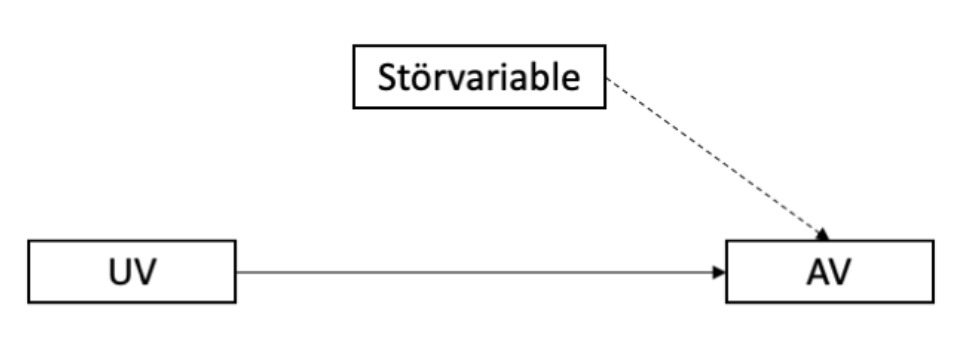
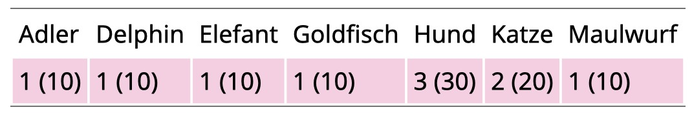

```{r setup, include=FALSE}
library(learnr)
library(psych)
library(shiny)
library(faux)
library(tidyverse)
knitr::opts_chunk$set(echo = FALSE)
```

## Willkommen

### Was können Sie von dieser Übung erwarten?

Wir möchten Ihnen eine erste Möglichkeit geben, sich mit dem Statistikprogramm `R` vertraut zu machen. 

Dazu verwenden wir das Paket `learnr`. 

Dieses Paket gibt uns die Möglichkeit, `R` Aufgaben direkt über Ihren Browser zu üben. Dafür müssen Sie die Programme `R` und `RStudio` nicht auf dem eigenen Computer installieren. 

Zunächst erhalten Sie eine Einführung in die grundlegende Funktionalität von `R`. So können Sie im Verlauf des Semesters die gelernten statistischen Analysen direkt in `R` ausprobieren.

Zusätzlich finden Sie im Rahmen der Lektionen Quizaufgaben, um Ihr Wissen zu überprüfen. 


```{r eval = TRUE, echo = F, out.width = "150px", fig.align='center'}
knitr::include_graphics("images/R_logo.png")
```


## Einheit 1 - 

```{r}
# hinter jede Einheit den Titel
# Qquizfragen alle Einheiten aus Muster
# QM1 spezifische Aufgaben hinzufügen - Interpretieren..
# publishen 
# in studynet verlinken 
```


```{r quiz1_1, echo = FALSE}
quiz(
  question("Wofuer ist das Alter einer Versuchsperson ein Beispiel?",
    answer("Datensatz"),
    answer("Datenbank"),
    answer("Statistik"),
    answer("Daten", correct = TRUE), allow_retry = TRUE
  )
    )
```

```{r quiz1_2, echo = FALSE}
quiz(
  question("Was sind Vorteile digitaler Datenanalyse?",
    answer("Es können große Datensätze verarbeitet werden", correct = TRUE),
    answer("Kommt zu besseren Ergebnissen"),
    answer("Es werden weniger Flüchtigkeitsfehler gemacht", correct = TRUE),
    answer("Iterationsbasierte Verfahren möglich", correct = TRUE), allow_retry = TRUE
  )
    )
```

```{r quiz1_3, echo = FALSE}
quiz(
  question("Was sind Kriterien für wissenschaftliche Hypothesen?",
    answer("Falsifizierbarkeit", correct = TRUE),
    answer("Finalsatz"),
    answer("empirisch untersuchbar", correct = TRUE),
    answer("Konditionalsatz", correct = TRUE), allow_retry = TRUE
  )
    )
```

```{r quiz1_4, echo = FALSE}
quiz(
  question("Welche sind wissenschaftliche Hypothesen?",
    answer("Manche depressive Patienten schlafen schlechter.", correct = TRUE),
    answer("Zwangspatienten machen häufiger sauber, als gesunde Kontrollprobanden."),
    answer("Es gibt Menschen, die zum pathologischen Grübeln neigen."),
    answer("Es besteht ein Zusammenhand zwischen Angst und sozialer Netzwerkgröße.", correct = TRUE), allow_retry = TRUE
  )
    )
```

```{r quiz1_5, echo = FALSE}
quiz(
  question("Bei welchen handelt es sich um gerichtete Hypothesen?",
    answer("Frauen sind besser als Männer in mentalen Rotationsaufgaben.", correct = TRUE),
    answer("Es besteht ein Zusammenhang zwischen Schlafproblemen und Agitiertheit."),
    answer("Wenn man mehr Stress ausgesetzt ist entwickelt man leichter eine Psychose", correct = TRUE),
    answer("Es besteht ein negativer Zusammenhang zwischen Vermeidungsverhalten und beruflichem Erfolg.", correct = TRUE), allow_retry = TRUE
  )
    )
```

```{r quiz1_6, echo = FALSE}
quiz(
  question("Gewicht [kg] ist eine..",
    answer("stetige Variable", correct = TRUE),
    answer("latente Variable"),
    answer("dichotome Variable"),
    answer("manifeste Variable", correct = TRUE), allow_retry = TRUE
  )
    )
```

```{r quiz1_7, echo = FALSE}
quiz(
  question("Welche der folgenden sind latente Variablen?",
    answer("Persönlichkeit", correct = TRUE),
    answer("Extraversion", correct = TRUE),
    answer("Zittern"),
    answer("Blutdruck"),
    answer("Einsamkeit", correct = TRUE)
    , allow_retry = TRUE
  )
    )
```

```{r quiz1_8, echo = FALSE}
quiz(
  question("In der Hypothese: <Männer schlafen morgens länger als Frauen.> ist Geschlecht die...",
    answer("Moderatorvariable"),
    answer("AV"),
    answer("Störvariable"),
    answer("UV", correct = TRUE), allow_retry = TRUE
  )
    )
```

```{r quiz1_9, echo = FALSE}
quiz(
  question("Welche Aussagen sind hinsichtlich der Population und Stichprobe korrekt?",
    answer("Population wird auch als Grundgesamtheit bezeichnet", correct = TRUE),
    answer("Population = Teilgruppe die das interessierende Merkmal hat."),
    answer("Population wird gezogen."),
    answer("Verteilung innerhalb der Population basiert auf Wahrscheinlichkeitsannahmen.", correct = TRUE),
    answer("Verteilung innerhalb der Stichprobe basiert auf Beobachtung.", correct = TRUE), allow_retry = TRUE
  )
    )
```

```{r quiz1_10, echo = FALSE}
quiz(
  question("Welche sind Maße der zentralen Tendenz?",
    answer("Varianz"),
    answer("Mittelwert", correct = TRUE),
    answer("t-Test"),
    answer("Standardabweichung"),
    answer("Median", correct = TRUE), allow_retry = TRUE
  )
    )
```

```{r quiz1_11, echo = FALSE}
quiz(
  question(" Was macht Inferenzstatistik?",
    answer("Die Daten beschreiben"),
    answer("Aussagen über die Population treffen", correct = TRUE),
    answer("Schließen von Population auf Stichprobe"),
    answer("Vorhersagen über die Stichprobe"), allow_retry = TRUE
  )
    )
```

```{r quiz1_12, echo = FALSE}
quiz(
  question("Was ist bezogen auf Hypothesen zutreffend?",
    answer("Die Nullhypothese besagt, dass der erwartete Effekt besteht"),
    answer("H1: Der hypothetisierte Effekt besteht", correct = TRUE),
    answer("Wir versuchen die H0 zu verwerfen", correct = TRUE),
    answer("Wir versuchen die H1 zu verwerfen"),
    answer("Der angenommene Effekt wird durch die Alternativhypothese ausgedrückt", correct = TRUE), allow_retry = TRUE
  )
    )
```

```{r quiz1_13, echo = FALSE}
quiz(
  question("Was ist zutreffend? <br> {width=400px}",
    answer("Störvariablen sind alle Einflussgrößen auf die AV, die in einer Untersuchung nicht erfasst werden", correct = TRUE),
    answer("Ziel ist es, Störvariablen möglichst zu kontrollieren und zu erfassen", correct = TRUE),
    answer("Bsp. im Sinne der Abbildung: Eine neue Unterrichtsmethode (UV) soll anhand des Notendurchschnitts (AV) evaluiert werden. Ein Teil der Klasse wiederholt das Jahr jedoch und es bleibt unberücksichtigt, dass sie den Stoff bereits im vergangenen Jahr durchgenommen haben.", correct = TRUE),
    answer("Bsp. im Sinne der Abbildung: Schulnote (UV) beeinflusst Selbstwertgefühl, Selbstwertgefühl beeinflusst Lebenszufriedenheit (AV)"), allow_retry = TRUE
  )
    )
```

```{r quiz1_14, echo = FALSE}
quiz(
  question("Wir fertigen nach einer Befragung zu Lieblingshaustieren folgende Tabelle an. Welche Aussagen sind zutreffend? <br> {width=400px}",
    answer("20 Personen gaben an, dass Katzen ihre Lieblingshaustiere seien"),
    answer("Hund = Modus", correct = TRUE),
    answer("30% der befragten Personen gaben an, dass Hunde ihre Lieblingshaustiere seien", correct = TRUE),
    answer("N = 100"),
    answer("N = 10", correct = TRUE), allow_retry = TRUE
  )
    )
```


## Einheit 2

## Einheit 3

## Einheit 4

## Einheit 5

## Einheit 6

## Einheit 7

## Einheit 8

## Einheit 9

## Einheit 10

## Einheit 11

## Einheit 12

## Einheit 13
