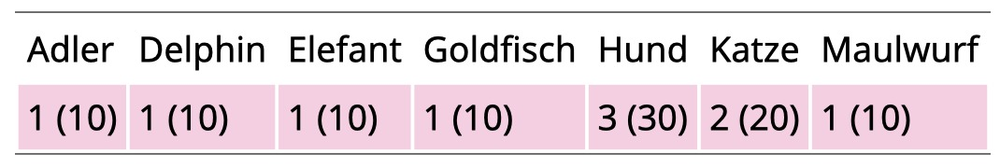

Question
========
Wir fertigen nach einer Befragung zu Lieblingshaustieren folgende Tabelle an. Welche Aussagen sind zutreffend?

{width=400px}

Answerlist
----------
* 20 Personen gaben an, dass Katzen ihre Lieblingshaustiere seien.
* "Hund" ist der Modus.
* 30% der befragten Personen gaben an, dass Hunde ihre Lieblingshaustiere seien.
* N=100
* N=10

Solution
========

Answerlist
----------
* Falsch. 2 Personen
* Richtig. "Hund" war der häufigste Wert.
* Richtig. Es handelt sich um die relative Häufigkeit.
* Falsch. Die Gesamtzahl der Antworten (Personen) war nicht 100.
* Richtig. Die Gesamtzahl der Antworten (Personen) war 10.

Meta-information
================
exname: Haeufigkeitstabelle
extype: mchoice 
exsolution: 01101
exshuffle: TRUE