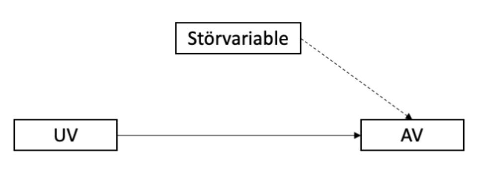

Question
========
Was ist zutreffend?

{width=400px}

Answerlist
----------
* Störvariablen sind alle Einflussgrößen auf die AV, die in einer Untersuchung nicht erfasst werden.
* Ziel ist es, Störvariablen möglichst zu kontrollieren.
* Abbildung: Bei der Messung der Mathekompetenz mit einem Test sind Umgebungsgeräusche eine potentielle Störvariable.
* Abbildung: Bei der Messung der Mathekompetenz mit einem Test ist die Schwierigkeit der Aufgaben eine potentielle Störvariable.

Solution
========

Answerlist
----------
* Richtig. 
* Richtig. Dafür müssen wir sie im Studiendesign kontrollieren oder mitmessen und herausrechnen.
* Richtig. Korrekt, wenn nur manche Studierenden den Geräuschen ausgesetzt sind oder mehr/weniger empfindlich darauf reagieren.
* Falsch. Solange alle den selben Test schreiben, ist die Schwierigkeit der Aufgaben keine Störvariable.

Meta-information
================
exname: Stoervariable
extype: mchoice 
exsolution: 1110
exshuffle: TRUE