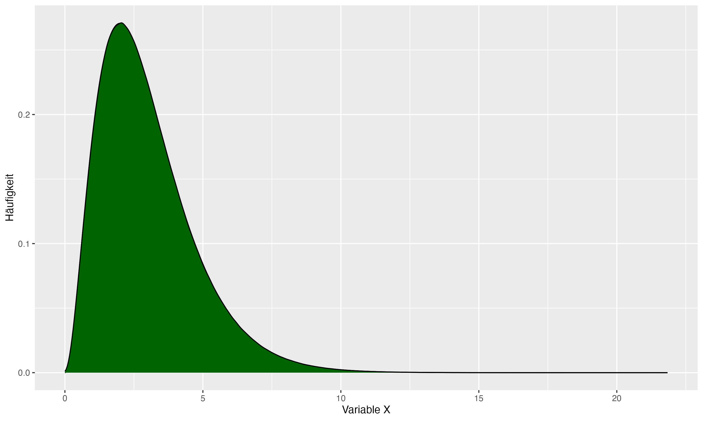

Question 
======== 

Sie analysieren und visualisieren Daten und erhalten folgende Verteilung:

{width=600px}

```{r graph, echo=FALSE, message=FALSE, warning=FALSE, fig.height=2, fig.width=2}
set.seed(123)
shape <- 2 
scale <- 1
n <- 100000
data <- rgamma(n, shape = shape, scale = scale)
df = data.frame(x = data)

graph = ggplot(data = df, aes(x = x)) +
  stat_function(fun = dgamma, n = 10000, args = list(shape = shape, scale = scale)) +
  geom_density(fill = "darkgreen", color = "black") + 
  labs(x = "Variable X", y = "Häufigkeit")

plot(graph)
```


Welche der folgenden Aussagen treffen zu?

Answerlist
----------

* Wir sehen hier eine rechtssteile Verteilung
* Wir sehen hier eine rechtsschiefe Verteilung
* Die Verteilung ist unimodal 
* Die Verteilung ist symmetrisch 
* Mittelwert, Median und Modus verhalten sich: Modalwert < Median < Mittelwert

Solution
========

Answerlist
----------

* Falsch. Die Verteilung ist linkssteil / rechtsschief 
* Richtig. Die Verteilung ist linkssteil / rechtsschief 
* Richtig. 
* Falsch. Diese Verteilung ist nicht symmetrisch
* Richtig. Bei einer linkssteilen Verteilung gilt: Modus < Median < Mittelwert. Bei einer rechtssteilen Verteilung gilt: Mittelwert < Median < Modalwert

Meta-information
================
exname: name
extype: mchoice 
exsolution: 01101
exshuffle: TRUE
