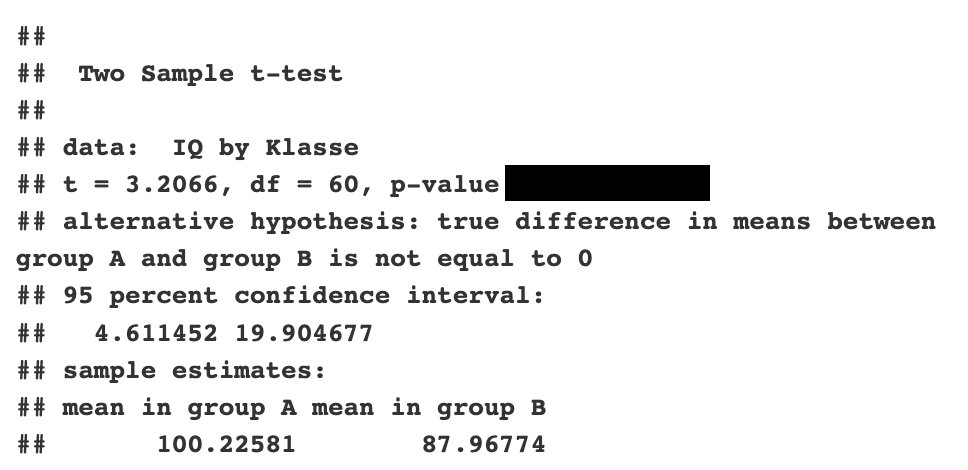

```{r simulation, include=FALSE}
set.seed(1234)

N = 62
df = data.frame(IQ = c(round(rnorm(N/2, 104, 15),0), round(rnorm(N/2, 95, 15))),Klasse = c(rep("A", N/2), rep("B", N/2)))    

t = t.test(IQ ~ Klasse, data = df, var.equal = T)


```


Question 
======== 

Welche Aussagen zu folgendem Output stimmen? 

{width=400px}


Answerlist
----------

* Es wurde eine einseitige Hypothese überprüft 
* Der Test zeigt ein signifikantes Ergebnis 
* Ohne den p-Wert können wir keine Aussage darüber geben, ob der Test signifikant ist
* Der Test wurde nicht signifikant
* Wir sehen den Output eines abhängigen t-Tests


Solution
========

Answerlist
----------

* Falsch. Es wurde eine zweiseitige Hypothese überprüft. Wir erkennen dies an "true difference in means between group A and group B is not equal to 0." Bei einer einseitigen Hypothese zeigt uns der Output entweder "...is greater than 0" oder "...is less than 0" 
* Richtig. Anhand des Konfidenzintervalls können wir auch ohne den p-Wert erkennen, dass der Test signifikant ist. Bei einem nicht signifikanten Ergebnis würde das KI die 0 enthalten.
* Falsch. Anhand des Konfidenzintervalls können wir auch ohne den p-Wert erkennen, dass der Test signifikant ist. Bei einem nicht signifikanten Ergebnis würde das KI die 0 enthalten.
* Falsch.
* Falsch. Wir sehen den Output eines unabhängigen t-Tests (Two sample t-test), keinen abhängigen t-Test (Paired t-test) 

Meta-information
================
exname: laplace_probability_explanation
extype: mchoice 
exsolution: 01000
exshuffle: TRUE
