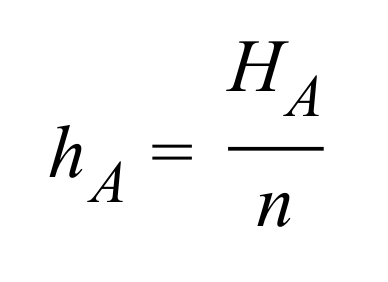
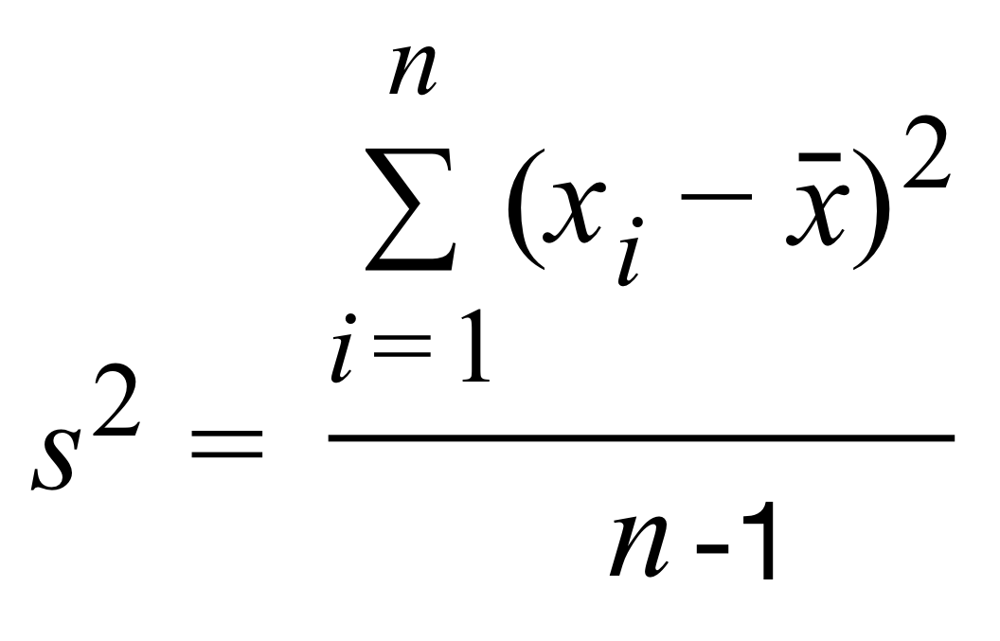
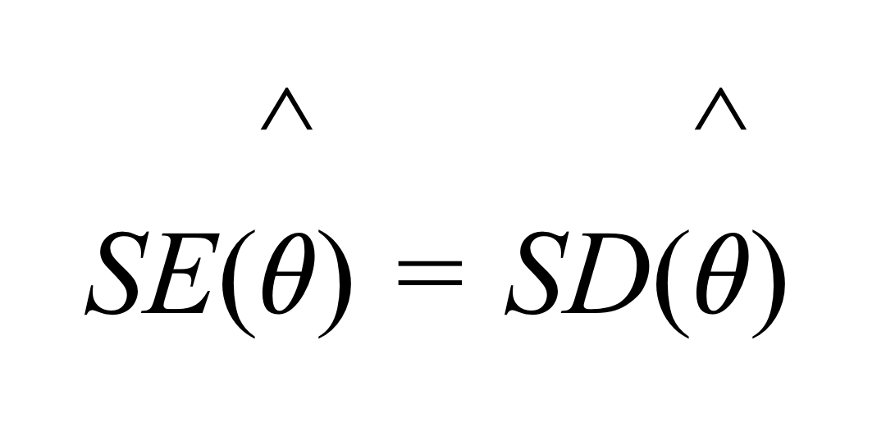

```{r setup, include=FALSE}
library(learnr)
library(psych)
library(shiny)
library(faux)
library(tidyverse)
library(exams2learnr)
library(knitr)
library(moments)
library(magrittr)
library(kableExtra)
library(ggplot2)
knitr::opts_chunk$set(echo = FALSE)
```

## Willkommen

### Was können Sie von dieser Übung erwarten?

Im Folgenden finden Sie Übungsaufgaben zur Vorlesung Statistik I (B-P 9.3-VO) im Modul Quantitative Methoden I (B-P 9.3).

Dazu verwenden wir das Paket `learnr`.

Dieses Paket gibt uns u.a. die Möglichkeit, `R` Aufgaben direkt über Ihren Browser zu üben. Sie müssen dafür die Programme `R` und `RStudio` nicht auf dem eigenen Computer installieren.

Zusätzlich finden Sie im Rahmen der Lektionen Quizaufgaben, um Ihr Wissen zu überprüfen.

```{r eval = TRUE, echo = F, out.width = "150px", fig.align='center'}
knitr::include_graphics("images/R_logo.png")
```

## Einheit 1 - Grundlagen der Datenanalyse

```{r xx, eval=FALSE, include=FALSE}
# Quizfragen alle Einheiten aus Muster
# QM1 spezifische Aufgaben hinzufügen - Interpretieren..
# Evtl Aufgaben LMU hinzufügen? 
```

```{r VO1_MC_Alter, message = FALSE, warning=FALSE}
exams2learnr("Questions/VO_01/VO1_MC_Alter.Rmd", allow_retry = TRUE)
```

```{r VO1_MC_Digitale, message = FALSE, warning=FALSE}
exams2learnr("Questions/VO_01/VO1_MC_Digitale.Rmd", allow_retry = TRUE)
```

```{r VO1_MC_Hypothesen1, message = FALSE, warning=FALSE}
exams2learnr("Questions/VO_01/VO1_MC_Hypothesen1.Rmd", allow_retry = TRUE)
```

```{r VO1_MC_Hypothesen2, message = FALSE, warning=FALSE}
exams2learnr("Questions/VO_01/VO1_MC_Hypothesen2.Rmd", allow_retry = TRUE)
```

```{r VO1_MC_Hypothesen3, message = FALSE, warning=FALSE}
exams2learnr("Questions/VO_01/VO1_MC_Hypothesen3.Rmd", allow_retry = TRUE)
```

```{r VO1_MC_Variablenarten1, message = FALSE, warning=FALSE}
exams2learnr("Questions/VO_01/VO1_MC_Variablenarten1.Rmd", allow_retry = TRUE)
```

```{r VO1_MC_Variablenarten2, message = FALSE, warning=FALSE}
exams2learnr("Questions/VO_01/VO1_MC_Variablenarten2.Rmd", allow_retry = TRUE)
```

```{r VO1_MC_StichprobePopulation, message = FALSE, warning=FALSE}
exams2learnr("Questions/VO_01/VO1_MC_StichprobePopulation.Rmd", allow_retry = TRUE)
```

```{r VO1_MC_ZentraleTendenz, message = FALSE, warning=FALSE}
exams2learnr("Questions/VO_01/VO1_MC_ZentraleTendenz.Rmd", allow_retry = TRUE)
```

```{r VO1_MC_Inferenzstatistik, message = FALSE, warning=FALSE}
exams2learnr("Questions/VO_01/VO1_MC_Inferenzstatistik.Rmd", allow_retry = TRUE)
```

```{r VO1_MC_Hypothesen4, message = FALSE, warning=FALSE}
exams2learnr("Questions/VO_01/VO1_MC_Hypothesen4.Rmd", allow_retry = TRUE)
```

```{r VO1_MC_Stoervariable, message = FALSE, warning=FALSE}
exams2learnr("Questions/VO_01/VO1_MC_Stoervariable.Rmd", allow_retry = TRUE)
```

```{r VO1_MC_Haeufigkeitstabelle, message = FALSE, warning=FALSE}
exams2learnr("Questions/VO_01/VO1_MC_Haeufigkeitstabelle.Rmd", allow_retry = TRUE)
```

```{r VO1_Num_Summe1, message = FALSE, warning=FALSE}
exams2learnr("Questions/VO_01/VO1_Num_Summe1.Rmd", allow_retry = TRUE)
```

```{r VO1_Num_Summe2, message = FALSE, warning=FALSE}
exams2learnr("Questions/VO_01/VO1_Num_Summe2.Rmd", allow_retry = TRUE)
```

```{r VO1_MC_RelativeHaeufigkeit, message = FALSE, warning=FALSE}
exams2learnr("Questions/VO_01/VO1_MC_RelativeHaeufigkeit.Rmd", allow_retry = TRUE)
```

```{r VO1_MC_AbsoluteHaeufigkeit, message = FALSE, warning=FALSE}
exams2learnr("Questions/VO_01/VO1_MC_AbsoluteHaeufigkeit.Rmd", allow_retry = TRUE)
```

## Einheit 2 - Skalenniveaus und statistische Kennwerte

```{r VO2_MC_Messen, message = FALSE, warning=FALSE}
exams2learnr("Questions/VO_02/VO2_MC_Messen.Rmd", allow_retry = TRUE)
```

```{r VO2_MC_Skalenniveau, message = FALSE, warning=FALSE}
exams2learnr("Questions/VO_02/VO2_MC_Skalenniveau.Rmd", allow_retry = TRUE)
```

```{r VO2_MC_Fussballteam, message = FALSE, warning=FALSE}
exams2learnr("Questions/VO_02/VO2_MC_Fussballteam.Rmd", allow_retry = TRUE)
```

```{r VO2_MC_IQ, message = FALSE, warning=FALSE}
exams2learnr("Questions/VO_02/VO2_MC_IQ.Rmd", allow_retry = TRUE)
```

```{r VO2_MC_Mittelwert, message = FALSE, warning=FALSE}
exams2learnr("Questions/VO_02/VO2_MC_Mittelwert.Rmd", allow_retry = TRUE)
```

```{r VO2_MC_Zentrale, message = FALSE, warning=FALSE}
exams2learnr("Questions/VO_02/VO2_MC_Zentrale.Rmd", allow_retry = TRUE)
```

```{r VO2_MC_Verhaeltnis, message = FALSE, warning=FALSE}
exams2learnr("Questions/VO_02/VO2_MC_Verhaeltnis.Rmd", allow_retry = TRUE)
```

```{r VO2_MC_Nominal, message = FALSE, warning=FALSE}
exams2learnr("Questions/VO_02/VO2_MC_Nominal.Rmd", allow_retry = TRUE)
```

```{r VO2_MC_Modalwert, message = FALSE, warning=FALSE}
exams2learnr("Questions/VO_02/VO2_MC_Modalwert.Rmd", allow_retry = TRUE)
```

```{r VO2_MC_Median, message = FALSE, warning=FALSE}
exams2learnr("Questions/VO_02/VO2_MC_Median.Rmd", allow_retry = TRUE)
```

```{r VO2_MC_Urliste, message = FALSE, warning=FALSE}
exams2learnr("Questions/VO_02/VO2_MC_Urliste.Rmd", allow_retry = TRUE)
```

```{r VO2_MC_Aussagen, message = FALSE, warning=FALSE}
exams2learnr("Questions/VO_02/VO2_MC_Aussagen.Rmd", allow_retry = TRUE)
```

```{r VO2_MC_Was_trifft_zu, message = FALSE, warning=FALSE}
exams2learnr("Questions/VO_02/VO2_MC_Was_trifft_zu.Rmd", allow_retry = TRUE)
```

```{r VO2_MC_Welche_Aussagen, message = FALSE, warning=FALSE}
exams2learnr("Questions/VO_02/VO2_MC_Welche_Aussagen_Stimmen.Rmd", allow_retry = TRUE)
```

## Einheit 3 - Statistische Kennwerte (2)

```{r VO3_MC_Streuungsmasse, message = FALSE, warning=FALSE}
exams2learnr("Questions/VO_03/VO3_MC_Streuungsmaße.Rmd", allow_retry = TRUE)
```

```{r VO3_MC_Unimodal, message = FALSE, warning=FALSE}
exams2learnr("Questions/VO_03/VO3_MC_Unimodal.Rmd", allow_retry = TRUE)
```

```{r VO3_MC_Spannweite2, message = FALSE, warning=FALSE}
exams2learnr("Questions/VO_03/VO3_MC_Spannweite2.Rmd", allow_retry = TRUE)
```

```{r VO3_MC_Standardabweichung, message = FALSE, warning=FALSE}
exams2learnr("Questions/VO_03/VO3_MC_Standardabweichung.Rmd", allow_retry = TRUE)
```

```{r VO3_MC_Varianz, message = FALSE, warning=FALSE}
exams2learnr("Questions/VO_03/VO3_MC_Varianz.Rmd", allow_retry = TRUE)
```

```{r VO3_MC_Varianz2, message = FALSE, warning=FALSE}
exams2learnr("Questions/VO_03/VO3_MC_Varianz2.Rmd", allow_retry = TRUE)
```

```{r VO3_MC_Varianz3, message = FALSE, warning=FALSE}
exams2learnr("Questions/VO_03/VO3_MC_Varianz3.Rmd", allow_retry = TRUE)
```

```{r VO3_MC_Spannweite, message = FALSE, warning=FALSE}
exams2learnr("Questions/VO_03/VO3_MC_Spannweite.Rmd", allow_retry = TRUE)
```

```{r VO3_MC_Aussagen, message = FALSE, warning=FALSE}
exams2learnr("Questions/VO_03/VO3_MC_Aussagen.Rmd", allow_retry = TRUE)
```

```{r VO3_MC_Werte, message = FALSE, warning=FALSE}
exams2learnr("Questions/VO_03/VO3_MC_Werte.Rmd", allow_retry = TRUE)
```

```{r VO3_MC_Leistungstest, message = FALSE, warning=FALSE}
exams2learnr("Questions/VO_03/VO3_MC_Leistungstest.Rmd", allow_retry = TRUE)
```

```{r VO3_Num_rechnen1, message = FALSE, warning=FALSE}
exams2learnr("Questions/VO_03/VO3_Num_rechnen1_.Rmd", allow_retry = TRUE)
```

```{r VO3_Num_Rechnen2, message = FALSE, warning=FALSE}
exams2learnr("Questions/VO_03/VO3_Num_Rechnen2.Rmd", allow_retry = TRUE)
```

**Sie analysieren und visualisieren Daten und erhalten folgende Verteilung:**

```{r graph, echo=FALSE}
set.seed(123)
shape <- 2 
scale <- 1
n <- 100000
data <- rgamma(n, shape = shape, scale = scale)
df = data.frame(x = data)

ggplot(data = df, aes(x = x)) +
  stat_function(fun = dgamma, n = 10000, args = list(shape = shape, scale = scale)) +
  geom_density(fill = "darkgreen", color = "black") + 
  labs(x = "Variable X", y = "Häufigkeit")

```

```{r VO3_Graph, message = FALSE, warning=FALSE}
exams2learnr("Questions/VO_03/VO3_Graph.Rmd", allow_retry = TRUE)
```

## Einheit 4 - Visualisierung

```{r VO4_1, message = FALSE, warning=FALSE}
exams2learnr("Questions/VO_04/VO4_Histogramm.Rmd", allow_retry = TRUE)
```

```{r VO4_2, message = FALSE, warning=FALSE}
exams2learnr("Questions/VO_04/VO4_Boxplot.Rmd", allow_retry = TRUE)
```

```{r VO4_3, message = FALSE, warning=FALSE}
exams2learnr("Questions/VO_04/VO4_Boxplot2.Rmd", allow_retry = TRUE)
```

```{r VO4_4, message = FALSE, warning=FALSE}
exams2learnr("Questions/VO_04/VO4_Streudiagramm.Rmd", allow_retry = TRUE)
```

```{r VO4_5, message = FALSE, warning=FALSE}
exams2learnr("Questions/VO_04/VO4_Whisker.Rmd", allow_retry = TRUE)
```

```{r VO4_6, message = FALSE, warning=FALSE}
exams2learnr("Questions/VO_04/VO4_Streudiagramm2.Rmd", allow_retry = TRUE)
```

```{r VO4_7, message = FALSE, warning=FALSE}
exams2learnr("Questions/VO_04/VO4_Graph.Rmd", allow_retry = TRUE)
```

```{r VO4_8, message = FALSE, warning=FALSE}
exams2learnr("Questions/VO_04/VO4_YAchse.Rmd", allow_retry = TRUE)
```

```{r VO4_9, message = FALSE, warning=FALSE}
exams2learnr("Questions/VO_04/VO4_Graphen.Rmd", allow_retry = TRUE)
```

```{r VO4_10, message = FALSE, warning=FALSE}
exams2learnr("Questions/VO_04/VO4_Aussagen.Rmd", allow_retry = TRUE)
```

**Welche Aussagen, bezogen auf die nachfolgende Grafik können Sie treffen?** 
```{r box, echo=FALSE}
set.seed(123)
N = 20
df8 = data.frame(ID = c(1:N),
                Gruppe = c(rep("A", N/2), rep("B", N/2)),
                Tremor = round(c(rnorm(N/2, 6, 5), rnorm(N/2, 12, 8))))

#box = boxplot(Tremor ~ Entzug, data = df, cex.lab = 2.5, cex.axis = 2.5)

ggplot2::ggplot(data = df8, aes(x = Gruppe, y = Tremor)) + 
                  geom_boxplot()
```
```{r VO4_11, message = FALSE, warning=FALSE}
exams2learnr("Questions/VO_04/VO4_Boxplot4.Rmd", allow_retry = TRUE)
```

```{r VO4_12, message = FALSE, warning=FALSE}
exams2learnr("Questions/VO_04/VO4_Balken.Rmd", allow_retry = TRUE)
```

```{r VO4_13, message = FALSE, warning=FALSE}
exams2learnr("Questions/VO_04/VO4_13.Rmd", allow_retry = TRUE)
```


## Einheit 5 - Stichprobe, Grundgesamtheit - Wahrscheinlichkeitstheorie und Verteilungen

```{r VO5_1, message = FALSE, warning=FALSE}
exams2learnr("Questions/VO_05/VO5_1.Rmd", allow_retry = TRUE)
```

```{r VO5_2, message = FALSE, warning=FALSE}
exams2learnr("Questions/VO_05/VO5_2.Rmd", allow_retry = TRUE)
```

```{r VO5_3, message = FALSE, warning=FALSE}
exams2learnr("Questions/VO_05/VO5_3.Rmd", allow_retry = TRUE)
```

```{r VO5_4, message = FALSE, warning=FALSE}
exams2learnr("Questions/VO_05/VO5_4.Rmd", allow_retry = TRUE)
```

```{r VO5_5, message = FALSE, warning=FALSE}
exams2learnr("Questions/VO_05/VO5_5.Rmd", allow_retry = TRUE)
```

```{r VO5_6, message = FALSE, warning=FALSE}
exams2learnr("Questions/VO_05/VO5_6.Rmd", allow_retry = TRUE)
```

```{r VO5_7, message = FALSE, warning=FALSE}
exams2learnr("Questions/VO_05/VO5_7.Rmd", allow_retry = TRUE)
```

```{r VO5_8, message = FALSE, warning=FALSE}
exams2learnr("Questions/VO_05/VO5_8.Rmd", allow_retry = TRUE)
```

```{r VO5_9, message = FALSE, warning=FALSE}
exams2learnr("Questions/VO_05/VO5_9.Rmd", allow_retry = TRUE)
```

```{r VO5_10, message = FALSE, warning=FALSE}
exams2learnr("Questions/VO_05/VO5_10.Rmd", allow_retry = TRUE)
```

```{r VO5_11, message = FALSE, warning=FALSE}
exams2learnr("Questions/VO_05/VO5_11.Rmd", allow_retry = TRUE)
```

```{r VO5_12, message = FALSE, warning=FALSE}
exams2learnr("Questions/VO_05/VO5_12.Rmd", allow_retry = TRUE)
```

```{r VO5_13, message = FALSE, warning=FALSE}
exams2learnr("Questions/VO_05/VO5_13.Rmd", allow_retry = TRUE)
```

```{r VO5_14, message = FALSE, warning=FALSE}
exams2learnr("Questions/VO_05/VO5_14.Rmd", allow_retry = TRUE)
```

```{r VO5_15, message = FALSE, warning=FALSE}
exams2learnr("Questions/VO_05/VO5_15.Rmd", allow_retry = TRUE)
```

```{r VO5_16, message = FALSE, warning=FALSE}
exams2learnr("Questions/VO_05/VO5_16.Rmd", allow_retry = TRUE)
```


## Einheit 6 - Schätzungen und Stichprobenfehler

```{r VO6_16, message = FALSE, warning=FALSE}
#exams2learnr("Questions/VO_06/VO6_16.Rmd", allow_retry = TRUE)
```


```{r quiz6_1, echo = FALSE}
quiz(
  question("Die Population...",
    answer("wird verwendet um auf Grundgesamtheit zu schließen."),
    answer("Wird auch Grundgesamtheit genannt.", correct = TRUE),
    answer("Ist eine zufällige Auswahl bestimmter Merkmalsträger:innen."),
    answer("...ist die Gesamtheit aller Merkmalsträger:innen, auf die eine Untersuchungsfrage gerichtet ist", correct = TRUE),
    allow_retry = TRUE
  )
    )
```

```{r quiz6_2, echo = FALSE}
quiz(
  question("Was sind häufig auftretende Probleme beim Ziehen von Zufallsstichproben?",
    answer("Unterschiedliche Skalenniveaus."),
    answer("Fehlende Repräsentativität", correct = TRUE),
    answer("Eine bestimmte Teilgruppe von Personen in der Population hat eine höhere Wahrscheinlichkeit, in die Stichprobe gezogen zu werden, als andere Personen.", correct = TRUE),
    answer("Unabhängigkeit der Ziehungen"),
    allow_retry = TRUE
  )
    )
```

```{r quiz6_3, echo = FALSE}
quiz(
  question("μ>100 ist ein Beispiel für...",
    answer("...eine Streuungsschätzung."),
    answer("...eine Parameterschätzung."),
    answer("...eine Hypothese, die mittels Hypothesentest überprüft werden kann.", correct = TRUE),
    answer("...eine Intervallschätzung."),
    allow_retry = TRUE
  )
    )
```

```{r quiz6_4, echo = FALSE}
quiz(
  question("Was ist ein naheliegender Schätzwert für π (Auftretenswahrscheinlichkeit in der Population)?",
    answer("relative Häufigkeit in der Stichprobe", correct = TRUE),
    answer("Mittelwert in der Stichprobe"),
    answer("Varianz in der Stichprobe"),
    answer("Median in der Stichprobe"),
    allow_retry = TRUE
  )
    )
```

```{r quiz6_5, echo = FALSE}
quiz(
  question("Was ist hinsichtlich Schätzfunktionen zutreffend?",
    answer("Realisation einer Schätzfunktion nennt sich Schätzwert.", correct = TRUE),
    answer("Schätzfunktionen sind Ergebnisse eines Hypothesentests."),
    answer("Zufallsvariable, die jedem möglichen Ergebnis des Zufallsexperiments den aus ihr berechneten Schätzwert zuweist.", correct = TRUE),
    answer("Sind Ergebnisse in der Stichprobe"),
    allow_retry = TRUE
  )
    )
```

```{r quiz6_6, echo = FALSE}
quiz(
  question("Was sind die Gütekriterien einer Schätzfunktion",
    answer("Erwartungstreue (und Genauigkeit)", correct = TRUE),
    answer("Effizienz", correct = TRUE),
    answer("Konsistenz", correct = TRUE),
    answer("Objektivität"),
    allow_retry = TRUE
  )
    )
```

```{r quiz6_7, echo = FALSE}
quiz(
  question("Was versteht man unter der Genauigkeit einer Schätzfunktion?",
    answer("Das ein möglichst großes Intervall bei der Schätzung herauskommt."),
    answer("Dass sie zu möglichst „präzisen“ oder „genauen“ Schätzungen führen sollte.", correct = TRUE),
    answer("Dass die Schätzwerte bei unendlicher Wiederholung des Zufallsexperiments im Mittel dem wahren Parameterwert entsprechen sollten"),
    answer("Dass der Standardfehler bei wachsendem Stichprobenumfang immer kleiner wird."),
    allow_retry = TRUE
  )
    )
```

```{r quiz6_8, echo = FALSE}
quiz(
  question("Was sind Vorteile der Standardnormalverteilung?",
    answer("Sie ist symmetrischer als die Normalverteilung."),
    answer("Erwartungswert liegt bei 1 und Standardabweichung bei 0."),
    answer("Wahrscheinlichkeit für jeden z-Wert kann abgelesen werden.", correct = TRUE),
    answer("Quantile der Standardnormalverteilung sind tabelliert.", correct = TRUE),
    allow_retry = TRUE
  )
    )
```

```{r quiz6_9, echo = FALSE}
quiz(
  question("Wovon hängt die Breite des Konfidenzintervalls ab?",
    answer("N", correct = TRUE),
    answer("Streuung", correct = TRUE),
    answer("Median"),
    answer("Signifikanzniveau", correct = TRUE),
    answer("Mittelwert"),
    allow_retry = TRUE
  )
    )
```

```{r quiz6_10, echo = FALSE}
quiz(
  question("Was ist mit Bezug auf die t-Verteilung korrekt?",
    answer("Ist Populationsvarianz jedoch nicht bekannt und muss geschätzt werden, dann ist der Quotient nicht standardnormalverteilt sondern t-verteilt", correct = TRUE),
    answer("Die Form der t-Verteilung ist mitbestimmt durch Freiheitsgrade.", correct = TRUE),
    answer("t-werte sind Quotienten aus zwei Varianzen."),
    answer("Sie approximiert die NV mit zunehmender Stichprobengröße.", correct = TRUE),
    answer("Die t-Verteilung ist wie die NV eingipfelig und symmetrisch", correct = TRUE),
    allow_retry = TRUE
  )
    )
```

```{r quiz6_11, echo = FALSE}
quiz(
  question("Was ist hinsichtlich des Standardfehlers korrekt?",
    answer("SE = Streuung der Stichprobenkennwerteverteilung", correct = TRUE),
    answer("Je größer N, desto kleiner fällt er aus", correct = TRUE),
    answer("Je größer σ in der Population, desto kleiner fällt er aus"),
    answer("Er ist ein Maß für die Genauigkeit der Schätzung", correct = TRUE),
    answer("Die Größe unserer Stichprobe hat keinen Einfluss auf den SE"),
    allow_retry = TRUE
  )
    )
```

```{r quiz6_12, echo = FALSE}
quiz(
  question("Was trifft auf das Ziehen einer einfachen Zufallsstichprobe zu?",
    answer("Der Vorgang ist ein Zufallsexperiment", correct = TRUE),
    answer("Ein Teil der Population hat eine größere Wahrscheinlichkeit in die Stichprobe gezogen zu werden"),
    answer("Wenn die Ziehung einer Person die Wahrscheinlichkeit der Ziehung einer anderen Person beeinflusst, können wir nicht mehr von einer einfachen Zufallsstichprobe sprechen", correct = TRUE),
    answer("Ziehen einer Zufallsstichprobe = Zufällige Zuteilung den Personen einer Gruppe zu Eigenschaften", correct = TRUE),
    allow_retry = TRUE
  )
    )
```

```{r quiz6_13, echo = FALSE}
quiz(
  question("Welche Aussagen sind korrekt? ",
    answer("Das Ergebnis einer Punktschätzung ist ein Intervall von Zahlen"),
    answer("Beispiel einer Punktschätzung: Wir gehen auf Basis unserer Stichprobe davon aus, dass der Parameter π gleich 0.45 ist", correct = TRUE),
    answer("Beispiel einer Intervallschätzung: Wir gehen auf Basis unserer Stichprobe davon aus, dass die relative Häufigkeit der uns interessierenden Messwertausprägung in der Population gleich 0.43 ist"),
    answer("Das Ergebnis einer Punktschätzung ist eine konkrete Zahl", correct = TRUE),
    allow_retry = TRUE
  )
    )
```

```{r quiz6_14, echo = FALSE}
quiz(
  question("Welche Formel aus der Deskriptivstatistik verwenden wir als erwartungstreue Schätzung der Populationsvarianz? ",
    answer("{width=200px}"),
    answer("{width=200px}", correct = TRUE),
    answer("{width=200px}"),
    allow_retry = TRUE
  )
    )
```

```{r quiz6_15, echo = FALSE}
quiz(
  question("Was versteht man unter Konsistenz einer Schätzfunktion?",
    answer("Mit wachsendem Stichprobenumfang sollte die Schätzfunktion immer genauer werden", correct = TRUE),
    answer("Die Schätzfunktion sollte einen geringeren Standardfehler als alle anderen erwartungstreuen Schätzfunktionen aufweisen"),
    answer("{width=200px}", correct = TRUE),
    answer("{width=200px}"),
    allow_retry = TRUE
  )
    )
```

## Einheit 7 - Hypothesen und Hypothesentests

```{r quiz7_1, echo = FALSE}
quiz(
  question("Die Nullhypothese",
    answer("Beinhaltet oft die neue Annahme, den angenommenen Effekt."),
    answer("Ist das Gegenstück zur eigentlichen Untersuchungshypothese", correct = TRUE),
    answer("Drückt eine Unterschiedlichkeit von einem Referenzwert aus"),
    answer("Stellt meistens den aktuellen Zustand oder anders ausgedrückt den „Standard“ dar, gegen den getestet wird", correct = TRUE),
    allow_retry = TRUE
  )
    )
```

```{r quiz7_2, echo = FALSE}
quiz(
  question("<Taxifahrer haben einen besseren Orientierungssinn als Nicht-Taxisfahrer> ist eine ",
    answer("einseitige H0"),
    answer("ungerichtete H1"),
    answer("gerichtete H1", correct = TRUE),
    answer("zweiseitige H0"),
    allow_retry = TRUE
  )
    )
```

```{r quiz7_3, echo = FALSE}
quiz(
  question("Zur Prüfung der Hypothese <Es besteht ein Unterschied zwischen Frauen und Männern hinsichtlich der mentalen Drehung im 3D Raum> benötigt man",
    answer("einen linksseitigen Test"),
    answer("einen zweiseitigen Test", correct = TRUE),
    answer("einen rechtsseitigen Test"),
    answer("einen einseitigen Test"),
    allow_retry = TRUE
  )
    )
```

```{r quiz7_4, echo = FALSE}
quiz(
  question("Wie und wann sollten Hypothesen formuliert werden?",
    answer("vor der eigenen Untersuchung", correct = TRUE),
    answer("mit Berücksichtigung der aktuellen Daten"),
    answer("aufgrund inhaltlicher Kriterien", correct = TRUE),
    answer("nach der Datenerhebung"),
    allow_retry = TRUE
  )
    )
```

```{r quiz7_5, echo = FALSE}
quiz(
  question("Der kritische Wert",
    answer("muss für ein signifikantes Ergebnis überschritten werden", correct = TRUE),
    answer("muss für ein signifikantes Ergebnis unterschritten werden"),
    answer("ist unabhängig vom Signifikanzniveau"),
    answer("ist bei t-Verteilung und z-Verteilung identisch"),
    allow_retry = TRUE
  )
    )
```

```{r quiz7_6, echo = FALSE}
quiz(
  question(" NV-Approximation der Binomialverteilung",
    answer("Ist bei kleinen Stichproben gegeben"),
    answer("erlaubt Gleichsetzung der NV Varianz mit np(1-p)",correct = TRUE),
    answer("Ist bei großen Stichproben gegeben",correct = TRUE),
    answer("erfordert eine Poisson Verteilung"),
    allow_retry = TRUE
  )
    )
```

```{r quiz7_7, echo = FALSE}
quiz(
  question("Der p-Wert...",
    answer("macht zusätzliche Prüfung erforderlich, wenn einseitige Hypothesen geprüft werden.", correct = TRUE),
    answer("gibt die Wahrscheinlichkeit für den Fehler erster Art an.", correct = TRUE),
    answer("muss durch 2 dividiert werden, wenn einseitiger p-Wert angegeben ist."),
    answer("hat den Vorteil, dass bei der Entscheidung keine Tabelle der Verteilung der Teststatistik benötigt wird", correct = TRUE),
    allow_retry = TRUE
  )
    )
```

```{r quiz7_8, echo = FALSE}
quiz(
  question("Was ist mit Bezug auf Fehler beim Hypothesentest korrekt?",
    answer("Fehler 1. Art ist, wenn die Nullhypothese fälschlicherweise beibehalten wird, obwohl die Alternativhypothese wahr ist"),
    answer("Fehler 2. Art ist, wenn die Nullhypothese fälschlicherweise beibehalten wird, obwohl die Alternativhypothese wahr ist", correct = TRUE),
    answer("alpha--Fehler ist, wenn die Nullhypothese fälschlicherweise verworfen wird und die Alternativhypothese angenommen wird", correct = TRUE),
    answer("Die statistische Power errechnet sich als 1-beta Fehlerwahrscheinlichkeit.", correct = TRUE),
    allow_retry = TRUE
  )
    )
```

```{r quiz7_9, echo = FALSE}
quiz(
  question("Wovon hängt die Teststärke (Power) ab?",
    answer("Signifikanzniveau", correct = TRUE),
    answer("Größe des Effekts", correct = TRUE),
    answer("Stichprobenumfang", correct = TRUE),
    answer("Ein- oder zweiseitige Alternativhypothese", correct = TRUE),
    allow_retry = TRUE
  )
    )
```

```{r quiz7_10, echo = FALSE}
quiz(
  question("Mit der Alpha-Fehler-Kumulierung ist gemeint, dass...",
    answer("Der Fehler 2. Art mit Anzahl der Test wahrscheinlicher wird"),
    answer("Die Testmacht sinkt"),
    answer("Der Fehler 1. Art mit Anzahl der Test wahrscheinlicher wird", correct = TRUE),
    answer("das Signifikanzniveau adjustiert werden muss", correct = TRUE),
    allow_retry = TRUE
  )
    )
```

```{r quiz7_11, echo = FALSE}
quiz(
  question("Welche sind korrekte Schritte beim Durchführen von Hypothesentests",
    answer("Aufstellen des Hypothesenpaars", correct = TRUE),
    answer("Entscheidung: Test ist signifikant, nicht-signifikant oder leicht-signifikant"),
    answer("Festlegung des Signifikanzniveaus", correct = TRUE),
    answer("Berechnen des Signifikanzniveaus"),
    answer("Vergleich kritischer Wert und empirischer (errechneter) Wert", correct = TRUE),
    allow_retry = TRUE
  )
    )
```

```{r quiz7_12, echo = FALSE}
quiz(
  question("Welche sind Beispiele für Teststatistiken?",
    answer("z-Wert", correct = TRUE),
    answer("t-Wert", correct = TRUE),
    answer("q-Wert"),
    answer("F-Wert", correct = TRUE),
    answer("r-Wert"),
    answer("χ2-Wert", correct = TRUE),
    allow_retry = TRUE
  )
    )
```

```{r quiz7_13, echo = FALSE}
quiz(
  question("Was sind Beispiele für gerichtete Hypothesen?",
    answer("Männer sind größer als Frauen", correct = TRUE),
    answer("Geld beeinflusst die Zufriedenheit von Menschen"),
    answer("Die Durchschnittseinkommen von Männern und Frauen unterscheiden sich"),
    answer("Eine Therapie kann depressive Symptome lindern"),
    allow_retry = TRUE
  )
    )
```

```{r quiz7_14, echo = FALSE}
quiz(
  question("Was sind Beispiele für ungerichtete Hypothesen?",
    answer("Eine Therapie kann depressive Symptome lindern"),
    answer("Geld beeinflusst die Zufriedenheit von Menschen", correct = TRUE),
    answer("Die Durchschnittseinkommen von Männern und Frauen unterscheiden sich", correct = TRUE),
    answer("Die Lebenszufriedenheit von Menschen die in Hamburg wohnen unterscheidet sich von der Lebenszufriedenheit von Menschen die in München wohnen", correct = TRUE),
    allow_retry = TRUE
  )
    )
```

```{r quiz7_15, echo = FALSE}
quiz(
  question("Was bedeutet ein Signifikanzniveau von α = .05",
    answer("Durch die 5% wird ein bestimmter Verwerfungsbereich festgelegt", correct = TRUE),
    answer("Wir erlauben uns eine 5%ige Wahrscheinlichkeit, einen α-Fehler zu begehen", correct = TRUE),
    answer("Wir erlauben uns eine 5%ige Wahrscheinlichkeit, unsere Hypothese fälschlicherweise abzulehnen"),
    answer("Ein Signifikanzniveau von α = .05 ist in der Wissenschaft eher unüblich"),
    allow_retry = TRUE
  )
    )
```

## Einheit 8 - *t*-Test

## Einheit 9 - *t*-Test (Übungsaufgaben Schritt-für-Schritt)

## Einheit 10 - Korrelation

## Einheit 11 - Korrelation (2)

## Einheit 12 - Effektstärke und Powerberechnung
