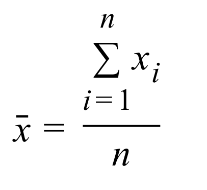
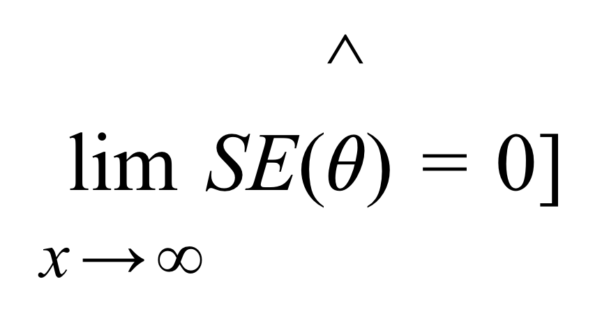
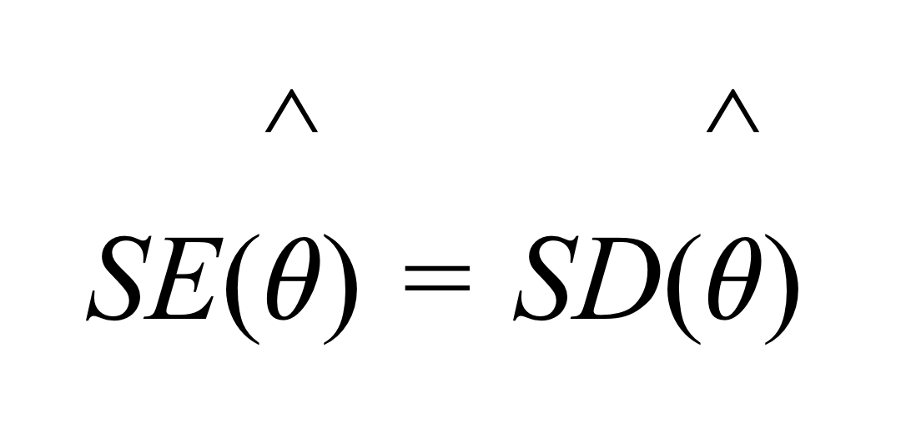

```{r setup, include=FALSE}
library(learnr)
library(psych)
library(shiny)
library(faux)
library(tidyverse)
library(exams2learnr)
knitr::opts_chunk$set(echo = FALSE)
```

## Willkommen

### Was können Sie von dieser Übung erwarten?

Im Folgenden finden Übungsaufgaben zur Vorlesung Statistik II (B-P 9.4-VO) im Modul Quantitative Methoden II (B-P 9.4). 

Dazu verwenden wir das Paket `learnr`. 

Dieses Paket gibt uns u.a. die Möglichkeit, `R` Aufgaben direkt über Ihren Browser zu üben. Sie müssen dafür die Programme `R` und `RStudio` nicht auf dem eigenen Computer installieren. 

Zusätzlich finden Sie im Rahmen der Lektionen Quizaufgaben, um Ihr Wissen zu überprüfen. 


```{r eval = TRUE, echo = F, out.width = "150px", fig.align='center'}
knitr::include_graphics("images/R_logo.png")
```

## Einheit 1

```{r eval=FALSE, include=FALSE}
# hinter jede Einheit den Titel
# Quizfragen alle Einheiten aus Muster
# QM1 spezifische Aufgaben hinzufügen - Interpretieren..
# Evtl Aufgaben LMU hinzufügen? 
# publishen 
# in studynet verlinken 
# neuer test
```

```{r VO1_MC_Alter, message = FALSE, warning=FALSE}
exams2learnr("Questions/VO_01/VO1_MC_Alter.Rmd", allow_retry = TRUE)
```

```{r VO1_MC_Digitale, message = FALSE, warning=FALSE}
exams2learnr("Questions/VO_01VO1_MC_Digitale.Rmd", allow_retry = TRUE)
```

```{r VO1_MC_Hypothesen1, message = FALSE, warning=FALSE}
exams2learnr("Questions/VO_01/VO1_MC_Hypothesen1.Rmd", allow_retry = TRUE)
```

```{r VO1_MC_Hypothesen2, message = FALSE, warning=FALSE}
exams2learnr("Questions/VO_01/VO1_MC_Hypothesen2.Rmd", allow_retry = TRUE)
```

```{r VO1_MC_Hypothesen3, message = FALSE, warning=FALSE}
exams2learnr("Questions/VO_01/VO1_MC_Hypothesen3.Rmd", allow_retry = TRUE)
```

```{r VO1_MC_Variablenarten1, message = FALSE, warning=FALSE}
exams2learnr("Questions/VO_01/VO1_MC_Variablenarten1.Rmd", allow_retry = TRUE)
```

```{r VO1_MC_Variablenarten2, message = FALSE, warning=FALSE}
exams2learnr("Questions/VO_01/VO1_MC_Variablenarten2.Rmd", allow_retry = TRUE)
```

```{r VO1_MC_StichprobePopulation, message = FALSE, warning=FALSE}
exams2learnr("Questions/VO_01/VO1_MC_StichprobePopulation.Rmd", allow_retry = TRUE)
```

```{r VO1_MC_ZentraleTendenz, message = FALSE, warning=FALSE}
exams2learnr("Questions/VO_01/VO1_MC_ZentraleTendenz.Rmd", allow_retry = TRUE)
```

```{r VO1_MC_Inferenzstatistik, message = FALSE, warning=FALSE}
exams2learnr("Questions/VO_01/VO1_MC_Inferenzstatistik.Rmd", allow_retry = TRUE)
```

```{r VO1_MC_Hypothesen4, message = FALSE, warning=FALSE}
exams2learnr("Questions/VO_01/VO1_MC_Hypothesen4.Rmd", allow_retry = TRUE)
```

```{r VO1_MC_Stoervariable, message = FALSE, warning=FALSE}
exams2learnr("Questions/VO_01/VO1_MC_Stoervariable.Rmd", allow_retry = TRUE)
```

```{r VO1_MC_Haeufigkeitstabelle, message = FALSE, warning=FALSE}
exams2learnr("Questions/VO_01/VO1_MC_Haeufigkeitstabelle.Rmd", allow_retry = TRUE)
```

## Einheit 2

```{r quiz2_1, echo = FALSE}
quiz(
  question("Was trifft auf den Begriff Messen zu?",
    answer("Messen = Variablen in Zahlen darstellen", correct = TRUE),
    answer("Daten erheben und Messen sind dasselbe"),
    answer("Einzelne Ausprägungen werden Zahlen auf einer Skala zugeordnet", correct = TRUE),
    answer("Messen ist homomorphe Abbildung eines empirischen Relativs in ein numerisches Relativ", correct = TRUE), allow_retry = TRUE
  )
    )
```

```{r quiz2_2, echo = FALSE}
quiz(
  question("Das Skalenniveau...",
    answer("ist immer entweder nominal oder numerisch"),
    answer("ist eindeutig durch das Merkmal definiert"),
    answer("bestimmt welche Rechenoperationen möglich sind", correct = TRUE),
    answer("eine der wichtigsten Eigenschaften einer Variable", correct = TRUE), allow_retry = TRUE
  )
    )
```

```{r quiz2_3, echo = FALSE}
quiz(
  question("Welches ist das niedrigste Skalenniveau?",
    answer("ordinal"),
    answer("nominal", correct = TRUE),
    answer("metrisch"),
    answer("intervall"), allow_retry = TRUE
  )
    )
```

```{r quiz2_4, echo = FALSE}
quiz(
  question("Das Lieblingsfußballteam ist ein Beispiel für eine Variable mit welchem Skalenniveau",
    answer("nominal", correct = TRUE),
    answer("metrisch"),
    answer("Verhältnisskala"),
    answer("intervall"), allow_retry = TRUE
  )
    )
```

```{r quiz2_5, echo = FALSE}
quiz(
  question("Der IQ ist ein Beispiel für eine Variable mit welchem Skalenniveau?",
    answer("metrisch", correct = TRUE),
    answer("Verhältnisskala"),
    answer("intervall", correct = TRUE),
    answer("ordinal"), allow_retry = TRUE
  )
    )
```

```{r quiz2_6, echo = FALSE}
quiz(
  question("Welches Skalenniveau ist zur Berechnung des Mittelwerts mindestens notwendig?",
    answer("nominal"),
    answer("intervall", correct = TRUE),
    answer("Verhältnisskala"),
    answer("ordinal"), allow_retry = TRUE
  )
    )
```

```{r quiz2_7, echo = FALSE}
quiz(
  question("Was trifft auf das Nominalskalenniveau zu?",
    answer("Häufig wird hier mit einer Codierung gearbeitet", correct = TRUE),
    answer("nur Beziehungen <gleich> , <ungleich> möglich", correct = TRUE),
    answer("logische Reihenfolge ist möglich"),
    answer("höchstes Skalenniveau"), 
    answer("eindeutige Transformationen sind möglich", correct = TRUE), allow_retry = TRUE
  )
    )
```

```{r quiz2_8, echo = FALSE}
quiz(
  question("Was trifft auf das Verhältnisskalenniveau zu?",
    answer("Hat absoluten Nullpunkt", correct = TRUE),
    answer("Temperatur waere ein Beispiel", correct = TRUE),
    answer("Aussage über das Verhältnis zwischen zwei Werten ist moeglich", correct = TRUE),
    answer("Selten in den Sozialwissenschaften", correct = TRUE), allow_retry = TRUE
  )
    )
```

```{r quiz2_9, echo = FALSE}
quiz(
  question("Maße der zentralen Tendenz...",
    answer("Sind z.B. Mittelwert und Median", correct = TRUE),
    answer("Können nur sinnvoll in der Stichprobe verwendet werden (nicht in Population)"),
    answer("geben Auskunft über Variation der Messwerte"),
    answer("Werden mit Häufigkeiten angegeben"), 
    answer("repraesentieren alle Einzelwerte der Verteilung zusammenfassend", correct = TRUE), allow_retry = TRUE
  )
    )
```

```{r quiz2_10, echo = FALSE}
quiz(
  question("Der Modalwert...",
    answer("ist der Durchschnitt einer Verteilung"),
    answer("ist der häufigste Wert", correct = TRUE),
    answer("Ist genau die Mitte der Verteilung"),
    answer("ist in der Wertereihe [1,2,2,3,3,3,4,4,4,4] die 3"), allow_retry = TRUE
  )
    )
```

```{r quiz2_11, echo = FALSE}
quiz(
  question("Was trifft auf den Median zu?",
    answer("Benötigt mindestens nominal skalierte Variablen"),
    answer("Ist der mittlere Wert der Verteilung", correct = TRUE),
    answer("Ist robust gegenüber Ausreißern", correct = TRUE),
    answer("Ist i.d.R. besser als der Mittelwert"), allow_retry = TRUE
  )
    )
```

```{r quiz2_12, echo = FALSE}
quiz(
  question("Folgende Urliste sei gegeben. Welche Aussagen stimmen? 
[2, 2, 3, 3, 4, 4, 4, 5, 6, 6, 6, 7, 8, 8, 9, 9] ",
    answer("Der Modus ist der Wert 4 bzw. 6", correct = TRUE),
    answer("Median = 5"),
    answer("Median = 5,5", correct = TRUE),
    answer("Arithmetisches Mittel = 5,5"), allow_retry = TRUE
  )
    )
```

```{r quiz2_13, echo = FALSE}
quiz(
  question("Welche Aussagen stimmen?",
    answer("Auf Ordinalskalenniveau ist es nicht möglich, Variablen in eine logische Reihenfolge zu bringen"),
    answer("Der Sitz des Wohnsitzfinanzamtes ist ein Beispiel für nominalskalierte Daten", correct = TRUE),
    answer("Die metrische Variable <Ergebnis in einem IQ Test> lässt sich auf ordinalskalenniveau runterskalieren", correct = TRUE),
    answer("Viele Daten in den Sozialwissenschaften haben Intervallskalenniveau", correct = TRUE), allow_retry = TRUE
  )
    )
```

```{r quiz2_14, echo = FALSE}
quiz(
  question("Was trifft zu?",
    answer("Bei einer linkssteilen Verteilung gilt: Modus < Median < Mittelwert", correct = TRUE),
    answer("Bei einer linkssteilen Verteilung gilt: Modus = Median = Mittelwert"),
    answer("Bei einer linkssteilen Verteilung gilt: Mittelwert < Modus < Median"),
    answer("Keine dieser Aussagen ist richtig"), allow_retry = TRUE
  )
    )
```

```{r quiz2_15, echo = FALSE}
quiz(
  question("Welche Aussagen stimmen?",
    answer("Häufigkeiten stellen wir in einem Histogramm dar", correct = TRUE),
    answer("Kategorien stellen wir in einem Balkendiagramm dar", correct = TRUE),
    answer("In einem Histogramm können auf der Y-Achse die absoluten Häufigkeiten der Ausprägungen dargestellt", correct = TRUE),
    answer("Gesamtfläche eines Histogramms = 1 <relative Häufigkeit> bzw. N <Absolute Häufigkeit>", correct = TRUE), allow_retry = TRUE
  )
    )
```

## Einheit 3


```{r quiz3_3, echo = FALSE}
quiz(
  question("Was ist in Bezug auf Streuungsmaße korrekt?",
    answer("Maße der zentralen Tendenz können eine Verteilung vollständig beschreiben."),
    answer("Sie beschreiben wie stark die einzelnen Werte einer Verteilung von der zentralen Tendenz abweichen", correct = TRUE),
    answer("Es handelt sich um Deskriptivstatistiken.", correct = TRUE),
    answer("Die Streuung kann man im Histogramm sehen.", correct = TRUE), allow_retry = TRUE
  )
    )
```

```{r quiz3_4, echo = FALSE}
quiz(
  question("Woran kann es liegen wenn unimodale Verteilungen mit gleichem Mittelwert in ihrer Form verschieden sind?",
    answer("Nominales Skalenniveau"),
    answer("Median"),
    answer("Streuung", correct = TRUE),
    answer("Inferenzstatistik"), allow_retry = TRUE
  )
    )
```

```{r quiz3_5, echo = FALSE}
quiz(
  question("Die Spannweite...",
    answer("beschreibt den Bereich in dem 50% der Werte liegen."),
    answer("beschreibt die Mitte der Verteilung"),
    answer("ist die Größe des Bereichs in dem alle Messwerte liegen", correct = TRUE),
    answer("berechnet sich als  Differenz aus größtem und kleinstem Wert", correct = TRUE), allow_retry = TRUE
  )
    )
```

```{r quiz3_6, echo = FALSE}
quiz(
  question("Was trifft auf die Varianz zu?",
    answer("Nur für metrische Daten sinnvoll.", correct = TRUE),
    answer("Ist robust gegenüber Ausreißern."),
    answer("Ist ein quadriertes Maß.", correct = TRUE),
    answer("Nimmt größere Werte an, je stärker Messwerte vom Mittelwert abweichen.", correct = TRUE), allow_retry = TRUE
  )
    )
```

```{r quiz3_7, echo = FALSE}
quiz(
  question("Im Nenner der Varianz steht?",
    answer("N"),
    answer("N / 1"),
    answer("N - 1", correct = TRUE),
    answer("N + 1"), allow_retry = TRUE
  )
    )
```

```{r quiz3_8, echo = FALSE}
quiz(
  question("Die Varianz ist ein sinnvolles Streuungsmaß für folgende Variablen:",
    answer("Nationalität"),
    answer("Anzahl erinnerter Items in Gedächtnistest", correct = TRUE),
    answer("Alter in Jahren", correct = TRUE),
    answer("Platzierung in einem Rechenwettbewerb"), allow_retry = TRUE
  )
    )
```

```{r quiz3_9, echo = FALSE}
quiz(
  question("Was trifft auf die Standardabweichung zu",
    answer("Lässt sich in der Einheit der Variable lesen.", correct = TRUE),
    answer("Wurzel aus der Spannweite"),
    answer("Wird stark von Ausreißern beeinflusst", correct = TRUE),
    answer("Eignet sich besser als der Quartilabstand für normalverteilte metrische Variablen ohne Ausreißer", correct = TRUE),
    answer("Streuung um den Mittelwert herum.", correct = TRUE),
    allow_retry = TRUE
  )
    )
```

```{r quiz3_11, echo = FALSE}
quiz(
  question("Die Spannweite folgender Messwerte [6,9, 100, 2, 5] ist",
    answer("32"),
    answer("54"),
    answer("2"),
    answer("98", correct = TRUE),
    answer("10"),
    allow_retry = TRUE
  )
    )
```

```{r quiz3_12, echo = FALSE}
quiz(
  question("Welche Aussagen sind korrekt? ",
    answer("99,7% aller Daten liegen innerhalb 3 Standardabweichungen vom Mittelwert", correct = TRUE),
    answer("68% aller Daten liegen innerhalb 1 Standardabweichung vom Mittelwert", correct = TRUE),
    answer("95% aller Daten liegen innerhalb 2 Standardabweichungen vom Mittelwert", correct = TRUE),
    answer("58% aller Daten liegen innerhalb 1 Standardabweichung vom Mittelwert"),
    answer("68% aller Daten liegen innerhalb 2 Standardabweichung vom Mittelwert"),
    allow_retry = TRUE
  )
    )
```

Gegeben sind folgende Werte: 

```{r}
df = data.frame(ID = c(1: 10),
                Wert = c(2, 3, 4, 5, 6, 6, 10, 12, 14, 18))
df = as.data.frame(t(df))
knitr::kable(df)
```
```{r quiz3_13, echo = FALSE}
quiz(
  question("Welche Aussagen stimmen? ",
    answer("Das untere Quartil ist 3", correct = TRUE),
    answer("Das untere Quartil ist 3,5"),
    answer("IQR = 9", correct = TRUE),
    answer("IQR = 9,5"), allow_retry = TRUE
  )
    )
```

```{r quiz3_15, echo = FALSE}
quiz(
  question("Uns liegen metrische Daten vor, die sich in einer eingipfeligen Verteilung visualisieren lassen. Wir erkennen jedoch einige Ausreißer in den Daten. Welche Kennwerte nutzen wir, um unsere Daten zu beschreiben?",
    answer("Das arithmetische Mittel ist das Maß der zentralen Tendenz unserer Wahl"),
    answer("Um die Streuung der Daten auszudrücken, wählen wir die Varianz"),
    answer("Der Median ist das Maß der zentralen Tendenz unserer Wahl", correct = TRUE),
    answer("Um die Streuung der Daten auszudrücken, wählen wir den Quartilabstand", correct = TRUE),
    answer("Um die Streuung der Daten auszudrücken, wählen wir die Standardabweichung"),
    allow_retry = TRUE
  )
    )
```

## Einheit 4


```{r quiz4_1, echo = FALSE}
quiz(
  question("Das Histogramm...",
    answer("eignet sich zur Darstellung multivariater Zusammenhänge"),
    answer("stellt Verteilung einer Variable dar", correct = TRUE),
    answer("Hat die Mittelwerte der Merkmalsausprägungen auf der Y-Achse"),
    answer("Hat Merkmalsausprägungen auf der X-Achse", correct = TRUE),
    allow_retry = TRUE
  )
    )
```

```{r quiz4_2, echo = FALSE}
quiz(
  question("Die Box des Boxplots",
    answer("benötigt Intervallskalenniveau"),
    answer("Ist die IQR mal 1.5"),
    answer("Umfasst 50% aller Werte", correct = TRUE),
    answer("entspricht der Spannweite"),
    allow_retry = TRUE
  )
    )
```

```{r quiz4_3, echo = FALSE}
quiz(
  question("Welche sind Vorteile des Boxplots?",
    answer("Zeigt ein Maß der zentralen Tendenz", correct = TRUE),
    answer("Zeit die Standardabweichung"),
    answer("Lässt sich auf bei Ordinalskalenniveau verwenden", correct = TRUE),
    answer("Zeigt Ausreißer", correct = TRUE),
    allow_retry = TRUE
  )
    )
```

```{r quiz4_4, echo = FALSE}
quiz(
  question("Was trifft auf das Streudiagramm zu?",
    answer("Jeder Punkt entspricht einem Fall", correct = TRUE),
    answer("Punkte zeigen Mittelwerte an"),
    answer("Kann Zusammenhang zwischen 2 numerischen Variablen visualisieren", correct = TRUE),
    answer("Nicht für metrische Variablen geeignet"),
    allow_retry = TRUE
  )
    )
```

```{r quiz4_5, echo = FALSE}
quiz(
  question("Die maximale Länge der Whiskers berechnet sich aus",
    answer("IQR multipliziert mit 1.5", correct = TRUE),
    answer("Standardabweichung + 1.5"),
    answer("IQR + 1.5"),
    answer("IQR + Maximum der Verteilung"),
    allow_retry = TRUE
  )
    )
```

```{r quiz4_6, echo = FALSE}
quiz(
  question("Im Streudiagramm",
    answer("Lassen sich keine standardisierten Variablen darstellen"),
    answer("Kann die Regressionsgerade visualisiert werden", correct = TRUE),
    answer("Kann man ggf. positive/negative Trends zwischen Variablen erkennen", correct = TRUE),
    answer("Lassen sich Mittelwertsunterschiede besonders gut erkennen"),
    allow_retry = TRUE
  )
    )
```

```{r quiz4_7, echo = FALSE}
quiz(
  question("Welcher Graph wäre geeignet, wenn die UV Nominalskalenniveau hat und die AV auch Nominalskalenniveau hat?",
    answer("Streudiagramm"),
    answer("Balkendiagramm", correct = TRUE),
    answer("Boxplot"),
    answer("Line Graph"),
    allow_retry = TRUE
  )
    )
```

```{r quiz4_9, echo = FALSE}
quiz(
  question("Wenn die UV Nominalskalenniveau hat und die AV auch Nominalskalenniveau würde was auf der Y Achse dargestellt?",
    answer("Mittelwerte"),
    answer("Streuung"),
    answer("Häufigkeiten", correct = TRUE),
    answer("Mediane"),
    allow_retry = TRUE
  )
    )
```

```{r quiz4_10, echo = FALSE}
quiz(
  question("Hat die UV Nominalskalenniveau und die AV is metrisch, was repräsentieren dann die Balken im Balkendiagramm?",
    answer("Median"),
    answer("IQR mal 1.5"),
    answer("Mittelwert", correct = TRUE),
    answer("Relative Häufigkeit"),
    answer("Maß der zentralen Tendenz", correct = TRUE),
    allow_retry = TRUE
  )
    )
```


```{r quiz4_11, echo = FALSE}
quiz(
  question("Wann benutzen wir Graphen in der Statistik?",
    answer("Zur schnellen Datenexploration", correct = TRUE),
    answer("Zur Identifikation von Extremwerten (Ausreißern)", correct = TRUE),
    answer("Zur Inspektion der Verteilung einer Variable", correct = TRUE),
    answer("Zur Darstellung von Gruppenunterschieden", correct = TRUE),
    answer("Zur Verdeutlichung der Ergebnisses eines Hypothesentests", correct = TRUE),
    allow_retry = TRUE
  )
    )
```


```{r quiz4_12, echo = FALSE}
quiz(
  question("Welchen Aussagen stimmen Sie zu?",
    answer("Zur Darstellung einer numerischen Variable nutzen wir das Histogramm", correct = TRUE),
    answer("Zur Darstellung zweier numerischer Variablen nutzen wir das Balkendiagramm"),
    answer("Zur Darstellung zweier kategorialer Variablen nutzen wir das Balkendiagramm", correct = TRUE),
    answer("Zur Darstellung einer kategorialen Variable nutzen wir das Histogramm"),
    answer("Bei einer ordinalen und einer kategorialen Variable eignet sich das Box Plot zur Darstellung", correct = TRUE),
    allow_retry = TRUE
  )
    )
```

```{r}
#set.seed(123)
#N = 12
#df2 = data.frame(ID = c(1:N),
                #Entzug = c(rep("A", N/2), rep("B", N/2), "B"),
                #Tremor = round(c(rnorm(N/2, 4, 3), rnorm(N/2, 10, 4), 20))

#boxplot(Tremor ~ Entzug, data = df2, cex.lab = 2.5, cex.axis = 2.5)
```


```{r quiz4_13, echo = FALSE}
quiz(
  question("Was können wir folgender Grafik entnehmen?  <br> {width=400px}",
    answer("IQR von Gruppe A ist größer als IQR von Gruppe B"),
    answer("In den Daten gibt es Ausreißer"),
    answer("Die Streuung der Daten in Gruppe B ist größer als die Streuung der Daten in Gruppe A", correct = TRUE),
    answer("In den Daten gibt es keine Ausreißer", correct = TRUE),
    allow_retry = TRUE
  )
    )
```


## Einheit 5


```{r quiz5_1, echo = FALSE}
quiz(
  question("Die Laplace-Wahrscheinlichkeit",
    answer("Gilt bei Zufallsexperimenten, bei denen nur endlich viele, gleichwahrscheinliche Ergebnisse möglich sind",correct = TRUE),
    answer("Wir mit dem Bayes Theorem berechnet"),
    answer("Ergibt sich durch das Verhältnis aus möglichen Ereignissen zu günstigen Ereignissen"),
    answer("Ergibt sich durch das Verhältnis aus günstigen Ereignissen zu möglichen Ereignissen", correct = TRUE),
    allow_retry = TRUE
  )
    )
```


```{r quiz5_2, echo = FALSE}
quiz(
  question("Was sind Axiome der Wahrscheinlichkeitsrechnung nach Kolmogoroff?",
    answer("Wahrscheinlichkeiten nehmen Werte zwischen 0 und 1 an.",correct = TRUE),
    answer("Sichere Ereignisse haben eine Wahrscheinlichkeit von P=1.",correct = TRUE),
    answer("Negative Wahrscheinlichkeiten beschreiben besonders seltene Ereignisse."),
    answer("Gesamtwahrscheinlichkeit mehrere unabhängiger Ereignisse ist die Summe der Einzelwahrscheinlichkeiten", correct = TRUE),
    allow_retry = TRUE
  )
    )
```

```{r quiz5_3, echo = FALSE}
quiz(
  question("Die bedingte Wahrscheinlichkeit P(A|B)",
    answer("Die Wahrscheinlichkeit von Ereignis A unter der Bedingung, dass Ereignis B bereits eingetreten ist.", correct = TRUE),
    answer("Die Wahrscheinlichkeit von Ereignis B unter der Bedingung, dass Ereignis A bereits eingetreten ist."),
    answer("Die Korrelation von A und B."),
    answer("Das Eintreten von B beeinflusst die Wahrscheinlichkeit von A.", correct = TRUE),
    allow_retry = TRUE
  )
    )
```

```{r quiz5_4, echo = FALSE}
quiz(
  question("Zwei Ereignisse sind stochastisch unabhängig...",
    answer("Wenn sie einander bedingen."),
    answer("Wenn die Summe ihrer Einzelwahrscheinlichkeiten 1 ergibt"),
    answer("Wenn das Eintreten des einen Ereignisses keinen Einfluss auf das Eintreten des anderen Ereignisses hat.", correct = TRUE),
    answer("Qenn die Wahrscheinlichkeit für das gemeinsame Auftreten dem Produkt ihrer Einzelwahrscheinlichkeiten entspricht.", correct = TRUE),
    allow_retry = TRUE
  )
    )
```

```{r quiz5_5, echo = FALSE}
quiz(
  question("Was stimmt hinsichtlich der Nomenklatur des Zufallsexperiments?",
    answer("Jedes mögliche Ergebnis aus einem Zufallsexperiment nennen wir ein Elementarereignis ω.", correct = TRUE),
    answer("Der Ereignisraum Ω heißt diskret, wenn er aus überabzählbar vielen Elementarereignissen besteht"),
    answer("Die Menge aller möglichen Ereignisse ist definiert als der Ereignisraum Ω.", correct = TRUE),
    answer("Zufallsexperiment ist ein allgemeiner Begriff, der Grundlage für die Inferenzstatistik ist", correct = TRUE),
    allow_retry = TRUE
  )
    )
```

```{r quiz5_6, echo = FALSE}
quiz(
  question("Der Erwartungswert...",
    answer("...ergibt sich als Durchschnitt, wenn man ein Zufallsexperiment sehr oft durchführt.", correct = TRUE),
    answer("...einer ZV ist ein Maß für das Zentrum der Verteilung.", correct = TRUE),
    answer("...ist die Streuung aller möglichen Ausprägungen einer ZV."),
    answer("...ist die Gegenwahrscheinlichkeit vom Mittelwert."),
    allow_retry = TRUE
  )
    )
```

```{r quiz5_7, echo = FALSE}
quiz(
  question("Das alpha-Quantil...",
    answer("...ist immer das Signifikanzniveau."),
    answer("...ist ein ein Wert bezeichnet, unterhalb dessen ein vorgegebener Anteil (alpha) aller Fälle der Verteilung liegen.", correct = TRUE),
    answer("...muss bei diskreten ZV  zur nächsten ganzzahligen Ausprägung gerundet werden", correct = TRUE),
    answer("...ist der Erwartungswert einer stetigen ZV."),
    allow_retry = TRUE
  )
    )
```

```{r quiz5_8, echo = FALSE}
quiz(
  question("Was ist bezüglich der diskreten Gleichverteilung korrekt?",
    answer("Verteilung ähnelt einer Glockenkurve."),
    answer("Anwendung bei Zufallsexperimenten, deren Ergebnisse gleich häufig sind.", correct = TRUE),
    answer("Enden der Verteilung sind weniger wahrscheinlich."),
    answer("Beschreibt seltene Ereignisse"),
    allow_retry = TRUE
  )
    )
```

```{r quiz5_9, echo = FALSE}
quiz(
  question("Was ist hinsichtlich der Normalverteilung (NV) korrekt?",
    answer("Ist eine stetige Verteilung, die symmetrisch um den Erwartungswert verteilt ist.", correct = TRUE),
    answer("Die Fläche zwischen den Standardabweichungen umfasst cs. 68% aller Fälle.", correct = TRUE),
    answer("Wenn die Standardabweichung gering ist, ist die Verteilung breit und niedrig."),
    answer("Die Standardabweichung gibt den Abstand zwischen Erwartungswert und den Wendepunkten der Dichtefunktion an.", correct = TRUE),
    allow_retry = TRUE
  )
    )
```

```{r quiz5_10, echo = FALSE}
quiz(
  question("Es sei A = {1,2,3,4}.
Welches ist das Gegenereignis zu A?",
    answer("D = {-1,-2,-3,-4}"),
    answer("B = {5,6,7,8,9,10}"),
    answer("C = {4,3,2,1}"),
    answer("Es gibt kein Gegenereignis, da kein Ergebnisraum spezifiziert ist.", correct = TRUE),
answer("Es gibt kein Gegenereignis, da kein Ergebnisraum spezifiziert ist."),
    allow_retry = TRUE
  )
    )
```

```{r quiz5_11, echo = FALSE}
quiz(
  question("Wann spricht man von unabhängigen Ereignissen?",
    answer("Wenn zwei Ereignisse disjunkt sind, d.h. keine Schnittmenge haben."),
    answer("Für das Bestimmen von P(A|B) hat P(B) keinen zusätzlichen Informationsgehalt.", correct = TRUE),
    answer("Die Wahrscheinlichkeit für A gegeben B ändert sich nicht abhängig davon, ob A ein sicheres Ereignis ist."),
    answer("Ob B stimmt oder nicht, ändert nichts an der Wahrscheinlichkeit von A.", correct = TRUE),
    allow_retry = TRUE
  )
    )
```

```{r quiz5_12, echo = FALSE}
quiz(
  question("Was ist ein Elementarereignis?",
    answer("ein mögliches Ereignis bei einem Zufallsexperiment", correct = TRUE),
    answer("eine Teilmenge (aus zwei Elementen) des Ergebnisraums"),
    answer("eine Menge aus mehreren Elementarereignissen"),
    answer("Menge der geraden Zahlen beim Würfeln"),
    allow_retry = TRUE
  )
    )
```

```{r quiz5_13, echo = FALSE}
quiz(
  question("Was könnte man als Ergebnisraum bezeichnen? ",
    answer("{Erfolg, Misserfolg, weder noch} bei einer Therapie", correct = TRUE),
    answer("Ω", correct = TRUE),
    answer("eine Teilmenge der Menge der Elementarereignisse"),
    answer("alles, was eintreten kann", correct = TRUE),
    allow_retry = TRUE
  )
    )
```

```{r quiz5_14, echo = FALSE}
quiz(
  question("Was ist hinsichtlich der Standardnormalverteilung korrekt? ",
    answer("Sie ist eine Normalverteilung mit μ = 1 und σ = 0"),
    answer("Sie ist eine Normalverteilung mit μ = 0 und σ = 1", correct = TRUE),
    answer("Ist X N(μ, σ²) verteilt, dann führt die z-Transformation auf eine N(0, 1) Verteilung", correct = TRUE),
    answer("Wir können jede beliebige Normalverteilung in eine Standardnormalverteilung transformieren", correct = TRUE),
    allow_retry = TRUE
  )
    )
```


## Einheit 6


```{r quiz6_1, echo = FALSE}
quiz(
  question("Die Population...",
    answer("wird verwendet um auf Grundgesamtheit zu schließen."),
    answer("Wird auch Grundgesamtheit genannt.", correct = TRUE),
    answer("Ist eine zufällige Auswahl bestimmter Merkmalsträger:innen."),
    answer("...ist die Gesamtheit aller Merkmalsträger:innen, auf die eine Untersuchungsfrage gerichtet ist", correct = TRUE),
    allow_retry = TRUE
  )
    )
```

```{r quiz6_2, echo = FALSE}
quiz(
  question("Was sind häufig auftretende Probleme beim Ziehen von Zufallsstichproben?",
    answer("Unterschiedliche Skalenniveaus."),
    answer("Fehlende Repräsentativität", correct = TRUE),
    answer("Eine bestimmte Teilgruppe von Personen in der Population hat eine höhere Wahrscheinlichkeit, in die Stichprobe gezogen zu werden, als andere Personen.", correct = TRUE),
    answer("Unabhängigkeit der Ziehungen"),
    allow_retry = TRUE
  )
    )
```

```{r quiz6_3, echo = FALSE}
quiz(
  question("μ>100 ist ein Beispiel für...",
    answer("...eine Streuungsschätzung."),
    answer("...eine Parameterschätzung."),
    answer("...eine Hypothese, die mittels Hypothesentest überprüft werden kann.", correct = TRUE),
    answer("...eine Intervallschätzung."),
    allow_retry = TRUE
  )
    )
```

```{r quiz6_4, echo = FALSE}
quiz(
  question("Was ist ein naheliegender Schätzwert für π (Auftretenswahrscheinlichkeit in der Population)?",
    answer("relative Häufigkeit in der Stichprobe", correct = TRUE),
    answer("Mittelwert in der Stichprobe"),
    answer("Varianz in der Stichprobe"),
    answer("Median in der Stichprobe"),
    allow_retry = TRUE
  )
    )
```

```{r quiz6_5, echo = FALSE}
quiz(
  question("Was ist hinsichtlich Schätzfunktionen zutreffend?",
    answer("Realisation einer Schätzfunktion nennt sich Schätzwert.", correct = TRUE),
    answer("Schätzfunktionen sind Ergebnisse eines Hypothesentests."),
    answer("Zufallsvariable, die jedem möglichen Ergebnis des Zufallsexperiments den aus ihr berechneten Schätzwert zuweist.", correct = TRUE),
    answer("Sind Ergebnisse in der Stichprobe"),
    allow_retry = TRUE
  )
    )
```

```{r quiz6_6, echo = FALSE}
quiz(
  question("Was sind die Gütekriterien einer Schätzfunktion",
    answer("Erwartungstreue (und Genauigkeit)", correct = TRUE),
    answer("Effizienz", correct = TRUE),
    answer("Konsistenz", correct = TRUE),
    answer("Objektivität"),
    allow_retry = TRUE
  )
    )
```

```{r quiz6_7, echo = FALSE}
quiz(
  question("Was versteht man unter der Genauigkeit einer Schätzfunktion?",
    answer("Das ein möglichst großes Intervall bei der Schätzung herauskommt."),
    answer("Dass sie zu möglichst „präzisen“ oder „genauen“ Schätzungen führen sollte.", correct = TRUE),
    answer("Dass die Schätzwerte bei unendlicher Wiederholung des Zufallsexperiments im Mittel dem wahren Parameterwert entsprechen sollten"),
    answer("Dass der Standardfehler bei wachsendem Stichprobenumfang immer kleiner wird."),
    allow_retry = TRUE
  )
    )
```

```{r quiz6_8, echo = FALSE}
quiz(
  question("Was sind Vorteile der Standardnormalverteilung?",
    answer("Sie ist symmetrischer als die Normalverteilung."),
    answer("Erwartungswert liegt bei 1 und Standardabweichung bei 0."),
    answer("Wahrscheinlichkeit für jeden z-Wert kann abgelesen werden.", correct = TRUE),
    answer("Quantile der Standardnormalverteilung sind tabelliert.", correct = TRUE),
    allow_retry = TRUE
  )
    )
```

```{r quiz6_9, echo = FALSE}
quiz(
  question("Wovon hängt die Breite des Konfidenzintervalls ab?",
    answer("N", correct = TRUE),
    answer("Streuung", correct = TRUE),
    answer("Median"),
    answer("Signifikanzniveau", correct = TRUE),
    answer("Mittelwert"),
    allow_retry = TRUE
  )
    )
```

```{r quiz6_10, echo = FALSE}
quiz(
  question("Was ist mit Bezug auf die t-Verteilung korrekt?",
    answer("Ist Populationsvarianz jedoch nicht bekannt und muss geschätzt werden, dann ist der Quotient nicht standardnormalverteilt sondern t-verteilt", correct = TRUE),
    answer("Die Form der t-Verteilung ist mitbestimmt durch Freiheitsgrade.", correct = TRUE),
    answer("t-werte sind Quotienten aus zwei Varianzen."),
    answer("Sie approximiert die NV mit zunehmender Stichprobengröße.", correct = TRUE),
    answer("Die t-Verteilung ist wie die NV eingipfelig und symmetrisch", correct = TRUE),
    allow_retry = TRUE
  )
    )
```

```{r quiz6_11, echo = FALSE}
quiz(
  question("Was ist hinsichtlich des Standardfehlers korrekt?",
    answer("SE = Streuung der Stichprobenkennwerteverteilung", correct = TRUE),
    answer("Je größer N, desto kleiner fällt er aus", correct = TRUE),
    answer("Je größer σ in der Population, desto kleiner fällt er aus"),
    answer("Er ist ein Maß für die Genauigkeit der Schätzung", correct = TRUE),
    answer("Die Größe unserer Stichprobe hat keinen Einfluss auf den SE"),
    allow_retry = TRUE
  )
    )
```

```{r quiz6_12, echo = FALSE}
quiz(
  question("Was trifft auf das Ziehen einer einfachen Zufallsstichprobe zu?",
    answer("Der Vorgang ist ein Zufallsexperiment", correct = TRUE),
    answer("Ein Teil der Population hat eine größere Wahrscheinlichkeit in die Stichprobe gezogen zu werden"),
    answer("Wenn die Ziehung einer Person die Wahrscheinlichkeit der Ziehung einer anderen Person beeinflusst, können wir nicht mehr von einer einfachen Zufallsstichprobe sprechen", correct = TRUE),
    answer("Ziehen einer Zufallsstichprobe = Zufällige Zuteilung den Personen einer Gruppe zu Eigenschaften", correct = TRUE),
    allow_retry = TRUE
  )
    )
```

```{r quiz6_13, echo = FALSE}
quiz(
  question("Welche Aussagen sind korrekt? ",
    answer("Das Ergebnis einer Punktschätzung ist ein Intervall von Zahlen"),
    answer("Beispiel einer Punktschätzung: Wir gehen auf Basis unserer Stichprobe davon aus, dass der Parameter π gleich 0.45 ist", correct = TRUE),
    answer("Beispiel einer Intervallschätzung: Wir gehen auf Basis unserer Stichprobe davon aus, dass die relative Häufigkeit der uns interessierenden Messwertausprägung in der Population gleich 0.43 ist"),
    answer("Das Ergebnis einer Punktschätzung ist eine konkrete Zahl", correct = TRUE),
    allow_retry = TRUE
  )
    )
```

```{r quiz6_14, echo = FALSE}
quiz(
  question("Welche Formel aus der Deskriptivstatistik verwenden wir als erwartungstreue Schätzung der Populationsvarianz? ",
    answer("{width=200px}"),
    answer("{width=200px}", correct = TRUE),
    answer("{width=200px}"),
    allow_retry = TRUE
  )
    )
```

```{r quiz6_15, echo = FALSE}
quiz(
  question("Was versteht man unter Konsistenz einer Schätzfunktion?",
    answer("Mit wachsendem Stichprobenumfang sollte die Schätzfunktion immer genauer werden", correct = TRUE),
    answer("Die Schätzfunktion sollte einen geringeren Standardfehler als alle anderen erwartungstreuen Schätzfunktionen aufweisen"),
    answer("{width=200px}", correct = TRUE),
    answer("{width=200px}"),
    allow_retry = TRUE
  )
    )
```


## Einheit 7


```{r quiz7_1, echo = FALSE}
quiz(
  question("Die Nullhypothese",
    answer("Beinhaltet oft die neue Annahme, den angenommenen Effekt."),
    answer("Ist das Gegenstück zur eigentlichen Untersuchungshypothese", correct = TRUE),
    answer("Drückt eine Unterschiedlichkeit von einem Referenzwert aus"),
    answer("Stellt meistens den aktuellen Zustand oder anders ausgedrückt den „Standard“ dar, gegen den getestet wird", correct = TRUE),
    allow_retry = TRUE
  )
    )
```

```{r quiz7_2, echo = FALSE}
quiz(
  question("<Taxifahrer haben einen besseren Orientierungssinn als Nicht-Taxisfahrer> ist eine ",
    answer("einseitige H0"),
    answer("ungerichtete H1"),
    answer("gerichtete H1", correct = TRUE),
    answer("zweiseitige H0"),
    allow_retry = TRUE
  )
    )
```

```{r quiz7_3, echo = FALSE}
quiz(
  question("Zur Prüfung der Hypothese <Es besteht ein Unterschied zwischen Frauen und Männern hinsichtlich der mentalen Drehung im 3D Raum> benötigt man",
    answer("einen linksseitigen Test"),
    answer("einen zweiseitigen Test", correct = TRUE),
    answer("einen rechtsseitigen Test"),
    answer("einen einseitigen Test"),
    allow_retry = TRUE
  )
    )
```

```{r quiz7_4, echo = FALSE}
quiz(
  question("Wie und wann sollten Hypothesen formuliert werden?",
    answer("vor der eigenen Untersuchung", correct = TRUE),
    answer("mit Berücksichtigung der aktuellen Daten"),
    answer("aufgrund inhaltlicher Kriterien", correct = TRUE),
    answer("nach der Datenerhebung"),
    allow_retry = TRUE
  )
    )
```

```{r quiz7_5, echo = FALSE}
quiz(
  question("Der kritische Wert",
    answer("muss für ein signifikantes Ergebnis überschritten werden", correct = TRUE),
    answer("muss für ein signifikantes Ergebnis unterschritten werden"),
    answer("ist unabhängig vom Signifikanzniveau"),
    answer("ist bei t-Verteilung und z-Verteilung identisch"),
    allow_retry = TRUE
  )
    )
```

```{r quiz7_6, echo = FALSE}
quiz(
  question(" NV-Approximation der Binomialverteilung",
    answer("Ist bei kleinen Stichproben gegeben"),
    answer("erlaubt Gleichsetzung der NV Varianz mit np(1-p)",correct = TRUE),
    answer("Ist bei großen Stichproben gegeben",correct = TRUE),
    answer("erfordert eine Poisson Verteilung"),
    allow_retry = TRUE
  )
    )
```

```{r quiz7_7, echo = FALSE}
quiz(
  question("Der p-Wert...",
    answer("macht zusätzliche Prüfung erforderlich, wenn einseitige Hypothesen geprüft werden.", correct = TRUE),
    answer("gibt die Wahrscheinlichkeit für den Fehler erster Art an.", correct = TRUE),
    answer("muss durch 2 dividiert werden, wenn einseitiger p-Wert angegeben ist."),
    answer("hat den Vorteil, dass bei der Entscheidung keine Tabelle der Verteilung der Teststatistik benötigt wird", correct = TRUE),
    allow_retry = TRUE
  )
    )
```

```{r quiz7_8, echo = FALSE}
quiz(
  question("Was ist mit Bezug auf Fehler beim Hypothesentest korrekt?",
    answer("Fehler 1. Art ist, wenn die Nullhypothese fälschlicherweise beibehalten wird, obwohl die Alternativhypothese wahr ist"),
    answer("Fehler 2. Art ist, wenn die Nullhypothese fälschlicherweise beibehalten wird, obwohl die Alternativhypothese wahr ist", correct = TRUE),
    answer("alpha--Fehler ist, wenn die Nullhypothese fälschlicherweise verworfen wird und die Alternativhypothese angenommen wird", correct = TRUE),
    answer("Die statistische Power errechnet sich als 1-beta Fehlerwahrscheinlichkeit.", correct = TRUE),
    allow_retry = TRUE
  )
    )
```

```{r quiz7_9, echo = FALSE}
quiz(
  question("Wovon hängt die Teststärke (Power) ab?",
    answer("Signifikanzniveau", correct = TRUE),
    answer("Größe des Effekts", correct = TRUE),
    answer("Stichprobenumfang", correct = TRUE),
    answer("Ein- oder zweiseitige Alternativhypothese", correct = TRUE),
    allow_retry = TRUE
  )
    )
```

```{r quiz7_10, echo = FALSE}
quiz(
  question("Mit der Alpha-Fehler-Kumulierung ist gemeint, dass...",
    answer("Der Fehler 2. Art mit Anzahl der Test wahrscheinlicher wird"),
    answer("Die Testmacht sinkt"),
    answer("Der Fehler 1. Art mit Anzahl der Test wahrscheinlicher wird", correct = TRUE),
    answer("das Signifikanzniveau adjustiert werden muss", correct = TRUE),
    allow_retry = TRUE
  )
    )
```

```{r quiz7_11, echo = FALSE}
quiz(
  question("Welche sind korrekte Schritte beim Durchführen von Hypothesentests",
    answer("Aufstellen des Hypothesenpaars", correct = TRUE),
    answer("Entscheidung: Test ist signifikant, nicht-signifikant oder leicht-signifikant"),
    answer("Festlegung des Signifikanzniveaus", correct = TRUE),
    answer("Berechnen des Signifikanzniveaus"),
    answer("Vergleich kritischer Wert und empirischer (errechneter) Wert", correct = TRUE),
    allow_retry = TRUE
  )
    )
```

```{r quiz7_12, echo = FALSE}
quiz(
  question("Welche sind Beispiele für Teststatistiken?",
    answer("z-Wert", correct = TRUE),
    answer("t-Wert", correct = TRUE),
    answer("q-Wert"),
    answer("F-Wert", correct = TRUE),
    answer("r-Wert"),
    answer("χ2-Wert", correct = TRUE),
    allow_retry = TRUE
  )
    )
```

```{r quiz7_13, echo = FALSE}
quiz(
  question("Was sind Beispiele für gerichtete Hypothesen?",
    answer("Männer sind größer als Frauen", correct = TRUE),
    answer("Geld beeinflusst die Zufriedenheit von Menschen"),
    answer("Die Durchschnittseinkommen von Männern und Frauen unterscheiden sich"),
    answer("Eine Therapie kann depressive Symptome lindern"),
    allow_retry = TRUE
  )
    )
```

```{r quiz7_14, echo = FALSE}
quiz(
  question("Was sind Beispiele für ungerichtete Hypothesen?",
    answer("Eine Therapie kann depressive Symptome lindern"),
    answer("Geld beeinflusst die Zufriedenheit von Menschen", correct = TRUE),
    answer("Die Durchschnittseinkommen von Männern und Frauen unterscheiden sich", correct = TRUE),
    answer("Die Lebenszufriedenheit von Menschen die in Hamburg wohnen unterscheidet sich von der Lebenszufriedenheit von Menschen die in München wohnen", correct = TRUE),
    allow_retry = TRUE
  )
    )
```

```{r quiz7_15, echo = FALSE}
quiz(
  question("Was bedeutet ein Signifikanzniveau von α = .05",
    answer("Durch die 5% wird ein bestimmter Verwerfungsbereich festgelegt", correct = TRUE),
    answer("Wir erlauben uns eine 5%ige Wahrscheinlichkeit, einen α-Fehler zu begehen", correct = TRUE),
    answer("Wir erlauben uns eine 5%ige Wahrscheinlichkeit, unsere Hypothese fälschlicherweise abzulehnen"),
    answer("Ein Signifikanzniveau von α = .05 ist in der Wissenschaft eher unüblich"),
    allow_retry = TRUE
  )
    )
```

## Einheit 8

## Einheit 9

## Einheit 10

## Einheit 11

## Einheit 12

## Einheit 13
