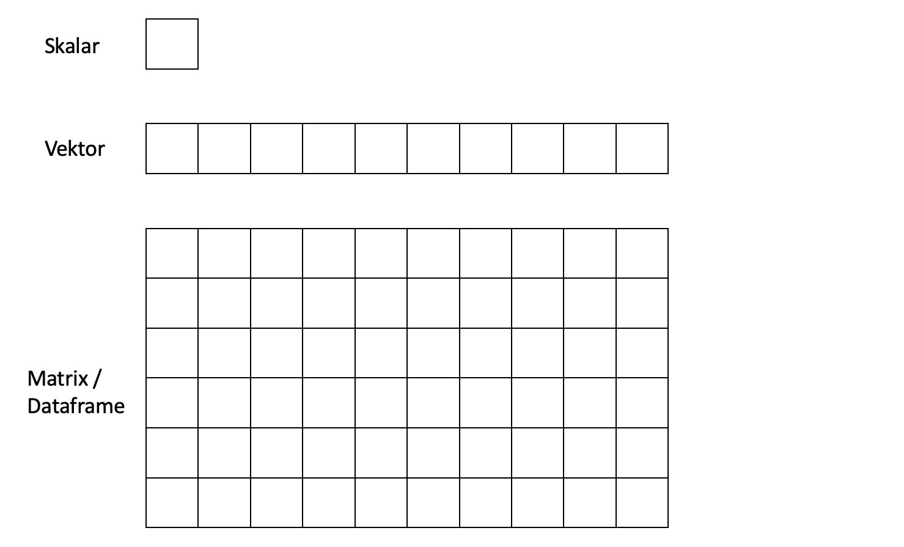

```{r setup, include=FALSE}
library(learnr)
knitr::opts_chunk$set(echo = FALSE)
```

## Einführung

### Was können Sie von dieser Übung erwarten?

Mit dieser Übung möchten wir Ihnen eine erste Möglichkeit geben, sich mit dem Statistikprogramm R vertraut zu machen. 

Dazu verwenden wir das Paket `learnr`. 

Dieses Paket gibt Ihnen die Möglichkeit, direkt über Ihren Browser R Codes anzuwenden, ohne die Programme `R` und `R Studio` auf Ihren Rechnern installieren zu müssen. 

Zunächst werden wir Ihnen eine Einführung in die grundlegende Codiersprache und Funktionalität von `R` geben damit Sie dann im späteren Verlauf des Semesters die behandelten statistischen Analysen direkt in R Codiersprache ausprobieren können.

## Grundlegende Arithmetik in R

Selbstverständlich können wir in `R` alle mathematischen Grundrechenoperationen ausführen. Dazu tippen Sie einen Rechenbefehl in das Programmierfenster und drücken auf `Run Code`.

Berechnen Sie: 2 + 3

```{r Addition, exercise=TRUE}

```

Berechnen Sie: 7 - 3

```{r Subtraktion, exercise=TRUE}

```

Berechnen Sie: 3 \* 9

```{r Multiplikation, exercise=TRUE}

```

Berechnen Sie: 9 / 3

```{r Division, exercise=TRUE}

```

Berechnen Sie: 3 hoch 3

```{r Quadrieren, exercise=TRUE}

```

```{r Quadrieren-hint}
3^3
```

Berechnen Sie: Wurzel aus 9

```{r Wurzel, exercise=TRUE}

```

```{r Wurzel-hint}
sqrt(9)
```

Berechnen Sie: √9 \* (2+6)

```{r Arith, exercise=TRUE}

```

```{r Arith-hint}
sqrt(9) * (2+6)
```

## Datenformate in R

### Datenformate

```{r eval=FALSE, include=FALSE}
@STEPHAN: Wie können Wir das Bild kleiner anzeigen? 
```

 

### Skalar

Der einfachste Objekttyp in R ist der **Skalar**. Ein Skalar Objekt ist einfach nur ein einzelner Wert, z.B. eine Zahl oder ein Wort.

Nun wollen wir den Wert 100 einem Skalar mit dem Buchstaben **a** zuweisen.


```{r Skalar1, exercise=TRUE}

```

```{r Skalar1-hint}
a = 100
```

Wie Sie bemerken, erzeugt R, wenn Sie diesen Code ausführen, keinen Output. Dazu geben Sie nun lediglich den Namen des Skalars in das Eingabefeld unterhalb Ihres Codes ein und drücken erneut `Run Code`. Wir haben unserem Skalar mit dem Wert 100 den "Namen" **a** gegeben.

Wir können einen Skalar auch mit dem Ergenbnis einer Rechenoperation belegen. Erstellen Sie bitte den Skalar **b**, welcher das Ergebnis der Rechnung $3 / 100$ enthalten soll, und lassen Sie sich diesen direkt anzeigen.  


```{r Skalar2, exercise=TRUE}

```

```{r Skalar2-hint}
b = 3 / 100
b
```


```{r Skalar3, exercise=TRUE}

```


*Here's an exercise with some prepopulated code as well as `exercise.lines = 5` to provide a bit more initial room to work.*

Now write a function that adds any two numbers and then call it:

```{r add-function, exercise=TRUE, exercise.lines = 5}
add <- function() {
  
}
```

## Topic 2

### Exercise with Hint

*Here's an exercise where the chunk is pre-evaluated via the `exercise.eval` option (so the user can see the default output we'd like them to customize). We also add a "hint" to the correct solution via the chunk immediate below labeled `print-limit-hint`.*

Modify the following code to limit the number of rows printed to 5:

```{r print-limit, exercise=TRUE, exercise.eval=TRUE}
mtcars
```

```{r print-limit-hint}
head(mtcars)
```

### Quiz

*You can include any number of single or multiple choice questions as a quiz. Use the `question` function to define a question and the `quiz` function for grouping multiple questions together.*

Some questions to verify that you understand the purposes of various base and recommended R packages:

```{r quiz}
quiz(
  question("Which package contains functions for installing other R packages?",
    answer("base"),
    answer("tools"),
    answer("utils", correct = TRUE),
    answer("codetools")
  ),
  question("Which of the R packages listed below are used to create plots?",
    answer("lattice", correct = TRUE),
    answer("tools"),
    answer("stats"),
    answer("grid", correct = TRUE)
  )
)
```
<<<<<<< HEAD

```{r logicals, echo = FALSE}
question(" What will the following code return? `filter(flights, month == 11 | month == 12)`",
         answer("Every flight that departed in November _or_ December", correct = TRUE),
         answer("Every flight that departed in November _and_ December", message = "Technically a flight could not have departed in November _and_ December unless it departed twice."),
         answer("Every flight _except for_ those that departed in November or December"),
         answer("An error. This is an incorrect way to combine tests.", message = "The next section will say a little more about combining tests."),
         allow_retry = TRUE
)
```

=======
>>>>>>> ef31d91195a860ddc341d74ca368906db75fd797
