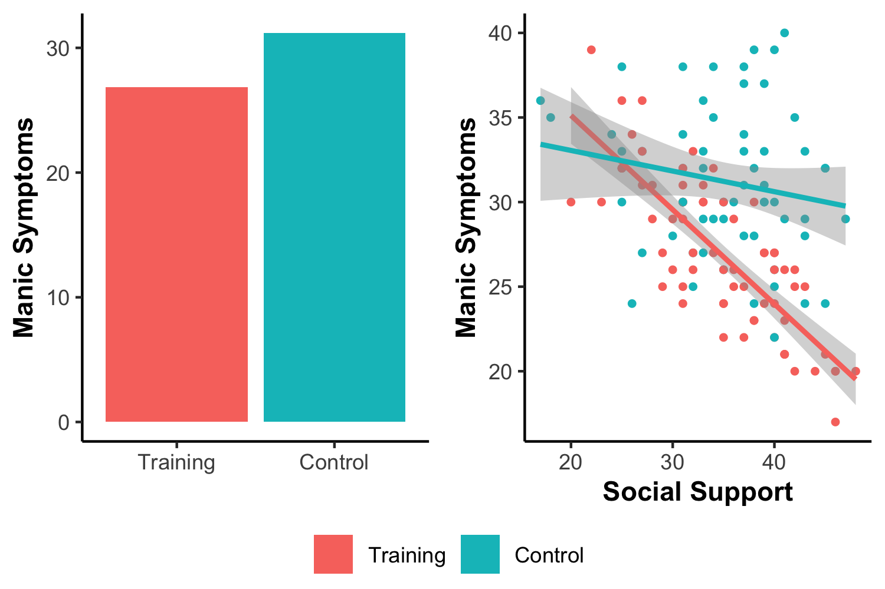

<style>

body {
  background-color: #f0f0f0;
  font-family: Arial, sans-serif;
  font-size: 14px; 
}

h1 {
  color: #333333;
  font-size: 14px; 
}

p {
  font-size: 14px; 
  line-height: 1.5;
  margin-bottom: 20px;
}

table {
  width: 50%; 
  border-collapse: collapse;
}

th, td {
  border: 1px solid #dddddd;
  padding: 8px;
  text-align: left;
  font-size: 14px; 
}

th {
  background-color: #f2f2f2;
}

img {
  width: 100%; 
  max-width: 500px; 
  height: auto;
  display: block;
  margin: 20px 0; 
  text-align: left; 
}
</style>


```{r setup, include=FALSE}
library(learnr)
library(psych)
library(shiny)
library(faux)
library(tidyverse)
library(exams2learnr)
library(knitr)
library(moments)
library(magrittr)
library(kableExtra)
library(ggplot2)
library(truncnorm)
library(faux)
library(sjPlot)
```

## Herzlich Willkommen!

Diese interaktive Plattform wurde speziell für den Kurs **R - Übung zur computergestützten Datenanalyse** entwickelt, um Ihnen eine praktische und anschauliche Lernumgebung zu bieten. Mit dieser Oberfläche haben Sie die Möglichkeit, die im Seminar erworbenen Fähigkeiten unmittelbar anzuwenden und zu vertiefen.

Auf dieser Plattform finden Sie eine Vielzahl von Beispielen und Übungen, die darauf ausgelegt sind, Ihr Verständnis von R und RStudio zu verbessern. Jede Übung ist darauf ausgerichtet, spezifische Konzepte und Techniken zu vermitteln, sodass Sie Ihr Wissen erweitern und festigen können.

Beginnen Sie nun, indem Sie eine der verfügbaren Übungen auswählen. Die interaktive Oberfläche ermöglicht es Ihnen, sofort Feedback zu Ihren Lösungen zu erhalten und bei Bedarf Änderungen vorzunehmen. Nutzen Sie diese Gelegenheit, um in Ihrem eigenen Tempo zu üben und zu lernen.


Viel Erfolg und Spaß beim Entdecken der Möglichkeiten mit R und RStudio! 

Stephan Goerigk und Janika Saretzki


## Grundlegende Arithmetik

Willkommen im Abschnitt **Grundlegende Arithmetik in R und RStudio**! 

In diesem Tel der learnR Oberfläche haben Sie die Möglichkeit, grundlegende arithmetische Operationen wie Addition, Subtraktion, Multiplikation und Division in RStudio praktisch anzuwenden. 

Anmerkung: Falls Sie die Lösung der Befehle aufrufen wollen, können Sie auf `Solution` klicken. Sie finden dabei unter Umständen auch Anmerkungen zu den spezifischen Herausforderungen einzelner Aufgaben.

<hr> <!-- Horizontale Trennlinie -->

**Aufgabe 1:** Berechnen Sie das Ergebnis der Subtraktion $534 + 16$.
```{r Arithmetik1, exercise=TRUE}


```

```{r Arithmetik1-solution}

534+16

```

<hr> <!-- Horizontale Trennlinie -->

**Aufgabe 2:** Berechnen Sie das Ergebnis der Subtraktion $7 - 3$.
```{r Arithmetik2, exercise=TRUE}

```

```{r Arithmetik2-solution}

7-3

```

<hr> <!-- Horizontale Trennlinie -->

**Aufgabe 3:** Berechnen Sie das Ergebnis der Multiplikation $3 \cdot 9$.
```{r Arithmetik3, exercise=TRUE}

```

```{r Arithmetik3-solution}

3*9

```

<hr> <!-- Horizontale Trennlinie -->

**Aufgabe 4:** Berechnen Sie den Mittelwert der Messwerte 11, 18, 32, 10, 33, 18, 25, 69, 39 und 12. Verwenden Sie dafür keine fertigen Funktionen, sondern nur Grundrechenarten. 
Führen Sie die Berechnung mit einem Befehl (ohne Zwischenergebnisse) durch.
```{r Arithmetik4, exercise=TRUE}

```

```{r Arithmetik4-solution}

(11+18+32+10+33+18+25+69+39+12)/10

```

<hr> <!-- Horizontale Trennlinie -->

**Aufgabe 5:** Berechnen Sie das Ergebnis der Division $1 $\div$ 7$ und runden Sie das Ergebnis auf zwei Nachkommastellen.

<font color='darkred'>Hinweis: Zum Runden von Zahlen (sowie Ergebnissen einfacher arithmetischer Operationen) können Sie die Funktion "round()" verwenden.</font>

```{r Arithmetik5, exercise=TRUE}

```

```{r Arithmetik5-solution}
  
round(1/7, digits = 2)

# Alternative: round(1/7, 2)

```

<hr> <!-- Horizontale Trennlinie -->

**Aufgabe 6:** Berechnen Sie das Ergebnis der Potenz $3^3$.
```{r Arithmetik6, exercise=TRUE}

```

```{r Arithmetik6-solution}

3^3

# Alternative: 3**3

```

<hr> <!-- Horizontale Trennlinie -->

**Aufgabe 7:** Berechnen Sie das Ergebnis der Wurzel aus 324.
```{r Arithmetik7, exercise=TRUE}

```

```{r Arithmetik7-solution}

sqrt(324)

```

<hr> <!-- Horizontale Trennlinie -->

**Aufgabe 8:** Berechnen Sie das Ergebnis des Ausdrucks $\sqrt{9} \cdot (2+6)$.
```{r Arithmetik8, exercise=TRUE}

```

```{r Arithmetik8-solution}

sqrt(9)*(2+6)

```

<hr> <!-- Horizontale Trennlinie -->

**Aufgabe 9:** Berechnen Sie das Ergebnis des Ausdrucks \( \sqrt{4} \cdot \frac{8^3 - \pi \cdot 8}{\frac{4}{2} + 16.75 \cdot 8^{\frac{4}{3}}} \). 

<font color='darkred'>Hinweis: Verwenden Sie den ausgeschriebenen Begriff 'pi', um die Zahl zu repräsentieren.</font>
```{r Arithmetik9, exercise=TRUE}

```

```{r Arithmetik9-solution}

sqrt(4) * ((8^3 - pi * 8) / ((4/2) + 16.75 * 8^(4/3)))

```

<hr> <!-- Horizontale Trennlinie -->

**Aufgabe 10:** Überprüfen Sie folgende Aussage: $4^2 + 3^2 = 7^2$
```{r Arithmetik10, exercise=TRUE}

```

```{r Arithmetik10-solution}

4^2 + 3^2 == 7^2

```

<hr> <!-- Horizontale Trennlinie -->

**Aufgabe 11:** Überprüfen Sie folgende Aussage: $4^2 \neq \frac{{43 - 11}}{{2}}$
```{r Arithmetik11, exercise=TRUE}

```

```{r Arithmetik11-solution}

4^2 != ((43-11)/2)

```

<hr> <!-- Horizontale Trennlinie -->

**Aufgabe 12:** Rufen Sie die Hilfe zur Funktion `summary` unter Verwendung zwei unterschiedlicher Methoden auf. 
```{r Arithmetik12, exercise=TRUE}

```

```{r Arithmetik12-solution}

?summary
help(summary)

```

## Datenformate

Willkommen im Abschnitt **Datenformate in R und RStudio**! 

In diesem Bereich werden Ihnen Übungen zu den grundlegenden Datenstrukturen begegnen, die in der Programmiersprache R verwendet werden: **Skalare, Vektoren und Data.Frames.** Jede dieser Strukturen spielt eine wichtige Rolle in der Datenverarbeitung und -analyse. Viel Erfolg!

<hr> <!-- Horizontale Trennlinie -->

**Aufgabe 1:** Weisen Sie dem Skalar `a` den Wert 150 zu:
```{r Datenformate1, exercise=TRUE}

```

```{r Datenformate1-solution}

a = 150
# Alternative: a <- 150

```

<hr> <!-- Horizontale Trennlinie -->

**Aufgabe 2:** Weisen Sie dem Skalar `b` das Ergebnis der Rechnung $3 \div 100$ zu und lassen Sie sich dieses zudem ausgeben. 

<font color='darkred'>Achtung: Bitte führen Sie die Zuweisung mit einem Befehl (ohne Zwischenergebnisse) durch.</font>
```{r Datenformate2, exercise=TRUE}

```

```{r Datenformate2-solution}

b = 3/100
b

```

<hr> <!-- Horizontale Trennlinie -->

**Aufgabe 3:** Weisen Sie dem Skalar `c` den Wert $50$, dem Skalar `d` den Wert $3$ und dem Skalar `e` das Ergebnis der Rechenoperation $(c + d) \div d$ zu. Lassen Sie sich das Ergebnis von `e` zudem ausgeben.
```{r Datenformate3, exercise=TRUE}

```

```{r Datenformate3-solution}

c = 50
d = 3
e = (c+d)/d
e

```

<hr> <!-- Horizontale Trennlinie -->

**Aufgabe 4:** Weisen Sie dem Skalar `f` das Ergebnis der Rechnoperation $5 + 4$, dem Skalar `g` den Wert $10$ zu und überprüfen Sie unter Verwendung der beiden Skalare, ob diese gleich sind.
```{r Datenformate4, exercise=TRUE}

```

```{r Datenformate4-solution}

f = 5+4
g = 10
f == g

```

<hr> <!-- Horizontale Trennlinie -->

**Aufgabe 5:** Erstellen Sie den Skalar `h`, der das Wort `Charlotte Fresenius` und den Skalar `i`, der das Wort `Carl Remigius Fresenius` beinhaltet. Lassen Sie sich lediglich den Inhalt des Skalars `i` ausgeben. 
```{r Datenformate5, exercise=TRUE}

```

```{r Datenformate5-hint}

h = "Charlotte Fresenius"
i = "Carl Remigius Fresenius"
i

```

<hr> <!-- Horizontale Trennlinie -->

**Aufgabe 6:** Speichern Sie die drei Grundfarben `blau`, `gelb` und `rot` in einem Vektor mit dem Namen `Farben` und lassen sich diesen ausgeben. Wählen Sie aus dem Vektor anschließend die Farbe `blau` aus und speichern Sie diese als Objekt mit dem Namen `Wasser`. Lassen Sie sich diesen zudem ausgeben.
```{r Datenformate6, exercise=TRUE}

```

```{r Datenformate6-solution}

Farben = c("blau", "gelb", "rot")
Farben

Wasser = Farben[1]
Wasser

```

<hr> <!-- Horizontale Trennlinie -->

**Aufgabe 7:** Erstellen Sie den Character-Vektor `Freunde` mit den Namen `Florian`, `Eva` und `Philipp` und lassen sich diesen ausgeben. Fügen Sie anschließend den Namen `Tanja` hinzu und überprüfen Sie Ihre Ergänzung.
```{r Datenformate7, exercise=TRUE}

```

```{r Datenformate7-hint}

Freunde <- c("Florian", "Eva", "Philipp")
Freunde

Freunde <- c(Freunde, "Tanja")
Freunde

```

<hr> <!-- Horizontale Trennlinie -->

**Aufgabe 8:** Erstellen Sie einen Vektor `j`, der die Werte der ganzen Zahlen von 1 bis 12 enthält. Erstellen Sie anschließend eine Matrix `k`, welche die Werte des Vektors `j` in 2 Zeilen und 6 Spalten enthält und lassen sich diesen ausgeben. Wählen Sie zuletzt die dritte Spalte der Matrix aus und weisen Sie diese dem Vektor `l` zu.
```{r Datenformate8, exercise=TRUE}

```

```{r Datenformate8-solution}

j = c(1, 2, 3, 4, 5, 6, 7, 8, 9, 10, 11, 12)
# Alternative: j = c(1:12)

k = matrix(j, nrow = 2, ncol = 6)
k
# Alternative: k = matrix(j, 2, 6)

k[,3]
l = k[,3]

```

<hr> <!-- Horizontale Trennlinie -->

**Aufgabe 9:** Bitte erstellen Sie den Vektor `m`, der die Werte 15, 30, NA, 40 und 80 enthält. Anschließend berechnen Sie den Mittelwert von m mithilfe der Funktion `mean`. 

<font color='darkred'>Hinweis: Bitte überprüfen Sie in der Hilfe der Funktion, wie Sie fehlende Werte bei der Berechnung ignorieren können, und führen Sie die Berechnung unter Berücksichtigung des entsprechenden Arguments durch.</font>
```{r Datenformate9, exercise=TRUE}

```

```{r Datenformate9-solution}

m = c(15, 30, NA, 40, 80)
mean(m) # Ergebnis ist NA

?mean
# na.rm-Argument:"a logical evaluating to TRUE or FALSE indicating whether NA values should be stripped before the computation proceeds."

mean(m, na.rm=TRUE) # Fehlende Werte (NAs) werden ignoriert

```

<hr> <!-- Horizontale Trennlinie -->

**Aufgabe 10:** Erstellen Sie den Vektor `sd`, der die Standardabweichungen 5.8, 11.5, 3.4 und 1 verschiedener Variablen enthält. Berechnen Sie anschließend (in einem Schritt) die Varianzen dieser Variablen.
```{r Datenformate10, exercise=TRUE}

```

```{r Datenformate10-solution}

sd = c(5.8, 11.5, 3.4, 1)
sd^2

```

<hr> <!-- Horizontale Trennlinie -->

**Aufgabe 11:** Erstellen Sie einen Vektor mit dem Namen `MeineListe`, welche die folgenden Elemente enthält: "Apfel", "Banane", "Orange", 10, 20, 40. Wählen Sie anschließend das dritte Element der Liste aus und lassen Sie es sich ausgeben.
```{r Datenformate11, exercise=TRUE}

```

```{r Datenformate11-solution}

MeineListe = c("Apfel", "Banane", "Orange", 10, 20, 30)
MeineListe[3]

```

<hr> <!-- Horizontale Trennlinie -->

**Aufgabe 12:** Erstellen Sie einen Data.Frame mit dem Namen `Studierende`, welcher die Vektoren `Vornamen`, `Nachnamen` und `Alter` beinhaltet. Füllen Sie entsprechende Vektoren mit den entsprechenden Daten: Anna, Max, Lena - Müller, Schmidt, Meier - 25, 22, 28. Greifen Sie nun auf den Nachnamen der zweiten Person zu und lassen Sie sich diesen ausgeben.
```{r Datenformate12, exercise=TRUE}

```

```{r Datenformate12-solution}

Studierende = data.frame(Vornamen = c("Anna", "Max", "Lena"),
                            Nachnamen = c("Müller", "Schmidt", "Meier"),
                            Alter = c(25, 22, 28))

Studierende[2, 2]
                    
```

<hr> <!-- Horizontale Trennlinie -->

**Aufgabe 13:** Erstellen Sie einen leeren Vektor mit dem Namen `Einkaufsliste`. Fügen Sie nun die folgenden Elemente hinzu, indem Sie den Befehl `append()` verwenden: Milch, Eier, Brot. Lassen Sie sich anschließend die aktualisierte Einkaufsliste ausgeben.
```{r Datenformate13, exercise=TRUE}

```

```{r Datenformate13-solution}

Einkaufsliste = c()

Einkaufsliste = append(Einkaufsliste, "Milch")
Einkaufsliste = append(Einkaufsliste, "Eier")
Einkaufsliste = append(Einkaufsliste, "Brot")
Einkaufsliste
                    
```

<hr> <!-- Horizontale Trennlinie -->

**Aufgabe 14:** Ihnen liegt ein Dataframe mit dem Namen `sales_data` mit Verkaufsdaten für verschiedene Produkte und Regionen vor: Produkt = c("Produkt A", "Produkt B", "Produkt A", "Produkt B", "Produkt A"), Region = c("Nord", "Süd", "Nord", "Süd", "West"), Verkaufszahlen = c(100, 150, 200, 120, 180). Erstellen Sie den Data.Frame und wählen Sie die Verkaufszahlen für Produkt A in der Nord-Region aus und lassen Sie sich lediglich den Mittelwert dieser ausgeben. 

<font color='darkred'>Hinweis: Verwenden Sie bitte verschiedene Indizierungstechniken, um die benötigten Daten in einem Schritt auszuwählen und verwenden Sie entsprechende Indizierung als Element der zusätzlich notwendigen Funktion.</font>
```{r Datenformate14, exercise=TRUE}

```

```{r Datenformate14-solution}

sales_data = data.frame(Produkt = c("Produkt A", "Produkt B", "Produkt A", "Produkt B", "Produkt A"),
                        Region = c("Nord", "Süd", "Nord", "Süd", "West"), 
                        Verkaufszahlen = c(100, 150, 200, 120, 180)
                        )

mean(sales_data$Verkaufszahlen[sales_data$Produkt == "Produkt A" & sales_data$Region == "Nord"])

```


## Datenvorverarbeitung

Willkommen im Abschnitt **Datenvorverarbeitung in R und RStudio**! 

In diesem Kapitel der learnR Oberfläche werden Sie durch praktische Übungen in die Methoden der deskriptiven Statistik und der Analyse von Fragebogendaten in RStudio eingeführt. 

Das Kapitel ist in zwei Hauptteile gegliedert, um Ihnen sowohl Einzelübungen als auch ein umfassenderes Projekt zu bieten. Ziel ist es, Ihnen sowohl konkrete Fähigkeiten in der Datenanalyse zu vermitteln, als auch einen realistischen Einblick in den Forschungsprozess zu geben.

<hr> <!-- Horizontale Trennlinie -->

### Teil 1: Einzelübungen

Im ersten Teil des Kapitels werden Sie durch eine Reihe von Einzelübungen geführt. Diese dienen dazu, Ihr Verständnis für die grundlegenden Prinzipien der deskriptiven Statistik zu festigen und Ihre Fähigkeiten in der Analyse von Forschungsdaten zu schärfen. Durch praktische Anwendungen lernen Sie, statistische Maße zu berechnen und zu interpretieren.

<hr> <!-- Horizontale Trennlinie -->

Der Iris-Datensatz von R.A. Fisher ist einer der bekanntesten Datensätze aus dem Bereich des maschinellen Lernens. Er enthält Messungen verschiedener Merkmale der Iris-Pflanze und klassifiziert diese in drei Spezies. Der Datensatz ist in R standardmäßig im Data.Frame `iris` verfügbar.

<hr> <!-- Horizontale Trennlinie -->

**Aufgabe 1:** Ermitteln Sie die Gesamtanzahl der Pflanzen im Iris-Datensatz. Verwenden Sie dafür eine Funktion, die Ihnen zusätzliche Informationen über die Art der im Datensatz enthaltenen Variablen und deren Typen gibt. Geben Sie Ihre Beobachtungen zu den Variablentypen in Ihrer Antwort an.
```{r Datenanalyse1, exercise=TRUE}


```

```{r Datenanalyse1-solution}

str(iris) 

# Gesamtzahl der Beobachtungen: 150 Pflanzen

# Variablen: Der Datensatz enthält fünf Variablen:
## "Sepal.Length": Numerische Variable, welche die Länge des Kelchblatts (Sepal) angibt.
## "Sepal.Width": Numerische Variable, welche die Breite des Kelchblatts angibt.
## "Petal.Length": Numerische Variable, welche die Länge des Blütenblatts (Petal) angibt.
## "Petal.Width": Numerische Variable, welche die Breite des Blütenblatts angibt.
## "Species": Faktorvariable mit drei Levels, welche die Spezies der Iris-Pflanze angibt.

```

<hr> <!-- Horizontale Trennlinie -->

**Aufgabe 2:** Berechnen Sie die deskriptiven Statistiken der Sepal-Länge (Variable "Sepal.Length") der drei verschiedenen Arten von Irisblumen: `setosa`, `versicolor` und `virginica`.

<font color='darkred'>Hinweis: Verwenden Sie die Funktion **summary()**, um die deskriptiven Statistiken zu berechnen. Nutzen Sie die Indizierung, um die Daten nach der Faktorvariablen "Species" zu gruppieren.</font>
```{r Datenanalyse2, exercise=TRUE}

```

```{r Datenanalyse2-solution}

summary(iris$Sepal.Length[iris$Species == "setosa"])
summary(iris$Sepal.Length[iris$Species == "versicolor"])
summary(iris$Sepal.Length[iris$Species == "virginica"])

```

<hr> <!-- Horizontale Trennlinie -->

**Aufgabe 3:** Ermitteln Sie die Anzahl der Pflanzen jeder Spezies im Datensatz. Verwenden Sie dafür eine Funktion, welche die Häufigkeiten der verschiedenen Werte einer Faktorvariable ermittelt.
```{r Datenanalyse3, exercise=TRUE}

```

```{r Datenanalyse3-solution}

table(iris$Species)

```

<hr> <!-- Horizontale Trennlinie -->

**Aufgabe 4:** Erstellen Sie eine neue Variable `Sepal.Ratio` im Iris-Datensatz, die das Verhältnis von Sepal-Länge zu -Breite darstellt. Berechnen Sie anschließend den Mittelwert und die Standardabweichung (auf zwei Nachkommastellen gerundet) dieser neuen Variable für den gesamten Datensatz.
```{r Datenanalyse4, exercise=TRUE}

```

```{r Datenanalyse4-solution}

iris$Sepal.Ratio = iris$Sepal.Length/iris$Sepal.Width

round(mean(iris$Sepal.Ratio), 2)
round(sd(iris$Sepal.Ratio), 2)

```

<hr> <!-- Horizontale Trennlinie -->

**Aufgabe 5:** Berechnen Sie die Spannweite (engl. Range) der Petal-Länge für jede der drei Iris-Arten. 

<font color='darkred'>Hinweis: Die "range()"-Funktion in RStudio ist darauf ausgelegt, die beiden Extremwerte (Minimum und Maximum) eines numerischen Vektors zurückzugeben. Um die **tatsächliche Spannweite zu berechnen, welche als Differenz zwischen Maximum und Minimum** definiert ist, können Sie die Funktion **diff()** mit der "range()"-Funktion kombinieren.</font>

```{r Datenanalyse5, exercise=TRUE}

```

```{r Datenanalyse5-solution}

diff(range(iris$Petal.Length[iris$Species == "setosa"]))
diff(range(iris$Petal.Length[iris$Species == "versicolor"]))
diff(range(iris$Petal.Length[iris$Species == "virginica"]))

```


### Teil 2: Projektarbeit externem Datensatz

Im zweiten Teil des Kapitels werden Sie in ein umfangreicheres Projekt eingeführt, bei dem Sie mit einem speziell dafür erstellten, simulierten Datensatz arbeiten. Ähnlich wie in den Seminareinheiten zielt dieser Abschnitt der learnR-Oberfläche darauf ab, den typischen Forschungsprozess nachzubilden, den Forschende durchlaufen, wenn sie erstmals auf neue Daten stoßen.

**Die Aufgaben zur Projektarbeit werden als Multiple-Choice-Fragen gestellt. Unter der ausführlichen Beschreibung des Projekts steht Ihnen ein R-Source-Feld zur Verfügung, in dem sämtliche Aufgaben berechnet werden können, sodass Sie die darunterstehenden MC-Aufgaben beantworten können. Die im Source-Feld bereits vorhandene Code-Zeile ermöglicht es Ihnen, den Datensatz zu laden. Behalten Sie diese bitte bei und beginnen Sie mit Ihren Berechnungen in der Zeile darunter. Das Source-Feld kann beliebig erweitert werden. Drücken Sie dazu einfach die Eingabetaste, um die Source-Box zu vergrößern.**

<hr> <!-- Horizontale Trennlinie -->

#### Bipolare Störungen und Monitoring von Frühwarnzeichen

##### Hintergrund

**Bipolare Störungen**, auch als manisch-depressive Störungen bekannt, sind eine komplexe und schwerwiegende psychische Erkrankung, die das Leben der Betroffenen erheblich beeinflusst. Diese Störung zeichnet sich durch extreme Stimmungsschwankungen aus, die zwischen manischen Episoden mit übersteigertem Energielevel, impulsivem Verhalten und intensivem Glücksgefühl und depressiven Episoden mit tiefer Traurigkeit, Antriebslosigkeit und Hoffnungslosigkeit wechseln können. Die Identifikation von Frühwarnzeichen spielt eine entscheidende Rolle in der Behandlung von bipolaren Störungen. Frühwarnzeichen sind subtile Veränderungen im Verhalten, in der Stimmung oder in den Denkmustern, die auf eine bevorstehende Episode hinweisen können. Durch das frühzeitige Erkennen solcher Anzeichen können Behandlungsstrategien rechtzeitig angepasst und Eskalationen verhindert werden. Dies ermöglicht eine bessere Stabilisierung der Stimmung, eine Reduzierung der Symptome und eine verbesserte Lebensqualität für die Betroffenen.
In einer neuen Studie wird die Wirksamkeit eines **Trainings zur Identifikation von Frühwarnzeichen zur Behandlung von bipolaren Störungen** untersucht. Das Ziel der Studie ist es, herauszufinden, ob ein spezifisches Training, das darauf abzielt, Patienten mit bipolarer Störung die Fähigkeit zur Früherkennung von Symptomen zu vermitteln, positive Auswirkungen auf den Verlauf der Erkrankung hat. Dabei sollen insbesondere auch die Angehörigen der Patient:innen in das Monitoring miteinbezogen werden. Teilnehmer:innen werden in zwei Gruppen aufgeteilt: Eine Gruppe, die das spezielle Frühwarnzeichen-Training erhält, und eine Kontrollgruppe, die lediglich an einer offenen Gesprächsgruppe teilnimmt. Die Ergebnisse dieser Studie sollen Erkenntnisse darüber liefern, wie die gezielte Schulung von Patient:innen zur Identifikation von Frühwarnzeichen den Krankheitsverlauf verbessern und mögliche Rückfälle verhindern kann. Dies könnte einen bedeutenden Fortschritt in der Behandlung von bipolaren Störungen darstellen und die individuelle Selbstmanagement-Fähigkeit der Betroffenen stärken.


<hr> <!-- Horizontale Trennlinie -->

##### Abhängige Variable (AV)
Young Mania Rating Scale (YMRS); Für jedes Item ist der Summenwert von täglich erfolgten Messungen über den Zeitraum von einem Monat (anschließend an das Training) enthalten.

**Hinweis: Den vollständigen Fragebogen inkl. Auswertungsanleitung finden Sie auf studynet im Ordner "Fragebögen".**

<hr> <!-- Horizontale Trennlinie -->

##### Unabhängige Variable (UV)
Aktiv manipuliert: Training (nein vs. ja)

<hr> <!-- Horizontale Trennlinie -->

##### Zusatzkonstrukt: Interpersonal Support Evaluation List (ISEL; Kurzversion, 12 Items)
Eine 12-Item Skala zur Wahrnehmung sozialer Unterstützung. Diese Maßnahme ist eine verkürzte Version des ursprünglichen ISEL (40 Items; Cohen & Hoberman, 1983). Dieser Fragebogen enthält drei verschiedene Subskalen, die drei Dimensionen der wahrgenommenen sozialen Unterstützung messen sollen. 

Diese Dimensionen sind: 
1.) Appraisal Support (*Bewertungsunterstützung*; Unterstützung bei der Einschätzung von Situationen)
2.) Belonging Support (*Zugehörigkeitsunterstützung*; Gefühl der Zugehörigkeit in einer Gemeinschaft)
3.) Tangible Support (*Konkrete Unterstützung*; Greifbare, praktische Hilfe)

Jede Dimension wird anhand von 4 Items auf einer 4-Punkte-Skala gemessen, die von "Definitiv falsch" bis "Definitiv wahr" reicht. Eine Umkodierung ist teilweise erforderlich.

**Hinweis: Auch die ISEL finden Sie auf studynet im Ordner "Fragebögen".**

<hr> <!-- Horizontale Trennlinie -->

##### Variablen zur Charakterisierung der Stichprobe 
*	Alter (in Jahren)
*	Geschlecht (weiblich vs. männlich)
*	Bildung (in Jahren)
*	Beziehungsstatus
*	Psych. Vorerkrankungen (ICD-10 Diagnosen)
*	Anzahl von Krankheitsepisoden
*	Ersterkrankungsalter

##### Kalkulation der Stichprobengröße (Rekrutierungsplanung)
Eine Poweranalyse für den Gruppenunterschied zwischen den beiden Trainings ergab unter Annahme eines Signifikanzniveaus von $\alpha$=.05, einer mittleren Effekstärke von Cohen’s *d*=0.5 und einer Power (1-$\beta$) von 0.80 eine Stichprobengröße von *N* = 128 Proband:innen.

##### Randomisierung
Proband:innen wurden unter Verwendung eines Randomisierungsalgorithmus mittels für Alter und Geschlecht stratifizierter Blockrandomisierung mit zufälligen Blockgrößen zufällig den 2 Bedingungen Training vs. kein Traning zugeteilt.

<hr> <!-- Horizontale Trennlinie -->

```{r Simulation, include=FALSE}

set.seed(123)

N = 128

df = data.frame(ID = as.character(1:N),
                Groups = sample(0:1, N, replace=TRUE, prob=c(.5, .5))
)

df$Groups = factor(df$Groups, levels = 0:1, labels = c("noEW", "EW"))

df$Gender <- sample(0:1, N, replace=TRUE, prob=c(.46, .54))
df$Gender = factor(df$Gender, levels = 0:1, labels = c("male", "female"))

df$Relationship_status = sample(0:1, N, replace=TRUE, prob=c(.39, .61))
df$Relationship_status = factor(df$Relationship_status, levels = 0:1, labels = c("single", "relationship"))

Age <- rnorm(N, 39, 15)
Age[Age < 18] = Age[Age < 18] + 5
Age[Age < 18] = 18
Age <- round(Age)
df$Age = Age

df$Employed <- sample(0:1, N, replace=TRUE, prob=c(.4, .6))
df$Employed = factor(df$Employed, levels = 0:1, labels = c("no", "yes"))

df$Comorbidities = sample(0:4, N, replace=TRUE, prob=c(.8, .1, 0.06, 0.03, 0.01))
df$Comorbidities = factor(df$Comorbidities, levels = 0:4, labels = c("none", "F32", "F40", "F45", "F60"))

df$Conc_med <- sample(0:1, N, replace=TRUE, prob=c(.2, .8))
df$Conc_med = factor(df$Conc_med, levels = 0:1, labels = c("no", "yes"))

df$Family_history_mood_disorders <- sample(0:1, N, replace=TRUE, prob=c(.5, .5))
df$Family_history_mood_disorders <- factor(df$Family_history_mood_disorders, levels = 0:1, labels = c("no", "yes"))

df$Previous_suicide_attempt <- sample(0:1, N, replace=TRUE, prob=c(.95, .05))
df$Previous_suicide_attempt <- factor(df$Previous_suicide_attempt, levels = 0:1, labels = c("no", "yes"))

YMRS_items = paste0("YMRS_", 1:11)

for(ch in YMRS_items){df[[ch]] = NA}

for(ch in paste0("YMRS_", c(1:4, 7, 10:11))){
  df[[ch]][df$Groups == "EW"] = round(rtruncnorm(n=sum(df$Groups == "EW"), a=0, b=4, mean=2.1, sd=1))
  df[[ch]][df$Groups == "noEW"] = round(rtruncnorm(n=sum(df$Groups == "noEW"), a=0, b=4, mean=2.5, sd=1))
}
for(ch in paste0("YMRS_", c(5:6, 8:9))){
  df[[ch]][df$Groups == "EW"] = round(rtruncnorm(n=sum(df$Groups == "EW"), a=0, b=9, mean=3.3, sd=2))
  df[[ch]][df$Groups == "noEW"] = round(rtruncnorm(n=sum(df$Groups == "noEW"), a=0, b=9, mean=4, sd=2))
  df[[ch]][df[[ch]] == 1] = 0
  df[[ch]][df[[ch]] == 3] = 2
  df[[ch]][df[[ch]] == 5] = 4
  df[[ch]][df[[ch]] == 7] = 6
  df[[ch]][df[[ch]] == 9] = 8
}

df$YMRS_sum = rowSums(df[, grep("YM", names(df))])

df$Previous_Ep = round(rnorm_pre(x = df$YMRS_sum, mu = 3.5, sd = 1, r = 0.4, empirical = T))
df$Education_years = round(rnorm_pre(x = df$YMRS_sum, mu = 12, sd = 2, r = 0.4, empirical = T))
df$Onset_age = round(rnorm_pre(x = df$YMRS_sum, mu = 20, sd = 5, r = -0.4, empirical = T))
df$Onset_age[df$Onset_age > df$Age] = df$Age[df$Onset_age > df$Age] - 5

ISEL_items = paste0("ISEL_", 1:12)

df$ISEL_3[df$Groups == "EW"]  = round(rnorm_pre(x = df$YMRS_sum[df$Groups == "EW"], mu = 2.5, sd = 1, r = -0.95, empirical = T))
df$ISEL_3[df$Groups == "noEW"]  = round(rnorm_pre(x = df$YMRS_sum[df$Groups == "noEW"], mu = 2.5, sd = 1, r = -0.2, empirical = T))

rev = c(1, 2, 7, 8, 11, 12)

for(ch in paste0("ISEL_", c(4:6, 9:10))){
  df[[ch]][df$Groups == "EW"] = round(rnorm_pre(x = df$ISEL_3[df$Groups == "EW"], mu = 2.5, sd = 1, r = 0.6, empirical = T))
  df[[ch]][df$Groups == "noEW"] = round(rnorm_pre(x = df$ISEL_3[df$Groups == "noEW"], mu = 2.5, sd = 1, r = 0.6, empirical = T))
}
for(ch in paste0("ISEL_", c(1, 2, 7, 8, 11, 12))){
  df[[ch]][df$Groups == "EW"] = round(rnorm_pre(x = df$ISEL_3[df$Groups == "EW"], mu = 1.5, sd = 1, r = -0.6, empirical = T))
  df[[ch]][df$Groups == "noEW"] = round(rnorm_pre(x = df$ISEL_3[df$Groups == "noEW"], mu = 1.5, sd = 1, r = -0.6, empirical = T))
}

df[,grep("ISE", names(df))][df[,grep("ISE", names(df))] <= 0] = 1

df = BBmisc::dropNamed(df, drop = "YMRS_sum")

df$ISEL_1[df$ISEL_1 > 4] = 4
df$ISEL_2[df$ISEL_2 > 4] = 4
df$ISEL_3[df$ISEL_3 > 4] = 4
df$ISEL_4[df$ISEL_4 > 4] = 4
df$ISEL_5[df$ISEL_5 > 4] = 4
df$ISEL_6[df$ISEL_6 > 4] = 4
df$ISEL_7[df$ISEL_7 > 4] = 4
df$ISEL_8[df$ISEL_8 > 4] = 4
df$ISEL_9[df$ISEL_9 > 4] = 4
df$ISEL_10[df$ISEL_10 > 4] = 4
df$ISEL_11[df$ISEL_11 > 4] = 4
df$ISEL_12[df$ISEL_12 > 4] = 4

# for(ch in paste0("ISEL_", c(1, 2, 7, 8, 11, 12))){
#   df[[ch]] = dplyr::recode(df[[ch]], "4" = 0, "3" = 2, "2" = 1, "1" = 4)
# }

# df$ISEL_sum = rowSums(df[, grep("ISE", names(df))])

# summary(lm(YMRS_sum ~ Groups * ISEL_sum, data = df))
# 
# png(file="/Users/jani/Desktop/CFH/Sommersemester 2024 Einführung in R/Rep/Uebung_computergestuetzte_Datenanalyse/bipolar/bipolar2.png", width = 8, height =4, units = "in", res = 300)
# cowplot::plot_grid(ggplot(df, aes(y = YMRS_sum, x = Groups, fill = Groups)) +
#                      stat_summary(geom = "bar", position = position_dodge2(.95)) +
#                      labs(fill = "", y = "YMRS", x = "") +
#                      theme_bw(),
#                    ggplot(df, aes(x = ISEL_sum, y = YMRS_sum, colour = Groups)) +
#                      geom_point() +
#                      geom_smooth(method = "lm") +
#                      labs(x = "Soz. Support", y= "YMRS", colour = "") +
#                      theme_bw())
# dev.off()
# 
# df = BBmisc::dropNamed(df, drop = c("YMRS_sum", "ISEL_sum"))

# write.csv(df, "/Users/jani/Desktop/CFH/Sommersemester 2024 Einführung in R/Rep/Uebung_computergestuetzte_Datenanalyse/bipolar/bipolar.csv")

```

```{r Projekt1, exercise=TRUE}

bipolar = read.csv("https://raw.githubusercontent.com/janikasaretzki/CFH_Dat/main/bipolar.csv")

```

```{r Projekt1-solution}

bipolar = read.csv("https://raw.githubusercontent.com/janikasaretzki/CFH_Dat/main/bipolar.csv")

# Aufgabe 1
dim(bipolar) # Datensatz mit 128 Zeilen (ProbandInnen) und 37 Spalten (Variablen)
nrow(bipolar) # Alternative Funktion, falls Unsicherheiten darüber bestehen, welche Zahl des "dim()"-Ergebnisses sich auf die Anzahl der Zeilen (engl. rows) bezieht
ncol(bipolar) # Alternative Funktion, falls Unsicherheiten darüber bestehen, welche Zahl des "dim()"-Ergebnisses sich auf die Anzahl der Spalten (engl. columns) bezieht

names(bipolar) # Übersicht der Variablen-Namen, die im bipolar Datensatz enthalten sind

table(bipolar$Groups) # Training: 68 Proband:innen, No Training: 60 Proband:innen

table(bipolar$Gender[bipolar$Groups == "EW"]) # Training: 32 weibliche, 36 männliche Proband:innen
table(bipolar$Gender[bipolar$Groups == "noEW"]) # No Training: 37 weibliche, 23 männliche Proband:innen

# Aufgabe 2
range(bipolar$Age) # Altersrange: 18-73
round((sum(bipolar$Age > 65) / length(bipolar$Age)) * 100, 2) # Prozentuale Anzahl der Proband:innen über 65 Jahre: 6.25%
round(mean(bipolar$Age[bipolar$Groups == "noEW"]), 2) # No Training (Age): M = 39.40
round(sd(bipolar$Age[bipolar$Groups == "noEW"]), 2) # Not Training (Age): SD = 15.08
round(mean(bipolar$Age[bipolar$Groups == "EW"]), 2) # Training (Age): M = 40.94
round(sd(bipolar$Age[bipolar$Groups == "EW"]), 2) # Training (Age): SD = 14.11

# Aufgabe 3 
# Auswertung YMRS (keine Umkodierung notwendig)

library(tidyverse) # Paket benötigt für select()-Funktion

bipolar$YMRS_sum = rowSums(select(bipolar, starts_with("YMRS"))) 
names(bipolar) # YMRS_sum erscheint nun als neue Variable

summary(bipolar$YMRS_sum[bipolar$Groups == "noEW"])
round(sd(bipolar$YMRS_sum[bipolar$Groups == "noEW"]), 2)

summary(bipolar$YMRS_sum[bipolar$Groups == "EW"])
round(sd(bipolar$YMRS_sum[bipolar$Groups == "EW"]), 2)


# Auswertung ISEL (Umkodierung teilweise erforderlich)

library(dplyr) # Paket benötigt für recode()-Funktion
# library(tidyverse) # Paket benötigt für select()-Funktion (bereits geladen für YMRS)

bipolar$ISEL_1 = recode(bipolar$ISEL_1, "1" = 4, "2" = 3, "3" = 2, "4" = 1)
bipolar$ISEL_2 = recode(bipolar$ISEL_2, "1" = 4, "2" = 3, "3" = 2, "4" = 1)
bipolar$ISEL_7 = recode(bipolar$ISEL_7, "1" = 4, "2" = 3, "3" = 2, "4" = 1)
bipolar$ISEL_8 = recode(bipolar$ISEL_8, "1" = 4, "2" = 3, "3" = 2, "4" = 1)
bipolar$ISEL_11 = recode(bipolar$ISEL_11, "1" = 4, "2" = 3, "3" = 2, "4" = 1)
bipolar$ISEL_12 = recode(bipolar$ISEL_12, "1" = 4, "2" = 3, "3" = 2, "4" = 1)

bipolar$ISEL_sum = rowSums(select(bipolar, starts_with("ISEL")))
names(bipolar)

summary(bipolar$ISEL_sum[bipolar$Groups == "noEW"])
round(sd(bipolar$ISEL_sum[bipolar$Groups == "noEW"]), 2)

summary(bipolar$ISEL_sum[bipolar$Groups == "EW"])
round(sd(bipolar$ISEL_sum[bipolar$Groups == "EW"]), 2)

# Appraisal Support Subscale
bipolar$ISEL_appraisal = rowSums(select(bipolar, ISEL_2, ISEL_4, ISEL_6, ISEL_11))
names(bipolar)

summary(bipolar$ISEL_appraisal[bipolar$Groups == "noEW"])
round(sd(bipolar$ISEL_appraisal[bipolar$Groups == "noEW"]), 2)

summary(bipolar$ISEL_appraisal[bipolar$Groups == "EW"])
round(sd(bipolar$ISEL_appraisal[bipolar$Groups == "EW"]), 2)

# Belonging Support Subscale
bipolar$ISEL_belonging = rowSums(select(bipolar, ISEL_1, ISEL_5, ISEL_7, ISEL_9))
names(bipolar)

summary(bipolar$ISEL_belonging[bipolar$Groups == "noEW"])
round(sd(bipolar$ISEL_belonging[bipolar$Groups == "noEW"]), 2)

summary(bipolar$ISEL_belonging[bipolar$Groups == "EW"])
round(sd(bipolar$ISEL_belonging[bipolar$Groups == "EW"]), 2)

# Tangible Support Subscale
bipolar$ISEL_tangible = rowSums(select(bipolar, ISEL_3, ISEL_8, ISEL_10, ISEL_12))
names(bipolar)

summary(bipolar$ISEL_tangible[bipolar$Groups == "noEW"])
round(sd(bipolar$ISEL_tangible[bipolar$Groups == "noEW"]), 2)

summary(bipolar$ISEL_tangible[bipolar$Groups == "EW"])
round(sd(bipolar$ISEL_tangible[bipolar$Groups == "EW"]), 2)

```

<hr> <!-- Horizontale Trennlinie -->

```{r Einheit_2_MC_1, echo = FALSE, warning = FALSE}
exams2learnr("Questions/Einheit_2_MC_1.Rmd", allow_retry = TRUE)
```

```{r Einheit_2_MC_2, echo = FALSE, warning = FALSE}
exams2learnr("Questions/Einheit_2_MC_2.Rmd", allow_retry = TRUE)
```

```{r Einheit_2_MC_3, echo = FALSE, warning = FALSE}
exams2learnr("Questions/Einheit_2_MC_3.Rmd", allow_retry = TRUE)
```


## Hypothesentests und Datenvisualisierung

Willkommen im Abschnitt **Hypothesentests und Datenvisualisierung in R und RStudio**! 

In diesem Abschnitt wird das in Kapitel zwei begonnene Projekt weitergeführt. Das Ziel ist es, die bereits teilweise in Kapitel zwei ermittelten Werte grafisch darzustellen und statistische Fragestellungen mit den Ihnen bekannten Methoden zu überprüfen. Der zur Verfügung gestellte Datensatz "bipolar" bleibt derselbe, enthält aber in der aktualisierten Version, die erneut über Github heruntergeladen werden muss, bereits die wichtigsten Werte:

* Gesamtwert der Young Mania Rating Scale (YMRS; YMRS_sum)
* Gesamtwert der Interpersonal Evaluation List (ISEL; ISEL_sum)
* Gesamtwerte der Subskalen der ISEL (ISEL_appraisal, ISEL_belonging, ISEL_tangible)

**Hinweis: Denken Sie bei der Anwendung statistischer Testverfahren auch daran, die eventuell notwendigen Voraussetzungen zu überprüfen.**

<hr> <!-- Horizontale Trennlinie -->

**Aufgabe 1:** Im Kontext des Ihnen vorliegenden bipolar-Datensatzes sind eine Vielzahl (statistischer) Fragestellungen möglicht. Beantworten sie folgende Fragestellungen anhand des Datensatzes. Dokumentieren Sie alle Auswertungsschritte und formulieren Sie zudem eine inhaltliche Interpretation der Ergebnisse.

<hr> <!-- Horizontale Trennlinie -->

**Fragestellung 1:** Besteht ein Unterschied in der durchschnittlichen Symptomatik im Folgemonat zwischen den beiden Gruppen?

**Fragestellung 2:** Hängen die Güte des sozialen Supportsystems und die Symptomatik zusammen?

**Fragestellung 3:** Spielt die Güte des sozialen Supportsystems vor dem Hintergrund der Erkennung von Frühwarnzeichen eine gesonderte Rolle?

```{r Hypothesentests1, exercise=TRUE}
bipolar = read.csv("https://raw.githubusercontent.com/janikasaretzki/CFH_Dat/main/bipolar_scores.csv")

```

```{r Hypothesentests1-solution}
  bipolar = read.csv("https://raw.githubusercontent.com/janikasaretzki/CFH_Dat/main/bipolar_scores.csv")

# Fragestellung 1

```

<hr> <!-- Horizontale Trennlinie -->

**Aufgabe 2:** Im Folgenden finden Sie ein Beispiel, wie Sie die aus Ihren Berechnungen gewonnenen Erkenntnisse visualisieren könnten.

Versuchen Sie bitte, die Grafik nachzucoden.

{width=60% height=100%}


```{r Datenvisualisierung1, exercise=TRUE}

bipolar = read.csv("https://raw.githubusercontent.com/janikasaretzki/CFH_Dat/main/bipolar_scores.csv")

```

```{r Datenvisualisierung1-solution, echo = FALSE, warning = FALSE}

bipolar = read.csv("https://raw.githubusercontent.com/janikasaretzki/CFH_Dat/main/bipolar_scores.csv")

library(ggplot2)
library(ggpubr)

barplot_bipolar <- ggplot(bipolar, aes(x = Groups, y = YMRS_sum, fill = Groups)) +
  stat_summary(geom = "bar", fun = "mean", position = position_dodge2(.95)) +
  scale_x_discrete(labels = c("noEW" = "Control", "EW" = "Training")) +  # Labels ändern
  labs(fill = "", y = "Manic Symptoms", x = "") +
  theme_bw() +
  theme(
    legend.position = "none", 
    panel.grid.major = element_blank(), 
    panel.grid.minor = element_blank(), 
    panel.border = element_blank(), 
    axis.line = element_line(),
    axis.title.x = element_text(face = "bold"),  
    axis.title.y = element_text(face = "bold")
  )

bipolar$Groups = factor(bipolar$Groups, 
                         levels = c("noEW", "EW"), 
                         labels = c("Control", "Training"))

scatterplot_bipolar <- ggplot(data = bipolar, aes(x = ISEL_sum, y = YMRS_sum, color = Groups)) +
  geom_point(size = 1) +
  geom_smooth(method = "lm") + 
  scale_color_discrete(labels = c("noEW" = "Control", "EW" = "Training")) +  
  labs(x = "Social Support", y = "Manic Symptoms", color = "Group") +  
  theme_bw() +
  theme(
    legend.position = "bottom", 
    legend.box = "horizontal",
    panel.grid.major = element_blank(), 
    panel.grid.minor = element_blank(), 
    panel.border = element_blank(), 
    axis.line = element_line(),
    axis.title.x = element_text(face = "bold"),  
    axis.title.y = element_text(face = "bold") 
  )

ggarrange(barplot_bipolar, scatter_bipolar, 
          ncol = 2, nrow = 1, 
          common.legend = TRUE, legend = "bottom")

```

<hr> <!-- Horizontale Trennlinie -->

## Stichprobenumfangsplanung


